# Modern cloud apps

## Hands-on lab step-by-step

## March 2018

Information in this document, including URL and other Internet Web site references, is subject to change without notice. Unless otherwise noted, the example companies, organizations, products, domain names, e-mail addresses, logos, people, places, and events depicted herein are fictitious, and no association with any real company, organization, product, domain name, e-mail address, logo, person, place or event is intended or should be inferred. Complying with all applicable copyright laws is the responsibility of the user. Without limiting the rights under copyright, no part of this document may be reproduced, stored in or introduced into a retrieval system, or transmitted in any form or by any means (electronic, mechanical, photocopying, recording, or otherwise), or for any purpose, without the express written permission of Microsoft Corporation.

Microsoft may have patents, patent applications, trademarks, copyrights, or other intellectual property rights covering subject matter in this document. Except as expressly provided in any written license agreement from Microsoft, the furnishing of this document does not give you any license to these patents, trademarks, copyrights, or other intellectual property.

The names of manufacturers, products, or URLs are provided for informational purposes only and Microsoft makes no representations and warranties, either expressed, implied, or statutory, regarding these manufacturers or the use of the products with any Microsoft technologies. The inclusion of a manufacturer or product does not imply endorsement of Microsoft of the manufacturer or product. Links may be provided to third party sites. Such sites are not under the control of Microsoft and Microsoft is not responsible for the contents of any linked site or any link contained in a linked site, or any changes or updates to such sites. Microsoft is not responsible for webcasting or any other form of transmission received from any linked site. Microsoft is providing these links to you only as a convenience, and the inclusion of any link does not imply endorsement of Microsoft of the site or the products contained therein.
© 2018 Microsoft Corporation. All rights reserved.

Microsoft and the trademarks listed at https://www.microsoft.com/en-us/legal/intellectualproperty/Trademarks/Usage/General.aspx are trademarks of the Microsoft group of companies. All other trademarks are property of their respective owners.

## Contents

<!-- TOC -->

- [Modern cloud apps](#modern-cloud-apps)
    - [Hands-on lab step-by-step](#hands-on-lab-step-by-step)
    - [March 2018](#march-2018)
    - [Contents](#contents)
- [Modern cloud apps hands-on lab step-by-step](#modern-cloud-apps-hands-on-lab-step-by-step)
    - [Abstract and learning objectives](#abstract-and-learning-objectives)
    - [Overview](#overview)
    - [Requirements](#requirements)
    - [Solution architecture](#solution-architecture)
    - [Help references](#help-references)
    - [Before the hands-on lab](#before-the-hands-on-lab)
        - [Task 1: Setup a development environment](#task-1-setup-a-development-environment)
        - [Task 2: Disable IE Enhanced Security](#task-2-disable-ie-enhanced-security)
        - [Task 3: Install SQL Server Management Studio](#task-3-install-sql-server-management-studio)
        - [Task 4: Validate connectivity to Azure](#task-4-validate-connectivity-to-azure)
        - [Task 5: Download and explore the Contoso Sports League sample](#task-5-download-and-explore-the-contoso-sports-league-sample)
        - [Task 6: Create a new Azure Resource Group](#task-6-create-a-new-azure-resource-group)
    - [Exercise 1: Proof of concept deployment](#exercise-1-proof-of-concept-deployment)
        - [Task 1: Deploy the e-commerce website, SQL Database, and storage](#task-1-deploy-the-e-commerce-website-sql-database-and-storage)
            - [Subtask 1: Create the Web App and SQL database instance](#subtask-1-create-the-web-app-and-sql-database-instance)
            - [Subtask 2: Provision the storage account](#subtask-2-provision-the-storage-account)
            - [Subtask 3: Update the configuration in the starter project](#subtask-3-update-the-configuration-in-the-starter-project)
            - [Subtask 4: Deploy the e-commerce Web App from Visual Studio](#subtask-4-deploy-the-e-commerce-web-app-from-visual-studio)
        - [Task 2: Setup SQL Database Geo-Replication](#task-2-setup-sql-database-geo-replication)
            - [Subtask 1: Add secondary database](#subtask-1-add-secondary-database)
            - [Subtask 2: Failover secondary SQL database -- OPTIONAL](#subtask-2-failover-secondary-sql-database----optional)
            - [Subtask 3: Test e-commerce Web App after Failover](#subtask-3-test-e-commerce-web-app-after-failover)
            - [Subtask 4: Revert Failover back to Primary database](#subtask-4-revert-failover-back-to-primary-database)
            - [Subtask 5: Test e-commerce Web App after reverting Failover](#subtask-5-test-e-commerce-web-app-after-reverting-failover)
        - [Task 3: Deploying the call center admin website](#task-3-deploying-the-call-center-admin-website)
            - [Subtask 1: Provision the call center admin Web App](#subtask-1-provision-the-call-center-admin-web-app)
            - [Subtask 2: Update the configuration in the starter project](#subtask-2-update-the-configuration-in-the-starter-project)
            - [Subtask 3: Deploy the call center admin Web App from Visual Studio](#subtask-3-deploy-the-call-center-admin-web-app-from-visual-studio)
        - [Task 4: Deploying the payment gateway](#task-4-deploying-the-payment-gateway)
            - [Subtask 1: Provision the payment gateway API app](#subtask-1-provision-the-payment-gateway-api-app)
            - [Subtask 2: Deploy the Contoso.Apps.PaymentGateway project in Visual Studio](#subtask-2-deploy-the-contosoappspaymentgateway-project-in-visual-studio)
        - [Task 5: Deploying the offers Web API](#task-5-deploying-the-offers-web-api)
            - [Subtask 1: Provision the offers Web API app](#subtask-1-provision-the-offers-web-api-app)
            - [Subtask 2: Configure cross-origin resource sharing (CORS)](#subtask-2-configure-cross-origin-resource-sharing-cors)
            - [Subtask 3: Update the configuration in the starter project](#subtask-3-update-the-configuration-in-the-starter-project-1)
            - [Subtask 4: Deploy the Contoso.Apps.SportsLeague.Offers project in Visual Studio](#subtask-4-deploy-the-contosoappssportsleagueoffers-project-in-visual-studio)
        - [Task 6: Update and deploy the e-commerce website](#task-6-update-and-deploy-the-e-commerce-website)
            - [Subtask 1: Update the Application Settings for the Web App that hosts the Contoso.Apps.SportsLeague.Web project](#subtask-1-update-the-application-settings-for-the-web-app-that-hosts-the-contosoappssportsleagueweb-project)
            - [Subtask 2: Validate App Settings are correct](#subtask-2-validate-app-settings-are-correct)
    - [Exercise 2: Identity and security](#exercise-2-identity-and-security)
        - [Task 1: Enable Azure AD Premium Trial](#task-1-enable-azure-ad-premium-trial)
        - [Task 2: Create a new Contoso user](#task-2-create-a-new-contoso-user)
        - [Task 3: Configure access control for the call center administration Web Application](#task-3-configure-access-control-for-the-call-center-administration-web-application)
            - [Subtask 1: Enable Azure AD Authentication](#subtask-1-enable-azure-ad-authentication)
            - [Subtask 2: Verify the call center administration website uses the access control logon](#subtask-2-verify-the-call-center-administration-website-uses-the-access-control-logon)
        - [Task 4: Apply custom branding for the Azure Active Directory logon page](#task-4-apply-custom-branding-for-the-azure-active-directory-logon-page)
        - [Task 5: Verify the branding has been successfully applied to the Azure Active Directory logon page](#task-5-verify-the-branding-has-been-successfully-applied-to-the-azure-active-directory-logon-page)
    - [Exercise 3: Enable Azure B2C for customer site](#exercise-3-enable-azure-b2c-for-customer-site)
        - [Task 1: Create a new directory](#task-1-create-a-new-directory)
        - [Task 2: Add a new application](#task-2-add-a-new-application)
        - [Task 3: Create Policies, Sign up](#task-3-create-policies-sign-up)
        - [Task 4: Create a sign-in policy](#task-4-create-a-sign-in-policy)
        - [Task 5: Create a profile editing policy](#task-5-create-a-profile-editing-policy)
        - [Task 6: Modify the Contoso.App.SportsLeague.Web](#task-6-modify-the-contosoappsportsleagueweb)
        - [Task 7: Send authentication requests to Azure AD](#task-7-send-authentication-requests-to-azure-ad)
        - [Task 8: Display user information](#task-8-display-user-information)
        - [Task 9: Run the sample app](#task-9-run-the-sample-app)
    - [Exercise 4: Enabling Telemetry with Application Insights](#exercise-4-enabling-telemetry-with-application-insights)
        - [Task 1: Configure the application for telemetry](#task-1-configure-the-application-for-telemetry)
            - [Subtask 1: Add Application Insights Telemetry to the e-commerce website project](#subtask-1-add-application-insights-telemetry-to-the-e-commerce-website-project)
            - [Subtask 2: Enable client side telemetry](#subtask-2-enable-client-side-telemetry)
            - [Subtask 3: Deploy the e-commerce Web App from Visual Studio](#subtask-3-deploy-the-e-commerce-web-app-from-visual-studio)
        - [Task 2: Creating the web performance test and load test](#task-2-creating-the-web-performance-test-and-load-test)
            - [Subtask 1: Create the load test](#subtask-1-create-the-load-test)
            - [Subtask 2: View the Application Insights logs](#subtask-2-view-the-application-insights-logs)
    - [Exercise 5: Automating backend processes with Azure Functions and Logic Apps](#exercise-5-automating-backend-processes-with-azure-functions-and-logic-apps)
        - [Task 1: Create an Azure Function to Generate PDF Receipts](#task-1-create-an-azure-function-to-generate-pdf-receipts)
        - [Task 2: Create an Azure Logic App to Process Orders](#task-2-create-an-azure-logic-app-to-process-orders)
        - [Task 3: Use Twilio to send SMS Order Notifications](#task-3-use-twilio-to-send-sms-order-notifications)
            - [Subtask 1: Configure your Twilio trial account](#subtask-1-configure-your-twilio-trial-account)
            - [Subtask 2: Create a new logic app](#subtask-2-create-a-new-logic-app)
    - [After the hands-on lab](#after-the-hands-on-lab)
        - [Task 1: Delete resources](#task-1-delete-resources)

<!-- /TOC -->

# Modern cloud apps hands-on lab step-by-step 

## Abstract and learning objectives 

In this Microsoft Cloud Workshop, attendees will implement an end-to-end solution for e-commerce that is based on Azure App Services, Azure Active Directory, and Visual Studio Online. Attendees will ensure the solution is PCI-compliant, and appropriate security measures are put into place for both on-prem and public access scenarios.

Attendees will be better able to deploy and configure Azure Web Apps and associated services. In addition,

-   Configure Web Apps for authentication with Azure AD

-   Instrument and load-test the application with App Insights

-   Automate backend services using Cloud Services and Logic Apps

## Overview

The Modern cloud apps Hackathon is a hands-on exercise that will challenge you to implement an end-to-end scenario using a supplied sample that is based on Microsoft Azure App Services and related services. The scenario will include implementing compute, storage, security, and scale using various components of Microsoft Azure. The Hackathon can be implemented on your own, but it is highly recommended to pair up with other members at the Hackathon to model a real-world experience much closer and to allow each member to share their expertise for the overall solution.

## Requirements

1.  Microsoft Azure subscription

2.  Local machine or a virtual machine configured with:

    a.  Visual Studio 2017 Community Edition

## Solution architecture


## Help references

|    |            |
|----------|:-------------:|
| **Description** | **Links** |
| SQL firewall | <https://azure.microsoft.com/en-us/documentation/articles/sql-database-configure-firewall-settings/> |
| Deploying a Web App | <https://azure.microsoft.com/en-us/documentation/articles/web-sites-deploy/> |
| Deploying an API app | <https://azure.microsoft.com/en-us/documentation/articles/app-service-dotnet-deploy-api-app/> |
| Accessing an API app from a JavaScript client | <https://azure.microsoft.com/en-us/documentation/articles/app-service-api-javascript-client/> |
| SQL Database Geo-Replication overview | <https://azure.microsoft.com/en-us/documentation/articles/sql-database-geo-replication-overview/> |
| What is Azure AD? | <https://azure.microsoft.com/en-us/documentation/articles/active-directory-whatis/> |
| Azure Web Apps authentication | <http://azure.microsoft.com/blog/2014/11/13/azure-websites-authentication-authorization/> |
| View your access and usage reports | <https://msdn.microsoft.com/en-us/library/azure/dn283934.aspx> |
| Custom branding an Azure AD Tenant | <https://msdn.microsoft.com/en-us/library/azure/Dn532270.aspx> |
| Service Principal Authentication | <https://docs.microsoft.com/en-us/azure/app-service-api/app-service-api-dotnet-service-principal-auth> |
| Consumer Site B2C | <https://docs.microsoft.com/en-us/azure/active-directory-b2c/active-directory-b2c-devquickstarts-web-dotnet> |
| Getting Started with Active Directory B2C | <https://azure.microsoft.com/en-us/trial/get-started-active-directory-b2c/> |
| How to Delete an Azure Active Directory | <https://blog.nicholasrogoff.com/2017/01/20/how-to-delete-an-azure-active-directory-add-tenant/> |
| Run performance tests on your app | <http://blogs.msdn.com/b/visualstudioalm/archive/2015/09/15/announcing-public-preview-for-performance-load-testing-of-azure-webapp.aspx> |
| Application Insights Custom Events | <https://azure.microsoft.com/en-us/documentation/articles/app-insights-api-custom-events-metrics/> |
| Enabling Application Insights | <https://azure.microsoft.com/en-us/documentation/articles/app-insights-start-monitoring-app-health-usage/> |
| Detect failures | <https://azure.microsoft.com/en-us/documentation/articles/app-insights-asp-net-exceptions/> |
| Monitor performance problems | <https://azure.microsoft.com/en-us/documentation/articles/app-insights-web-monitor-performance/> |
| Creating a Logic App | <https://azure.microsoft.com/en-us/documentation/articles/app-service-logic-create-a-logic-app/> |
| Logic app connectors | <https://azure.microsoft.com/en-us/documentation/articles/app-service-logic-connectors-list/> | 
| Logic Apps Docs | <https://docs.microsoft.com/en-us/azure/logic-apps/logic-apps-what-are-logic-apps> |
| Azure Functions -- create first function | <https://docs.microsoft.com/en-us/azure/azure-functions/functions-create-first-azure-function> |
| Azure Functions docs | <https://docs.microsoft.com/en-us/azure/logic-apps/logic-apps-azure-functions> | 


## Before the hands-on lab

Duration: 30 minutes

Before initiating the hands-on lab, you will setup an environment to use for the rest of the exercises.

### Task 1: Setup a development environment

1.  Create a virtual machine in Azure using the Visual Studio Community 2017 with the latest release on Windows Server 2016 image.

    

Note: It is **highly** recommended to use a DS2 or D2 instance size for this VM.

### Task 2: Disable IE Enhanced Security

Note: Sometimes this image has IE ESC disabled, and sometimes it does not.

1.  On the new VM you just created, select the Server Manager icon.

    

2.  Click **Local Server**.

    

3.  On the right side of the pane, click **On** by IE Enhanced Security Configuration.

    

4.  Change to **Off** for Administrators, and click **OK**.

    

### Task 3: Install SQL Server Management Studio

1.  On the new VM, download and install SQL Server Management Studio.\
    <https://msdn.microsoft.com/en-us/library/mt238290.aspx>

### Task 4: Validate connectivity to Azure

1.  Within the virtual machine, launch Visual Studio, and validate you can login with your Microsoft Account when prompted.

2.  Validate connectivity to your Azure subscription. Launch Visual Studio, open Server Explorer from the View menu, and ensure that you can connect to your Azure subscription.

    

### Task 5: Download and explore the Contoso Sports League sample

1.  Create a new folder on your C: drive named **Hackathon**.

2.  Download the sample application from here: <https://cloudworkshop.blob.core.windows.net/modern-cloud-apps/Modern%20Cloud%20Apps%20Student%20Files.zip> and extract to the **Hackathon** folder.

3.  From the **Contoso Sports League** folder under **Hackathon**, open the Visual Studio Solution file: **Contoso.Apps.SportsLeague.sln**.

4.  The solution contains the following projects:
    ```  
    Contoso.Apps.SportsLeague.Web      Contoso Sports League e-commerce application
    ---------------------------------- ------------------------------------------
    Contoso.Apps.SportsLeague.Admin    Contoso Sports League call center admin application
    Contoso.Apps.SportsLeague.Data     Data tier
    Contoso.Apps.SportsLeague.Offers   API for returning list of available products
    Contoso.Apps.PaymentGateway        API for payment processing
    ```  

### Task 6: Create a new Azure Resource Group

1.  Create a new folder on your C: drive named **Hackathon**. Within the Azure Management Portal, open the **Resource groups** tile and click **Add**.

    

2.  Specify the name of the resource group as **contososports**, and choose the Azure region you want to deploy the lab to. This resource group will be used throughout the rest of the lab. Click **Create** to create the resource group.

    

You should follow all steps provided *before* attending the hands-on lab.

## Exercise 1: Proof of concept deployment

Duration: 60 minutes

Contoso has asked you to create a proof of concept deployment in Microsoft Azure by deploying the web, database, and API applications for the solution as well as validating that the core functionality of the solution works. Ensure all resources use the same resource group previously created for the App Service Environment.

### Task 1: Deploy the e-commerce website, SQL Database, and storage

In this exercise, you will provision a website via the Azure Web App + SQL template using the Microsoft Azure Portal. You will then edit the necessary configuration files in the starter project and deploy the e-commerce website.

#### Subtask 1: Create the Web App and SQL database instance

1.  Navigate to the Azure Management portal, [http://portal.azure.com](http://portal.azure.com/), using a new tab or instance, navigate to create **Web App + SQL**.

2.  Click **New**, and in the Marketplace search text box, enter **"Web App + S."** Click the **Web App + SQL** item in the search results.

    

3.  On the **Everything** blade, select **Web App + SQL**.

    

4.  Click **Create**.

    

5.  On the **Web App + SQL** blade, select **App Service plan/Location, *Configure required settings***.

    

6.  Create a new App Service plan called **ContosoSportsPlan** in the same region and with the **S1 Standard** pricing tier.

7.  On the Web App blade, specify the following configuration:

    a.  Specify a unique and valid name (until the green check mark appears)

    b.  Specify the **contososports** resource group.

    c.  Specify the name **ContosoSportsPlan** as the App Service plan and choose the same location as the Resource Group.

    

8.  Select **SQL Database *Configure required settings***, and click **Create a new database**.

    

9.  On the **SQL Database** blade, specify **ContosSportsDB** as the database name.

    

10. On the **SQL Database** blade, select **Target** **Server *Configure required settings***.

    

11. On the **New server** blade, specify the following configuration:

    a.  Server name: a unique value (ensure the green checkmark appears)

    b.  Server admin login: **demouser**

    c.  **Password** and **Confirm Password**: demo\@pass123

    d.  Ensure the **Location** is the same region as the Web App.

    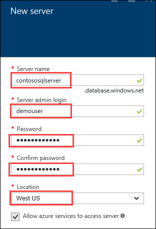

12. Once the values are accepted in the **New server** blade, click **Select**.

    

13. On the **SQL Database** blade, click **Select**.

    

14. After the values are accepted, click **Create**.

    

This may take a couple minutes to provision the Web App and SQL Database resources.

15. After the Web App and SQL Database are provisioned, click **More services** **\>** **SQL databases** followed by the name of the SQL Database you just created.

    

16. On the **SQL Database** blade, click the **Show database connection strings** link.

    

17. On the **Database connection strings** blade, select and copy the **ADO.NET** connection string. Then, save it in Notepad for use later.\
    

18. Click the SQL Database server name link.

    

19. On the **SQL Server** blade, under **Firewall**, click **Show firewall settings**.

    

20. On the **Firewall Settings** blade, specify a new rule named **ALL**, with START IP **0.0.0.0**, and END IP **255.255.255.255**.

    

This is only done to make the lab easier to do. In Production, you do NOT want to open up your SQL Database to all IP Addresses this way. In Production you will want to specify just the IP Addresses you wish to allow through the Firewall.

21. Click **Save**.

    

22. On the **Success!** dialog box, click **OK**.

    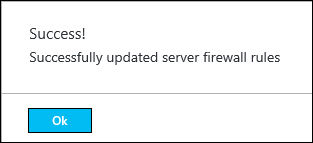

23. Close all configuration blades.

#### Subtask 2: Provision the storage account

1.  Using a new tab or instance of your browser, navigate to the Azure Management portal <http://portal.azure.com>.

2.  Click **+New, Storage,** and **Storage account.**

    

3.  On the Create storage account blade specify the following configuration options:

    a.  Name: unique value for the storage account (ensure the green check mark appears)

    b.  Specify the Resource Group **contososports**

    c.  Specify the same **Location** as the resource group.

    

4.  Click **Create**.

    

5.  Once the storage account has completed provisioning, open the storage account by clicking **More services \>** **Storage accounts** and clicking on the storage account name.

    

6.  On the **Storage account** blade, click **All** **settings**.

    

7.  On the **Storage** account blade, scroll down, and select the **Access keys** option.

    

8.  On the **Access keys** blade, click the copy button by **key1** on the Connection string. Put the value in notepad for later reference.

    contoso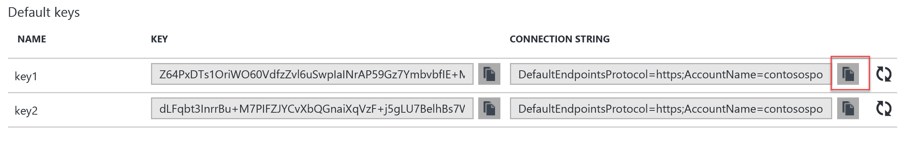

#### Subtask 3: Update the configuration in the starter project

1.  In the Azure Portal, click on **Resource Groups**. Then, click on the **contososports** resource group.\
    

2.  Click on the **Web App** just created in a previous step.

3.  On the **App Service** blade, scroll down in the left pane, and click on **Application settings**.\
    

4.  Scroll down, and locate the **App settings** section.\
    

5.  Add a new **App setting** with the following values:

    a.  Key: **AzureQueueConnectionString**

    b.  Value: **enter the Connection String for the Azure Account just created**
        

6.  Locate **Connection Strings** below App settings.\
    

7.  Add a new **Connection String** with the following values:

    a.  Name: **ContosoSportsLeague**

    b.  Value: **enter the Connection String for the SQL Database just created**

    c.  Type: ***SQL Database***

    

Ensure you replace the string placeholder values **{your\_username}** **{your\_password\_here}** with the username and password you respectively setup during creation (demouser AND demo\@pass123).


8.  Click Save.\
    

#### Subtask 4: Deploy the e-commerce Web App from Visual Studio

1.  Navigate to the **Contoso.Apps.SportsLeague.Web** project located in the **Web** folder using the **Solution Explorer** of Visual Studio.

    

2.  Right-click the **Contoso.Apps.SportsLeague.Web** project, and click **Publish**.

3.  Choose **Microsoft Azure App Service** as the publish target, and choose **Select Existing**.

4.  If prompted, log on with your credentials, and ensure the subscription you published earlier are selected.

    

5.  Select the Contoso Sports Web App.

    

6.  Click **OK**, and click **Publish** to publish the Web Application.

7.  In the Visual Studio **Output** view, you will see a status that indicates the Web App was published successfully.

    

8.  Validate the website by clicking the **Store** link on the menu. As long as products return, the connection to the database is successful.

    

### Task 2: Setup SQL Database Geo-Replication

In this exercise, the attendee will provision a secondary SQL Database and configure Geo-Replication using the Microsoft Azure Portal.

#### Subtask 1: Add secondary database

1.  Using a new tab or instance of your browser, navigate to the Azure Management Portal <http://portal.azure.com>

2.  Click **More services \> SQL databases**, and click the name of the SQL Database you created previously.\
    

3.  Under **Settings**, click on **Geo-Replication**.\
    

4.  Select the Azure Region to place the Secondary within.\
    

The Secondary Azure Region should be the Region Pair for the region the SQL Database is hosted in. The portal suggests the Region Pair to use by labeling it as "Recommended."

5.  On the **Create secondary** blade, select **Secondary Type** as **Readable**.

6.  Select **Target server** ***Configure required settings***.
    
    

7.  On the **New server** blade, specify the following configuration:

    a.  Server name: a unique value (ensure the green checkmark appears)

    b.  Server admin login: **demouser**

    c.  Password and Confirm Password: **demo\@pass123**

    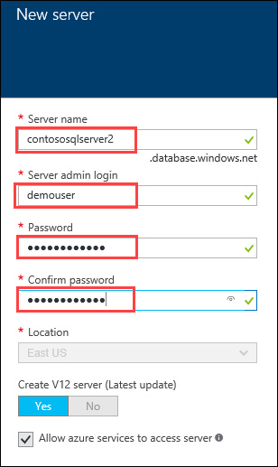

8.  Once the values are accepted in the **New server** blade, click **Select**.
    

9.  On the **Create secondary** blade, click **OK**.
    

10. After the Geo-Replication has finished provisioning, click **More services \> SQL databases**.\
    
    

11. Click the name of the Secondary SQL Database you just created.\
    

12. On the **SQL Database** blade, click the **Show database connection strings** link.\
    

13. On the **Database connection strings** blade, select and copy the **ADO.NET** connection string, and save it in Notepad for use later.\
    

14. Click the SQL Database Server name link.\
    

15. On the **SQL Server** blade, under **Firewall**, click **Show firewall settings**.\
    

16. On the **Firewall Settings** blade, specify a new rule named **ALL**, with START IP **0.0.0.0**, and END IP **255.255.255.255**.\
    

17. Click **Save**.
    
    

18. On the **Success!** Dialog box, click **OK**.\
    

19. Close all configuration blades.

#### Subtask 2: Failover secondary SQL database -- OPTIONAL

Since the Replication and Failover process can take anywhere from 10 -- 30 minutes to complete, you have the choice to skip Subtask 2 through 5, and skip directly to Task 3. However, if you have the time, it is recommended that you complete these steps.

1.  Using a new tab or instance of your browser, navigate to the Azure Management Portal <http://portal.azure.com>.

2.  Click **More services \> SQL databases**, and click the name of the SQL Database you created previously.\
    

3.  On the **Settings** blade, click **Geo-Replication**.\
    

4.  On the **Geo-Replication** blade, select the Secondary database.\
    

5.  Click the **Failover** button.\
    

6.  On the **Failover** prompt, click **Yes**.\
    

The Failover may take a few minutes to complete. You can continue with the next Subtask modifying the Web App to point to the Secondary SQL Database while the Failover is pending.

#### Subtask 3: Test e-commerce Web App after Failover

1.  Once completed, in the Azure Portal, click on **SQL databases**, and select the **ContosoSportsDB** secondary.\
    

2.  Next, click on **Show database connection strings**, and copy it off thereby replacing the user and password.
    

3.  From the Azure portal, click on resource groups, and select contososports.

4.  Click on the **Web App** just created in a previous step.

5.  On the **App Service** blade, scroll down in the left pane, and click on **Application settings**.\
    

6.  Scroll down, and locate the **Connection strings** section.

7.  Update the **ContosoSportsLeague** Connection String to the value of the Connection String for the **Secondary SQL Database**.\
    

Ensure you replace the string placeholder values **{your\_username}** **{your\_password\_here}** with the username and password you respectively setup during creation (demouser AND demo\@pass123).


8.  Click **Save**.
    

9.  On the **App Service** blade, click on **Overview**.\
    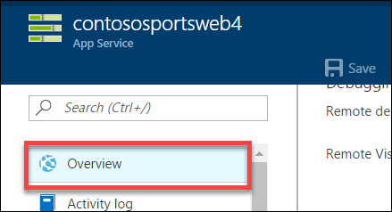

10. On the **Overview** pane, click on the **URL** for the Web App to open it in a new browser tab.\
    

11. After the e-commerce Web App loads in Internet Explorer, click on **STORE** in the top navigation bar of the website.\
    

12. Verify the product list from the database displays.\
    

#### Subtask 4: Revert Failover back to Primary database

1.  Using a new tab or instance of your browser, navigate to the Azure Management Portal <http://portal.azure.com>.

2.  Click **More services \> SQL databases**, and click the name of the SQL Database you created previously.\
    

3.  On the **Settings** blade, click **Geo-Replication**.\
    

4.  On the **Geo-Replication** blade, select the Secondary database.\
    

5.  Click the **Failover** button.\
    

6.  On the **Failover** prompt, click **Yes**.\
    

The Failover may take a few minutes to complete. You can continue with the next Subtask modifying the Web App to point back to the Primary SQL Database while the Failover is pending.

#### Subtask 5: Test e-commerce Web App after reverting Failover

1.  In the Azure Portal, click on **Resource Groups** **\>** **contososports** resource group.\
    

2.  Click on the **Web App** just created in a previous step.

3.  On the **App Service** blade, scroll down in the left pane, and click on **Application settings**.\
    

4.  Scroll down, and locate the **Connection strings** section.

5.  Update the **ContosoSportsLeague** Connection String to the value of the Connection String for the **Primary SQL Database**.
    

Ensure you replace the string placeholder values **{your\_username}** **{your\_password\_here}** with the username and password you respectively setup during creation (demouser AND demo\@pass123).


6.  Click **Save**.
    
    

7.  On the **App Service** blade, click on **Overview**.\
    

8.  On the **Overview** pane, click on the **URL** for the Web App to open it in a new browser tab.\
    

9.  After the e-commerce Web App loads in Internet Explorer, click on **STORE** in the top navigation bar of the website.\
    

10. Verify the product list from the database displays.\
    

### Task 3: Deploying the call center admin website

In this exercise, you will provision a website via the Azure Web App template using the Microsoft Azure Portal. You will then edit the necessary configuration files in the Starter Project and deploy the call center admin website.

#### Subtask 1: Provision the call center admin Web App 

1.  Using a new tab or instance of your browser, navigate to the Azure Management portal <http://portal.azure.com>.

2.  Click **New** **\>** **Web + mobile** **\>** **Web App**. 

3.  Specify a **unique URL** for the Web App, and ensure the **same App Service Plan** and **resource group** you have used throughout the lab are selected.

    

4.  Click on **App Service plan/Location**, and select the **ContosoSportsPlan** used by the front-end Web App.

5.  After the values are accepted, click **Create**.

    

#### Subtask 2: Update the configuration in the starter project

1.  Navigate to the **App Service** blade for the Call Center Admin App just provisioned.\
    

2.  On the **App Service** blade, click on **Application settings** in the left pane.

    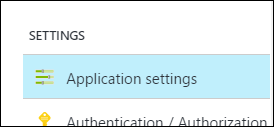

3.  Scroll down, and locate the **Connection strings** section.

    

4.  Add a new **Connection string** with the following values:

    a.  Name: **ContosoSportsLeague**

    b.  Value: **enter the Connection String for the SQL Database that was created**

    c.  Type: **SQL Database**

    

Ensure you replace the string placeholder values **{your\_username}** **{your\_password\_here}** with the username and password you respectively setup during creation (demouser AND demo\@pass123).


5.  Click **Save**.
    
    

#### Subtask 3: Deploy the call center admin Web App from Visual Studio

1.  Navigate to the **Contoso.Apps.SportsLeague.Admin** project located in the **Web** folder using the **Solution Explorer** in Visual Studio.

    

2.  Right-click the **Contoso.Apps.SportsLeague.Admin** project, and click **Publish**.

    

3.  Choose **Microsoft Azure App Service** as the publish target, and choose **Select Existing**.

    

4.  Select the **Web App** for the Call Center Admin App.

    

5.  Click **OK**, and click **Publish** to deploy the site.

6.  The website should load / display the following:

    

### Task 4: Deploying the payment gateway

In this exercise, the attendee will provision an Azure API app template using the Microsoft Azure Portal. The attendee will then deploy the payment gateway API to the API app.

#### Subtask 1: Provision the payment gateway API app

1.  Using a new tab or instance of your browser, navigate to the Azure Management Portal <http://portal.azure.com>.

2.  Click **+New**, type **API App** into the Search the marketplace box, and press **Enter**.

    

3.  Click on **API App** in the search results list.\
    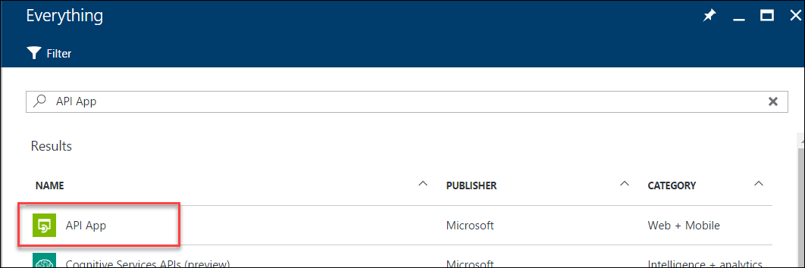

4.  Click on **Create**.\
    

5.  On the new **API App** blade, specify a unique name for the App Name, and ensure the previously used Resource Group and App Service Plan are selected.\
    

6.  Click on **App Service plan/Location**, and select the same App Service Plan used for the other Web App services.\
    

7.  After the values are accepted, click **Create**.\
    

#### Subtask 2: Deploy the Contoso.Apps.PaymentGateway project in Visual Studio

1.  Navigate to the **Contoso.Apps.PaymentGateway** project located in the **APIs** folder using the **Solution Explorer** in Visual Studio.

    

2.  Right-click the **Contoso.Apps.PaymentGateway** project, and click **Publish**.

    

3.  On the **Publish Web** dialog box, click **Microsoft Azure App Service**, and choose **Select Existing**.

    

4.  Select the Payment Gateway API app created earlier, click **OK** **\>** **Publish**.

    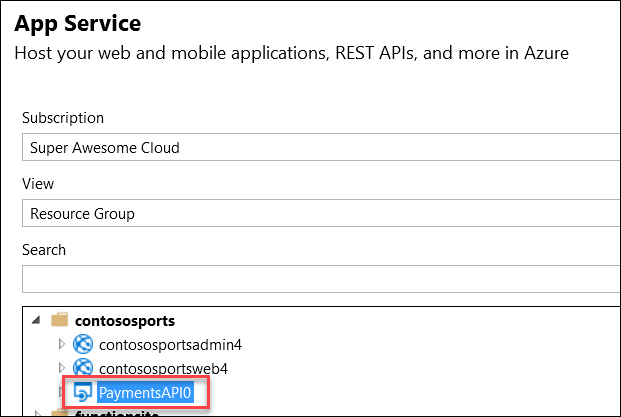

5.  In the Visual Studio **Output** view, you will see a status indicating the Web App was published successfully.

    

6.  Record the value of the deployed **API App URL** for later use.

### Task 5: Deploying the offers Web API

In this exercise, the attendee will provision an Azure API app template using the Microsoft Azure Portal. The attendee will then deploy the offers Web API.

#### Subtask 1: Provision the offers Web API app

1.  Using a new tab or instance of your browser, navigate to the Azure Management Portal (<http://portal.azure.com>).

2.  Click **+New**, type **API App** into the Search the marketplace box, and **press Enter**.

    

3.  Click on **API App** in the search results list.\
    

4.  Click on **Create**.\
    

5.  On the new **API App** blade, specify a unique name for the App Service Name, and ensure the previously used Resource Group and App Service Plan are selected.

    

6.  After the values are accepted, click **Create**.\
    

7.  When the Web App template has completed provisioning, open the new API App by clicking **More services** **\>** **App Services \>** **Offers API** (just created).

    

#### Subtask 2: Configure cross-origin resource sharing (CORS) 

1.  On the **App Service** blade, scroll down, and click on **CORS** within the API section of the left pane.

    

1.  In the **ALLOWED ORIGINS** text box, specify, and click **Save**.

#### Subtask 3: Update the configuration in the starter project

1.  On the **App Service** blade for the Offers API, click on **Application settings\
    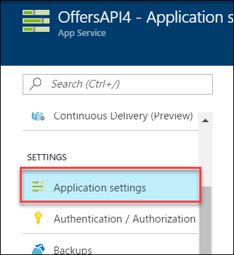
    **

2.  Scroll down, and locate the **Connection strings** section.\
    

3.  Add a new **Connection string** with the following values:

    a.  Name: **ContosoSportsLeague**

    b.  Value: **enter the Connection String for the SQL Database that was created**

    c.  Type: **SQL Database\
        

Ensure you replace the string placeholder values **{your\_username}** **{your\_password\_here}** with the username and password you respectively setup during creation (demouser AND demo\@pass123).


4.  Click **Save**.
    
    

#### Subtask 4: Deploy the Contoso.Apps.SportsLeague.Offers project in Visual Studio

1.  Navigate to the **Contoso.Apps.SportsLeague.Offers** project located in the **APIs** folder using the **Solution Explorer** in Visual Studio.

    

2.  Right-click the **Contoso.Apps.SportsLeague.Offers** project, and select **Publish**.

    

3.  On the **Publish Web** dialog box, click **Microsoft Azure App Service**, and choose **Select Existing**.\
    

4.  Select the Offers API app created earlier, and click **OK** **\>** **Publish**.

    

5.  In the Visual Studio **Output** view, you will see a status the API app was published successfully.

6.  Record the value of the deployed API app URL for later use.

### Task 6: Update and deploy the e-commerce website

#### Subtask 1: Update the Application Settings for the Web App that hosts the Contoso.Apps.SportsLeague.Web project

1.  Using a new tab or instance of your browser, navigate to the Azure Management Portal <http://portal.azure.com>.

2.  Click on **Resource groups** **\>** **contososports** resource group.\
    

3.  Click on the **App Service Web App** for the front-end Web Application.\
    

4.  On the **App Service** blade, scroll down, and click on **Application settings** in the left pane.

    

5.  Scroll down, and locate the **App settings** section.\
    

6.  Add a new **App Setting** with the following values:

    a.  Key: **paymentsAPIUrl**

    b.  Value: enter the **HTTPS** URL for the Payments API App with **/api/nvp** appended to the end. Ex: https://paymentsapi0.azurewebsites.net/api/nvp\
        

7.  Add a new **App Setting** with the following values:

    c.  Key: **offersAPIUrl**

    d.  Value: enter the **HTTPS** URL for the Offers API App with **/api/get** appended to the end. Ex: https://offersapi4.azurewebsites.net/api/get\
        

8.  Click on **Save**.
    

**Note:** Ensure both of the API URLs are using **SSL** (https://), or you will see a CORS errors.

#### Subtask 2: Validate App Settings are correct

1.  On the **App Service** blade, click on **Overview**.\
    

2.  In the **Overview** pane, click on the **URL** for the Web App to open it in a new browser tab.\
    

3.  On the homepage, you should see the latest offers populated from the Offers API.

    

4.  Submit several test orders to ensure all pieces of the site are functional.

    

**Leader Note:** If the attendee is still experiencing CORS errors ensure the URLs to the Web App in Azure local host are exact.

## Exercise 2: Identity and security

Duration: 75 Minutes

The Contoso call center admin application will only be accessible by users of the Contoso Active Directory environment. You have been asked to create a new Azure AD Tenant and secure the application so only users from the tenant can log on.

### Task 1: Enable Azure AD Premium Trial

Note: this task is **optional**, and it is valid only if you are a global administrator on the Azure AD tenant associated with your subscription.

1.  Navigate to the Azure Management portal, [http://portal.azure.com](http://portal.azure.com/), using a new tab or instance.

2.  Click on **More services** followed by **Azure Active Directory** under the SECURITY + IDENTITY section.\
    

3.  On the **Azure Active Directory** blade, locate and click on the **Company branding** option.\
    

4.  Click on the option to **Get a free Premium trial**.\
    

If you already have a Premium Azure Active Directory, skip to Task 2.

5.  On the **Activate** blade, click on the **Free Trial** link within the AZURE AD PREMIUM box.\
    

6.  On the **Active Azure AD Premium trial** blade, click the **Activate** button.\
    

7.  Close the **Azure Active Directory** blades.

### Task 2: Create a new Contoso user 

Note: this task is **optional**, and it is valid only if you are a global administrator on the Azure AD tenant associated with your subscription.

1.  Navigate to the Azure Management portal, [http://portal.azure.com](http://portal.azure.com/), using a new tab or instance.

2.  Click on **More services** **\>** **Azure Active Directory** under the SECURITY + IDENTITY section.\
    

3.  On the **Azure Active Directory** blade, click on **Domain** names.\
    

1.  Copy the **Domain Name** for your Azure AD Tenant. It will be in the format: *[your tenant\].onmicrosoft.com*
    This will be used for creating the new user's Username.\
    

5.  On the **Azure Active Directory** blade, click on **Users and groups** followed by **All users**.\
    

6.  Click on **+Add** to add a new user.\
    

7.  On the **User** blade, specify a user's **Name** and **Username**. Specify the **Username** to be at the domain name for your Azure AD Tenant. For example: *tbaker@\[your tenant\].onmicrosoft.com*\
    

8.  Click on the **Show Password** checkbox, and make a note of the Password for use later.\
    

9.  Click **Create**.
    
    

### Task 3: Configure access control for the call center administration Web Application

Note: This task is **optional**, and it is valid only if you have the right to create applications in your Azure AD Tenant.

#### Subtask 1: Enable Azure AD Authentication

1.  On the left navigation of the Azure Portal, select **App Services** (or click **More services** **\>** **App Services**).

    

2.  On the **Web Apps** page, select the **call center administration Web App**.

    

3.  Click the **Authentication / Authorization** tile.

    

4.  Change **App Service Authentication** to **On**, and change the dropdown to **Log in with Azure Active Directory**.

    

5.  Click on the **Azure Active Directory**.\
    

6.  On the **Azure Active Directory Settings** blade, change **Management mode** to **Express**.

    

7.  Click **OK**.\
    

8.  Change the **Action to take when request is not authenticated** option to **Login with Azure Active Directory**.

    

9.  In the **Authentication / Authorization** blade, click **Save**.

    

#### Subtask 2: Verify the call center administration website uses the access control logon

1.  Close your browser (or use an alternative), and launch a browser is InPrivate or Incognito mode. Navigate to the **call center administration** website.

2.  The browser will redirect to the non-branded Access Control logon URL. You can log on with your Microsoft account or the **Contoso test user** you created earlier.

    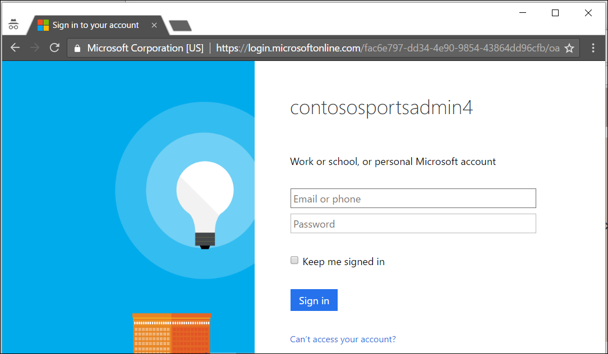

3.  After you log on and **accept the consent**, your browser will be redirected to the Contoso Sports League Admin webpage.

    

4.  Verify in the upper-right corner you see the link **Logged In**. If it is not configured, you will see **Sign in**.

     

### Task 4: Apply custom branding for the Azure Active Directory logon page

Note: this task is **optional**, and it is valid only if you are a global administrator on the Azure AD tenant associated with your subscription, and you completed the Enabling Azure AD Premium exercise.

1.  Navigate to the Azure Management portal, [http://portal.azure.com](http://portal.azure.com/), using a new tab or instance.

2.  Click on **More services** **\>** **Azure Active Directory** under the SECURITY + IDENTITY section.\
    

3.  On the **Azure Active Directory** blade, click on **Company branding**.\
    

4.  Click on the **Configure company branding now** link.\
    

5.  On the **Configure company branding** blade, select the **default\_signin\_illustration.jpg** image file from **C:\\hackathon** for the **Sign-in page image**.\
    

6.  Select the **logo-60-280.png** image file from **C:\\hackathon** for the **Banner image**.\
    

    Click **Save**.
    
    

### Task 5: Verify the branding has been successfully applied to the Azure Active Directory logon page

1.  Close any previously authenticated browser sessions to the call center administration website, reopen using InPrivate or Incognito mode, and navigate to the **call center administration** website.

2.  The browser will redirect to the branded access control logon URL.

    

3.  After you log on, your browser will be redirected to the Contoso Sports League Admin webpage.

    

4.  Verify in the upper-right corner you see the link **Logged in**.

    

5.  If you run the app using localhost, ensure connection strings for all of the web.config files in the solution have the placeholders removed with actual values. Search on web.config in the solution explorer to come up with the list.

    

## Exercise 3: Enable Azure B2C for customer site

Duration: 75 minutes

In this exercise, you will configure an Azure AD Business to Consumer (B2C) instance to enable authentication and policies for sign-in, sign-out and profile policies for the Contoso E-Commerce site.

### Task 1: Create a new directory

1.  Log in to the Azure portal by using your existing Azure subscription or by starting a free trial. At the left bottom of the screen, click **New** **\>** **Azure Active Directory B2C**.

    

    

2.  Enter for the name, **ContosoB2C** and a unique domain name and region. Click **Create a new Azure AD B2C Tenant**, and it will take a minute to complete. Click the link to manage your new B2C Directory.

    

3.  Click on the orange No Subscription message for instructions on how to link to an active subscription.

    

Note: Essentially, you will need to switch back to your previous Azure AD tenant, and then launch the Azure AD B2C creation wizard again.

4.  Click on **Link an existing Azure AD B2C Tenant to my Azure subscription,** and select the Tenant you just created in the dropdown list and existing resource group. Press **Create**. 

5.  Open the new Azure AD B2C tenant.

6.  Click on **All Settings \> Applications \> +Add**.


### Task 2: Add a new application

1.  Specify the following configuration options for the Web App:

    -   Name: Contoso B2C Application

    -   Reply URL: https://\[your web url\].azurewebsites.net \<- this should be the HTTPS URL to the Contoso E-Commerce Site.

    -   Include Web App / web API: Yes

        

2.  Click **Create**.

3.  Click the application you just created, and copy down the globally unique **Application ID** you will use later in your code.

### Task 3: Create Policies, Sign up

1.  Open your Azure AD B2C Tenant in the Azure management portal.

2.  To enable sign-up on your application, you will need to create a sign-up policy. This policy describes the experiences consumers will go through during sign-up and the contents of tokens the application will receive on successful sign-ups. Click **Sign-up or sign-in policies** as well as **+Add** at the top of the blade.

    

3.  The **Name** determines the sign-up policy name used by your application. For example, enter \"SiUp."

4.  Click **Identity providers**, and select \"Email signup." Optionally, you can also select social identity providers (if previously configured for the tenant). Click **OK**.

    

5.  Click **Sign-up attributes**. Here, you choose attributes you want to collect from the consumer during sign-up. For example, select \"Country/Region,\" \"Display Name\" and \"Postal Code." Click **OK**.

    

6.  Click **Application claims**. Here, you choose claims you want returned in the tokens sent back to your application after a successful sign-up experience. For example, select \"Display Name,\" \"Identity Provider,\" \"Postal Code,\" \"User is new\" and \"User\'s Object ID." Click **OK**.

    

7.  Click **Create**. Observe the policy just created appears as \"**B2C\_1\_SiUp**\" (the **B2C\_1\_** fragment is automatically added) in the **Sign-up policies** blade.

8.  Open the policy by clicking \"**B2C\_1\_SiUp**."

9.  Select **\"Contoso B2C app\"** in the **Applications** drop-down.

10. Click **Run now**. A new browser tab opens, and you can run through the consumer experience of signing up for your application.

### Task 4: Create a sign-in policy

To enable sign-in on your application, you will need to create a sign-in policy. This policy describes the experiences consumers will go through during sign-in and the contents of tokens the application will receive on successful sign-ins.

1.  Click **Sign-in policies**.

    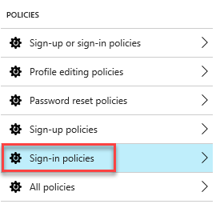s

2.  Click **+Add** at the top of the blade.

3.  The **Name** determines the sign-in policy name used by your application. For example, enter \"**SiIn**\" \<the 3^rd^ letter is an upper case i\>.

4.  Click **Identity providers** and select \"**Local Account SignIn**." Optionally, you can also select social identity providers, if already configured. Click **OK**.

> 

5.  Click **Application claims**. Here you choose claims that you want returned in the tokens sent back to your application after a successful sign-in experience. For example, select \"Display Name,\" \"Identity Provider,\" \"Postal Code,\" and \"User\'s Object ID." Click **OK**.

    

6.  Click **Create**. Observe the policy just created appears as \"**B2C\_1\_SiIn**\" (the **B2C\_1\_** fragment is automatically added) in the **Sign-in policies** blade.

7.  Open the policy by clicking \"**B2C\_1\_SiIn**."

8.  Select \"Contoso B2C app\" in the **Applications** drop-down.

9.  Click **Run now**. A new browser tab opens, and you can run through the consumer experience of signing into your application.

### Task 5: Create a profile editing policy

To enable profile editing on your application, you will need to create a profile editing policy. This policy describes the experiences that consumers will go through during profile editing and the contents of tokens that the application will receive on successful completion.

1.  Click **Profile editing policies**.

    

2.  Click **+Add** at the top of the blade.

3.  The Name determines the profile editing policy name used by your application. For example, enter \"SiPe."

4.  Click Identity providers, and select \"**Local Account SignIn**." Optionally, you can also select social identity providers, if already configured. Click **OK**.

> 

5.  Click **Profile attributes**. Here, you choose attributes the consumer can view and edit. For example, select \"Country/Region,\" \"Display Name,\" "Job Title,\" \"Postal Code,\" "State/Province,\" and "Street Address." Click **OK**.

    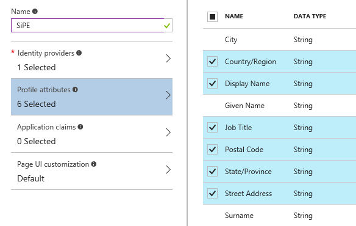

6.  Click **Application claims**. Here, you choose claims you want returned in the tokens sent back to your application after a successful profile editing experience. For example, select \"Display Name\" and \"Postal Code." Click **OK**

7.  Click **Create**. Observe the policy just created appears as \"**B2C\_1\_SiPe**\" (the **B2C\_1\_** fragment is automatically added) in the **Profile editing policies** blade.

8.  Open the policy by clicking \"**B2C\_1\_SiPe**."

9.  Select \"Contoso B2C app\" in the **Applications** drop-down.

10. Click **Run now**. A new browser tab opens, and you can run through the profile editing consumer experience in your application.

### Task 6: Modify the Contoso.App.SportsLeague.Web

1.  Within Visual Studio, click on **View -\> Other Windows -\> Package Manager Console**. Execute the following commands to install these the required NuGet Packages.
    ```
    Install-Package Microsoft.Owin.Security.OpenIdConnect -Version 3.0.1
    Install-Package Microsoft.Owin.Security.Cookies -Version 3.0.1
    Install-Package Microsoft.Owin.Host.SystemWeb -Version 3.0.1
    Install-Package Microsoft.IdentityModel.Protocol.Extensions -Version 1.0.4.403061554
    ```

2.  Next, using the Azure Management Portal, open the Contoso E-Commerce Site, and click on App Settings.

3.  Add the following settings:

    -   ida:Tenant - \[your Azure AD B2C name\].onmicrosoft.com

    -   ida:ClientId -- \[the client/app ID from your app\]

    -   ida:RedirectUri - https://\[your web url\].azurewebsites.net

    -   ida:SignupPolicyId -- B2C\_1\_SiUp

    -   ida:SignInPolicyId -- B2C\_1\_SiIn \<the 3^rd^ letter is an upper case i\>

    -   ida:UserProfilePolicyId -- B2C\_1\_SiPe

    -   ida:AadInstance - https://login.microsoftonline.com/{0}/v2.0/.well-known/openid-configuration?p={1}

    

4.  Click **Save** when you are complete.

5.  Within Visual Studio, **right** click on the **Contoso.Apps.SportsLeague.Web** project, and click **Add -\> New Item.**

    

6.  In the Search Installed Templates search box search for OWIN. Click the OWIN Startup class, change the name to **Startup.cs,** and then click **Add**.

7.  In the new class, insert the word partial in between public and class to make this a partial class.

    

8.  Add the following code between the brackets of the Configuration method.
    ```
    ConfigureAuth(app);
    ```
    ```
    // Startup.cs

    public partial class Startup

    {

    public void Configuration(IAppBuilder app)

    {

    ConfigureAuth(app);

    }

    }
    ```

Note: The OWIN middleware will invoke the Configuration(\...) method when your app starts.

9.  Right click on the **App\_Start** folder, and click **Add -\> Class**.

10. Select **Visual C\# and Class,** and name the new file **Startup.Auth.cs**.

11. Replace the entire contents of Startup.Auth.cs with the following code:
    ```
    // App\_Start\\Startup.Auth.cs

    using System;

    using Owin;

    using Microsoft.Owin.Security;

    using Microsoft.Owin.Security.Cookies;

    using Microsoft.Owin.Security.OpenIdConnect;

    using System.Threading.Tasks;

    using Microsoft.Owin.Security.Notifications;

    using Microsoft.IdentityModel.Protocols;

    using System.Configuration;

    using System.IdentityModel.Tokens;

    using System.Web.Helpers;

    using System.IdentityModel.Claims;

    namespace Contoso.Apps.SportsLeague.Web

    {

    public partial class Startup

    {

    // App config settings

    private static string clientId = ConfigurationManager.AppSettings\[\"ida:ClientId\"\];

    private static string aadInstance = ConfigurationManager.AppSettings\[\"ida:AadInstance\"\];

    private static string tenant = ConfigurationManager.AppSettings\[\"ida:Tenant\"\];

    private static string redirectUri = ConfigurationManager.AppSettings\[\"ida:RedirectUri\"\];

    // B2C policy identifiers

    public static string SignUpPolicyId = ConfigurationManager.AppSettings\[\"ida:SignUpPolicyId\"\];

    public static string SignInPolicyId = ConfigurationManager.AppSettings\[\"ida:SignInPolicyId\"\];

    public static string ProfilePolicyId = ConfigurationManager.AppSettings\[\"ida:UserProfilePolicyId\"\];

    public void ConfigureAuth(IAppBuilder app)

    {

    app.SetDefaultSignInAsAuthenticationType(CookieAuthenticationDefaults.AuthenticationType);

    app.UseCookieAuthentication(new CookieAuthenticationOptions());

    // Configure OpenID Connect middleware for each policy

    app.UseOpenIdConnectAuthentication(CreateOptionsFromPolicy(SignUpPolicyId));

    app.UseOpenIdConnectAuthentication(CreateOptionsFromPolicy(ProfilePolicyId));

    app.UseOpenIdConnectAuthentication(CreateOptionsFromPolicy(SignInPolicyId));

    AntiForgeryConfig.UniqueClaimTypeIdentifier = ClaimTypes.NameIdentifier;

    }

    // Used for avoiding yellow-screen-of-death

    private Task AuthenticationFailed(AuthenticationFailedNotification\<OpenIdConnectMessage, OpenIdConnectAuthenticationOptions\> notification)

    {

    notification.HandleResponse();

    if (notification.Exception.Message == \"access\_denied\")

    {

    notification.Response.Redirect(\"/\");

    }

    else

    {

    notification.Response.Redirect(\"/Home/Error?message=\" + notification.Exception.Message);

    }

    return Task.FromResult(0);

    }

    private OpenIdConnectAuthenticationOptions CreateOptionsFromPolicy(string policy)

    {

    return new OpenIdConnectAuthenticationOptions

    {

    // For each policy, give OWIN the policy-specific metadata address, and

    // set the authentication type to the id of the policy

    MetadataAddress = String.Format(aadInstance, tenant, policy),

    AuthenticationType = policy,

    // These are standard OpenID Connect parameters, with values pulled from web.config

    ClientId = clientId,

    RedirectUri = redirectUri,

    PostLogoutRedirectUri = redirectUri,

    Notifications = new OpenIdConnectAuthenticationNotifications

    {

    AuthenticationFailed = AuthenticationFailed,

    },

    Scope = \"openid\",

    ResponseType = \"id\_token\",

    // This piece is optional - it is used for displaying the user\'s name in the navigation bar.

    TokenValidationParameters = new TokenValidationParameters

    {

    NameClaimType = \"name\",

    },

    };

    }

    }

    }
    ```

Note: The parameters you provide in OpenIdConnectAuthenticationOptions serve as coordinates for your app to communicate with Azure AD. You also need to set up cookie authentication. The OpenID Connect middleware uses cookies to maintain user sessions, among other things.

### Task 7: Send authentication requests to Azure AD

Your app is now properly configured to communicate with Azure AD B2C by using the OpenID Connect authentication protocol. OWIN has taken care of all of the details of crafting authentication messages, validating tokens from Azure AD, and maintaining user session. All that remains is to initiate each user\'s flow.

1.  Right click on the **Controllers** folder, and click **Add** -\> **Controller**. 

2.  Select **MVC 5 Controller -- Empty, and click Add.** Replace **Default** with **Account** for the controller name.

3.  Add the following using statement to the top of the controller:
    ```
    using Microsoft.Owin.Security;
    ```

4.  Replace the default controller method Index

    

    With the following code:
    ```
    // Controllers\\AccountController.cs

    public void SignIn()

    {

    if (!Request.IsAuthenticated)

    {

    // To execute a policy, you simply need to trigger an OWIN challenge.

    // You can indicate which policy to use by specifying the policy id as the AuthenticationType

    HttpContext.GetOwinContext().Authentication.Challenge(

    new AuthenticationProperties () { RedirectUri = \"/\" }, Startup.SignInPolicyId);

    }

    }

    public void SignUp()

    {

    if (!Request.IsAuthenticated)

    {

    HttpContext.GetOwinContext().Authentication.Challenge(

    new AuthenticationProperties() { RedirectUri = \"/\" }, Startup.SignUpPolicyId);

    }

    }

    public void Profile()

    {

    if (Request.IsAuthenticated)

    {

    HttpContext.GetOwinContext().Authentication.Challenge(

    new AuthenticationProperties() { RedirectUri = \"/\" }, Startup.ProfilePolicyId);

    }

    }
    ```

5.  You can also use OWIN to sign out the user from the app. Add the following method to the account controller (**Controllers\\AccountController.cs**):
    ```
    C\# Copy
    ```
    ```
    // Controllers\\AccountController.cs

    public void SignOut()

    {

    // To sign out the user, you should issue an OpenIDConnect sign out request

    if (Request.IsAuthenticated)

    {

    IEnumerable\<AuthenticationDescription\> authTypes = HttpContext.GetOwinContext().Authentication.GetAuthenticationTypes();

    HttpContext.GetOwinContext().Authentication.SignOut(authTypes.Select(t =\> t.AuthenticationType).ToArray());

    Request.GetOwinContext().Authentication.GetAuthenticationTypes();

    }

    }
    ```

### Task 8: Display user information

When you authenticate users by using OpenID Connect, Azure AD returns an ID token to the app that contains **claims**. These are assertions about the user. You can use claims to personalize your app. You can access user claims in your controllers via the ClaimsPrincipal.Current security principal object.

1.  Open the **Controllers\\HomeController.cs file** and add the following using statements at the end of the other using statements.
    ```
    using System.Linq;

    using System.Security.Claims;
    ```

2.  Open the **Controllers\\HomeController.cs** file and add the following method:
    ```
    \[Authorize\]

    public ActionResult Claims()

    {

    Claim displayName = ClaimsPrincipal.Current.FindFirst(ClaimsPrincipal.Current.Identities.First().NameClaimType);

    ViewBag.DisplayName = displayName != null ? displayName.Value : string.Empty;

    return View();

    }
    ```

3.  You can access any claim that your application receives in the same way. A list of all the claims the app receives is available for you on the **Claims** page. Right click on **Views -\> Home,** click **Add -\> MVC 5 View Page (Razor)** and name it **Claims.** 

4.  Open the **Claims.cshtml** file and replace the code with the following:
    ```
    \@using System.Security.Claims

    @{

    ViewBag.Title = \"Claims\";

    }

    \<h2\>\@ViewBag.Title\</h2\>

    \<h4\>Claims Present in the Claims Identity: \@ViewBag.DisplayName\</h4\>

    \<table class=\"table-hover claim-table\"\>

    \<tr\>

    \<th class=\"claim-type claim-data claim-head\"\>Claim Type\</th\>

    \<th class=\"claim-data claim-head\"\>Claim Value\</th\>

    \</tr\>

    \@foreach (Claim claim in ClaimsPrincipal.Current.Claims)

    {

    \<tr\>

    \<td class=\"claim-type claim-data\"\>\@claim.Type\</td\>

    \<td class=\"claim-data\"\>\@claim.Value\</td\>

    \</tr\>

    }

    \</table\>
    ```

5.  Right click on the **Views -\> Shared** folder, click **Add**, and add a new **MVC 5 Partial Page (Razor)**. Specify **\_LoginPartial** for the name.

    

6.  Add the following code to the razor partial view to provide a sign-in and sign-out link as well as a link to edit the user's profile.
    ```
    \@if (Request.IsAuthenticated)

    {

    \<text\>

    \<ul class=\"nav navbar-nav navbar-right\"\>

    \<li\>

    \<a id=\"profile-link\"\>\@User.Identity.Name\</a\>

    \<div id=\"profile-options\" class=\"nav navbar-nav navbar-right\"\>

    \<ul class=\"profile-links\"\>

    \<li class=\"profile-link\"\>

    \@Html.ActionLink(\"Edit Profile\", \"Profile\", \"Account\")

    \</li\>

    \</ul\>

    \</div\>

    \</li\>

    \<li\>

    \@Html.ActionLink(\"Sign out\", \"SignOut\", \"Account\")

    \</li\>

    \</ul\>

    \</text\>

    }

    else

    {

    \<ul class=\"nav navbar-nav navbar-right\"\>

    \<li\>\@Html.ActionLink(\"Sign up\", \"SignUp\", \"Account\", routeValues: null, htmlAttributes: new { id = \"signUpLink\" })\</li\>

    \<li\>\@Html.ActionLink(\"Sign in\", \"SignIn\", \"Account\", routeValues: null, htmlAttributes: new { id = \"loginLink\" })\</li\>

    \</ul\>

    }
    ```

7.  Open Views\\Shared\\\_Layout.cshtml in Visual Studio. Locate the header-top div. and add the two lines highlighted.
    ```
    \<div class=\"header-top\"\>

    \<div class=\"container\"\>

    \<div class=\"row\"\>

    \<div class=\"header-top-left\"\>

    \<a href=\"\#\"\>\<i class=\"fa fa-twitter\"\>\</i\>\</a\>

    \<a href=\"\#\"\>\<i class=\"fa fa-facebook\"\>\</i\>\</a\>

    \<a href=\"\#\"\>\<i class=\"fa fa-linkedin\"\>\</i\>\</a\>

    \<a href=\"\#\"\>\<i class=\"fa fa-instagram\"\>\</i\>\</a\>

    \</div\>

    \<div class=\"header-top-right\"\>

    \<a href=\"\#\" class=\"top-wrap\"\>\<span class=\"icon-phone\"\>Call today: \</span\> (555) 555-8000\</a\>

    \@Html.ActionLink(\"Claims\", \"Claims\", \"Home\")

    \</div\>

    \@Html.Partial(\"\_LoginPartial\")

    \</div\>

    \</div\>

    \</div\>
    ```

### Task 9: Run the sample app

1.  Right click on the **Contoso.Apps.SportsLeague.Web** project, and click **Publish**. Follow the steps to deploy the updated application to the Microsoft Azure Web App.

Launch a browser outside of Visual Studio for testing if the page loads in Visual Studio.

2.  Test out Sign up. Next, test Sign out.

3.  When you click on Claims and are not signed in, it will bring you to the sign-in page and then display the claim information. Sign in, and test Edit Profile.

    

    Claims information page

## Exercise 4: Enabling Telemetry with Application Insights 

To configure the application for logging and diagnostics, you have been asked to configure Microsoft Azure Application Insights and add some custom telemetry.

Note: You may need to create an Application Insights Resource in Azure portal depending on your subscription rights. After it is created, you can configure it and add to the project using the tasks below. To create a new Application Insights resource.

1.  Click **Create** a resource. **Search** the marketplace for Application Insights. **Select** Application Insights.

    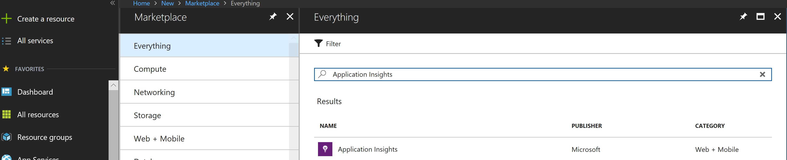

2.  Click the **Create** button.

    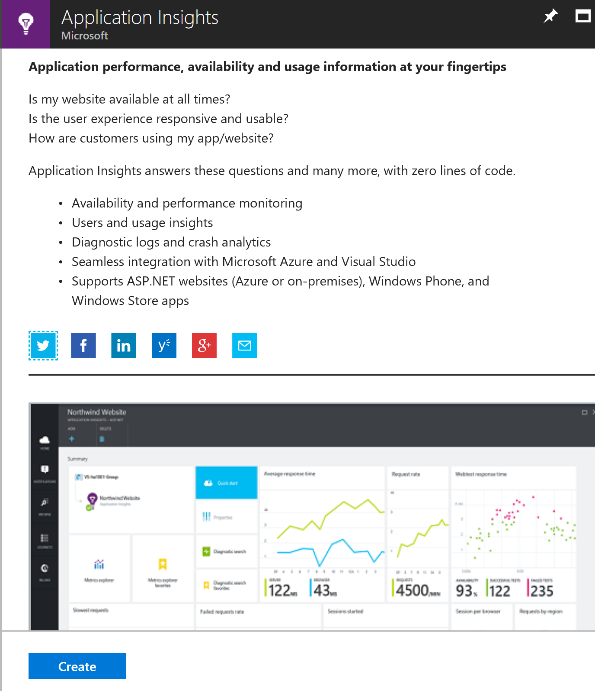

3. Enter the name as **Contoso.Apps.SportsLeague.Web.** Choose the existing resource group of **contoso**. Location should be the same location as your resource group.

    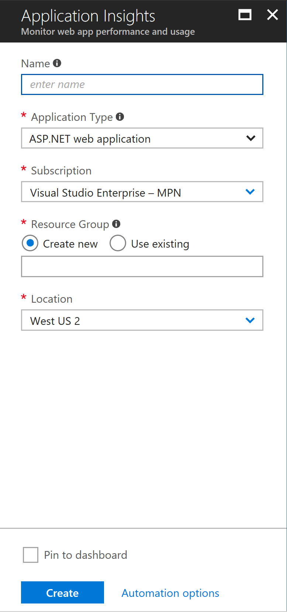

### Task 1: Configure the application for telemetry

#### Subtask 1: Add Application Insights Telemetry to the e-commerce website project

1.  Open the Solution **Contoso.Apps.SportsLeague** in Visual Studio.

2.  Navigate to the **Contoso.Apps.SportsLeague.Web** project located in the **Web** folder using the **Solution Explorer** in Visual Studio.

    

3.  Right-click the **Contoso.Apps.SportsLeague.Web** project, and select **Add \| Application Insights Telemetry..**.\
    

4.  Expand the **Sending telemetry to** section.\
    

5.  Click on the **Configure settings...** button.

    

6.  In the **Application Insights Configuration** dialog box, change the **Resource Group** to the **contososports** resource group used to host the Web App, and choose the New Application Insights Resource. Next, click **OK**, followed by **Update Resource**.

    

7.  Press **Finish** on the Application Insights window.\
    

8.  Once it completes, it displays the following Output and opens a new browser window

    

9.  Open the file **\\Helpers\\TelemetryHelper.cs** located in the **Contoso.Apps.SportsLeague.Web** project.

10. Add the following using statement to the top of the file:
    ```
    using Microsoft.ApplicationInsights;
    ```

11. Add the following code to the **TrackException** method to instantiate the telemetry client and track exceptions.
    ```
    var client = new TelemetryClient();
    
    client.TrackException(new Microsoft.ApplicationInsights.DataContracts.ExceptionTelemetry(exc));
    ```

12. Add the following code to the **TrackEvent** method to instantiate the telemetry client and track event data.
    ```
    var client = new TelemetryClient();

    client.TrackEvent(eventName, properties);
    ```

13. Save the **TelemetryHelper.cs** file.

#### Subtask 2: Enable client side telemetry 

1.  Open the Azure Management Portal (<http://portal.azure.com>). Click **More services** followed by **Application Insights**.

    

2.  Click the Application Insights instance associated with the Contoso E-Commerce Site.

    

3.  In CONFIGURE menu click on **Getting Started**.

    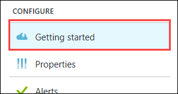

4.  Next, click the **MONITOR AND DIAGNOSE CLIENT SIDE APPLICATION** arrow. This will open the **Client application monitoring and diagnosis** blade.\
    

5.  Select and copy the full contents of the JavaScript on the **Client application monitoring and diagnosis** blade.

    

6.  Navigate to the **Contoso.Apps.SportsLeague.Web** project located in the **Web** folder using the **Solution Explorer** in Visual Studio.

7.  Open **Views \> Shared \> \_Layout.cshtml**.

    

8.  Paste in the code before the **\</head\>** tag.

    

9.  Save the **\_Layout.cshtml** file.

#### Subtask 3: Deploy the e-commerce Web App from Visual Studio

1.  Navigate to the **Contoso.Apps.SportsLeague.Web** project located in the **Web** folder using the **Solution Explorer** in Visual Studio.

    

2.  Right-click the **Contoso.Apps.SportsLeague.Web** project, and select **Publish**.\
    

3.  Click **Publish** again when the Publish dialog appears.

Launch a browser **outside of Visual Studio** for testing if the page is loaded in Visual Studio.

4.  Click a few links on the published E-Commerce website, and submit several orders to generate some sample telemetry.

### Task 2: Creating the web performance test and load test

#### Subtask 1: Create the load test

1.  Open the Azure Management Portal (<http://portal.azure.com>). Click **More services** followed by **Application Insights**.

    

2.  Click the Application Insights instance associated with the Contoso E-Commerce Site.

    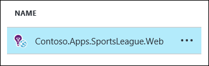

3.  Click **Performance Testing**.

    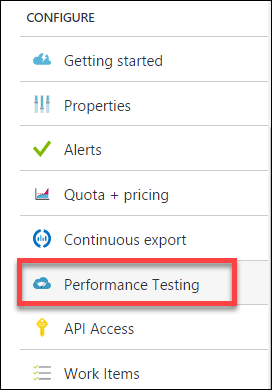

4.  Click the Set Account button to associate/create a Visual Studio Team Services account.

    

5.  On the Account tile, click **Or Create New**.

    

6.  Specify a unique name for the account and select a region. Note the region may differ from the region you have deployed your resources.

    

7.  Click **Subscription**, and select **your Subscription**.\
    

8.  Click **Select location**. Next, select a Location.\
    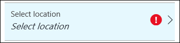

9.  Then, click **OK**.

The VSTS account creation will take a minute to complete.

10. Click **New**.

    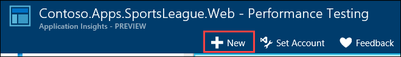

11. Click on **Configure Test Using**.
    

12. Specify the **URL** to the Contoso E-Commerce site, and click **Done**\
    

13. Name the test **ContosoSportsTest**, and click the **Run test** button.
    

14. Wait until the load test has completed.

    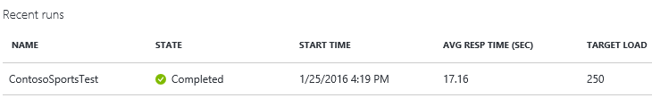

#### Subtask 2: View the Application Insights logs

1.  Using a new tab or instance of your browser, navigate to the Azure Management portal <http://portal.azure.com>.

2.  On the left menu area, click **More services**.

3.  On the **More services** blade, select **Application Insights**.

4.  On the **Application Insights** blade, select the Application Insights configuration you created for the e-commerce website.

    

5.  View the performance timeline to see the overall number of requests and page load time.

    

6.  Under **Usage Preview**. Check out the Events Button.

    

7.  After several minutes, you should see several Custom events from your previous order testing. This is reported through the TelemetryClient's TrackEvent method.

Note: If you do not see data here, come back later after the lab is complete.


8.  Drilling into the OrderCompleted events provides you with more detail about the specific order.

    

## Exercise 5: Automating backend processes with Azure Functions and Logic Apps

Contoso wants to automate the process of generating receipts in PDF format and alerting users when their orders have been processed using Azure Logic App and Functions. To run custom snippets of C\# or node.js in logic apps, you can create custom functions through Azure Functions. [Azure Functions](https://docs.microsoft.com/en-us/azure/azure-functions/functions-overview) offers server-free computing in Microsoft Azure and are useful for performing these tasks:

-   Advanced formatting or compute of fields in logic apps

-   Perform calculations in a workflow.

-   Extend the logic app functionality with functions that are supported in C\# or node.js

### Task 1: Create an Azure Function to Generate PDF Receipts

1.  Click the New button found on the upper left-hand corner of the Azure portal and then click **Compute \> Function App**, select your Subscription, type a unique App name that identifies your function app, then specify the following settings:

    -   [**Resource Group**](https://docs.microsoft.com/en-us/azure/azure-resource-manager/resource-group-overview): Use the existing resource group for **contososports**.

    -   [**Hosting plan**](https://docs.microsoft.com/en-us/azure/app-service/azure-web-sites-web-hosting-plans-in-depth-overview), which can be one of these plans:

        -   **Consumption plan**: The default plan type for Azure Functions. When you choose a consumption plan, you must also choose the **Location**.

        -   **App Service plan**: An App Service plan requires you to create an **App Service plan/location** or select an existing one. These settings determine the [location, features, cost, and compute resources](https://azure.microsoft.com/pricing/details/app-service/) associated with your app.

    -   **Storage account**: Each function app requires a storage account. Choose the existing storage account by clicking Select Existing and choosing the storage account in the contososports resource group.

    

2.  Click **Create** to provision and deploy the new function app.

    

3.  Open the Function App you just created. Click the **+ beside Functions**, scroll down, and select **Custom function**.

    

4.  Select **GenericWebHook**-**CSharp** with a Name of **ContosoMakePDF**, and press **Create**.

    

5.  Expand the View files area on the right of the code window and then click **Upload**.

    

6.  Upload the following files in the (Contoso Sports League\\Contoso.CreatePDFReport) folder beneath: C:\\Hackathon.

    -   ViewModels.csx

    -   CreatePdfReport.csx

    -   run.csx

    -   sample.dat

    -   StorageMethods.csx

    -   Project.json

    

7.  Click on run.csx, to refresh the code editor.

    

8.  Open the Log windows on the bottom.

    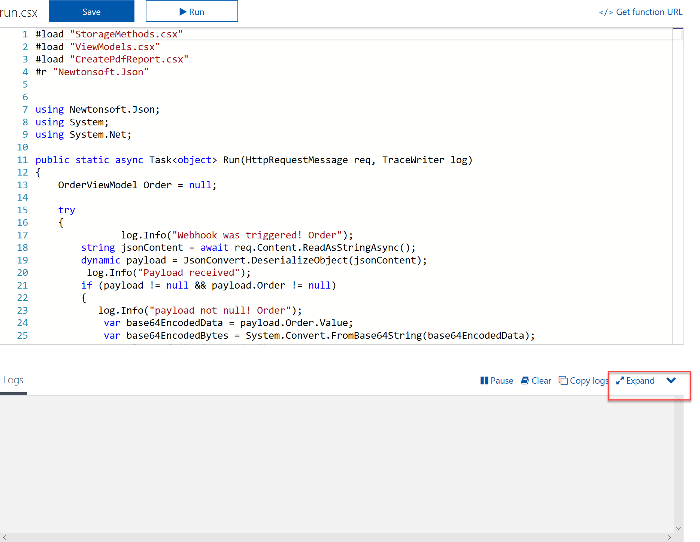

Note: You should see several messages about downloading dependent assemblies such as the Azure SDK and iText Sharp that were defined in the project.json file.

9.  Select the name of your function app, and then click on **Platform Features** followed by **Application settings.**

    

10. Add a new entry called **contososportsstorage**, and paste the value of the connection string noted in an earlier exercise. Click **Save** after adding the value.

    

Note: You can find the value by opening the storage account, and clicking the Access Keys tile.

11. Open the **sample.dat** file, and select as well as copy (Ctrl+C) the test data.

    

12. Select the **Run.csx** file, click on the **Test** tab, and replace the contents by pasting (CTRL-V) in the Test tab Request Body.

    

13. Select the **View Files** tab, select **Run.csx**, and click run.

14. You should see messages in the Logs window stating the Webhook was triggered, and the PDF was generated / saving it the storage account. Also, you should see that actual message text in the Output Window.

    

15. To see the PDF indeed landed in the receipts container in blob storage, download the Microsoft Storage Explorer at [http://storageexplorer.com](http://storageexplorer.com/). Use Microsoft Storage explorer to verify the PDF landed on the Blob Container for receipts. You may need to refresh and/or select another folder, and arrive back to the receipts folder to see the PDF.

    

### Task 2: Create an Azure Logic App to Process Orders

Without writing any code, you can automate business processes more easily and quickly when you create and run workflows with Azure Logic Apps. Logic Apps provide a way to simplify and implement scalable integrations and workflows in the cloud. It provides a visual designer to model and automate your process as a series of steps known as a workflow. There are [many connectors](https://docs.microsoft.com/en-us/azure/connectors/apis-list) across the cloud and on-premises to quickly integrate across services and protocols.

The advantages of using Logic Apps include the following:

-   Saving time by designing complex processes using easy to understand design tools

-   Implementing patterns and workflows seamlessly, that would otherwise be difficult to implement in code

-   Getting started quickly from templates

-   Customizing your logic app with your own custom APIs, code, and actions

-   Connect and synchronize disparate systems across on-premises and the cloud

-   Build off of BizTalk server, API Management, Azure Functions, and Azure Service Bus with first-class integration support

1.  Next, let us create a Logic App that will trigger when an item is added to the receiptgenerator queue. In the Azure Management Portal, click the **+** button**,** search for **Logic App**, click the returned Logic App result, and click **Create**.

    

2.  Fill out the name as **ContosoLogicApplication** along with your subscription, and use the existing resource group **contososports**. Choose the **same region** as your Web App and storage account. Click **Create**.

    

3.  Open up the logic app after it is deployed by clicking more services and search on logic.

    

4.  Click on the **Logic App Designer** link.

    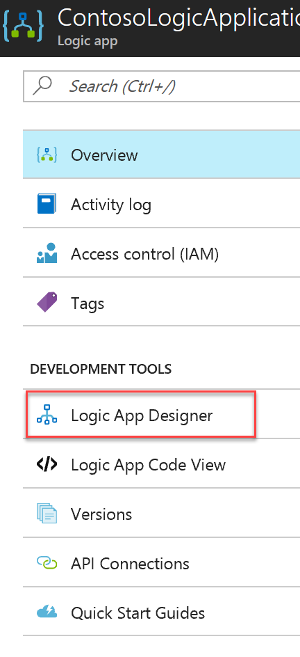

5.  In the Logic Apps Designer, select **Blank Logic App**.

    

6.  Select **Azure Queues.**

    

7.  Select **Azure Queues -- When there are messages in a queue**.

    

8.  Specify **ContosoStorage** as the connection name, select the Contoso storage account from the list, and click **Create**.

    

9.  Select the **receiptgenerator** queue from the drop-down, click **New Step**, and **Add an Action**.

    

10. Select **Azure Functions**.

    

11. Click **Azure Functions -- Choose an Azure function**.

    

12. Select the Azure function created earlier followed by selecting the **ContosoMakePDF** function.

    

13. Type this in the Request Body **{"Order":** \[pick MessageText from list on right\] **}**. Make sure the syntax is json format. Sometimes the ":" will go to the right side of MessageText by mistake. Keep it on the left. It should look like this:

    \
    

14. Click **Save** to save the Logic App.

15. There is one modification we need to make in the code. Click on the CodeView button.

    

16. Find the line of code in the body for the Order item that reads the MessageText value from the queue, and add the base64 function around it to ensure it encoded before passing it off to the Azure function. It should look like the following:
    ```
    \"Order\": \"@{base64(triggerBody()?\[\'MessageText\'\])}\"
    ```

    ![In the Order item code, the following line of code is circled: \"Order\": \"@{base64(triggerBody()?\[\'MessageText\'\])}\"](images/Hands-onlabstep-by-step-Moderncloudappsimages/media/image251.png "Order item code")

17. Run the logic app. It should process the orders you have submitted previously to test PDF generation. Using Azure Storage Explorer or Visual Studio Cloud Explorer you can navigate to the storage account and open the receipts container to see the created PDFs.

    

18. Double click it to see the Purchase receipt.

    

19. Now, add two more steps to the flow for updating the database and removing the message from the queue after it has been processed. Switch back to the designer, click **+ New Step** and select **Add an Action**.

    

20. Select **SQL Server**.

    

21. Select **SQL Server - Update row**.

    

22. Name the connection ContosoSportsDB, and select the primary ContosoSportsDB database for your solution. Under the user name and password used to create it, click **Create.**

    

23. From the drop-down select the name of the table, **Orders**.

    

24. Press **save** and ignore the error. Navigate to the code view.

25. Replace these lines:

    

    With these:
    ```
    \"OrderDate\": \"@{body(\'ContosoMakePDF\')\[\'OrderDate\'\]}\",

    \"FirstName\": \"@{body(\'ContosoMakePDF\')\[\'FirstName\'\]}\",

    \"LastName\": \"@{body(\'ContosoMakePDF\')\[\'LastName\'\]}\",

    \"Address\": \"@{body(\'ContosoMakePDF\')\[\'Address\'\]}\",

    \"City\": \"@{body(\'ContosoMakePDF\')\[\'City\'\]}\",

    \"State\": \"@{body(\'ContosoMakePDF\')\[\'State\'\]}\",

    \"PostalCode\": \"@{body(\'ContosoMakePDF\')\[\'PostalCode\'\]}\",

    \"Country\": \"@{body(\'ContosoMakePDF\')\[\'Country\'\]}\",

    \"Phone\": \"@{body(\'ContosoMakePDF\')\[\'Phone\'\]}\",

    \"SMSOptIn\": \"@{body(\'ContosoMakePDF\')\[\'SMSOptIn\'\]}\",

    \"SMSStatus\": \"@{body(\'ContosoMakePDF\')\[\'SMSStatus\'\]}\",

    \"Email\": \"@{body(\'ContosoMakePDF\')\[\'Email\'\]}\",

    \"ReceiptUrl\": \"@{body(\'ContosoMakePDF\')\[\'ReceiptUrl\'\]}\",

    \"Total\": \"@{body(\'ContosoMakePDF\')\[\'Total\'\]}\",

    \"PaymentTransactionId\": \"@{body(\'ContosoMakePDF\')\[\'PaymentTransactionId\'\]}\",

    \"HasBeenShipped\": \"@{body(\'ContosoMakePDF\')\[\'HasBeenShipped\'\]}\"
    ```

26. And modify the path variable to include the index key or OrderId to be as follows:
    ```
    \"path\": \"/datasets/default/tables/@{encodeURIComponent(encodeURIComponent(\'\[dbo\].\[Orders\]\'))}/items/@{encodeURIComponent(encodeURIComponent(body(\'ContosoMakePDF\')\[\'OrderId\'\]))}\"
    ```

    The code should now look as follows for the update\_row method:

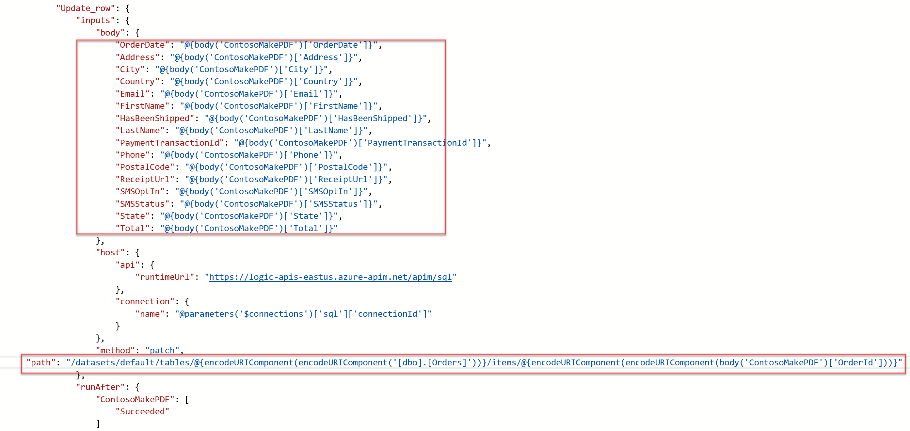

27. **Save** and return to the designer.

28. Your updated designer view should look like this:

    

29. Finally, let us add one more step to remove the message from the queue. Press **+New Step** and **Add an Action**. Type in Queue in the search box, and select Azure Queues -- Delete message.

    

30. Select the **receiptgenerator** queue from the list.

31. Select **Message Id** **\>** **Pop Receipt** from the list, and click **Save**.

    

32. Click Run on the Logic App Desinger, and then run the Contoso sports Web App and check out an Item.

33. Run the admin website app, and select the last Details link in the list.\
    

34. You should now see a Download receipt link because the database has been updated.

    

35. Click on the Download receipt link to see the receipt.

    

36. Return to the Logic app and you should see all green check marks for each step. If not, click the yellow status icon to find out details.

    

### Task 3: Use Twilio to send SMS Order Notifications

#### Subtask 1: Configure your Twilio trial account

1.  If you do not have a Twilio account, sign up for one for free at the following URL:??\
    [**https://www.twilio.com/try-twilio**](https://www.twilio.com/try-twilio).

    

2.  When you sign up for a free Twilio trial, you will be asked to verify your personal phone number. This is an important security step that is mandatory for trying Twilio.

    

3.  Click **All Products & Services**.\
    

4.  Click on **Phone Numbers**.\
    

5.  Click **Get Started**.\
    

6.  Click the **Get your first Twilio phone number** button.\
    

7.  Record the **Phone Number**, click the **Choose this Number** button on the **Your first Twilio Phone Number** prompt, and click **Done.**\
    

8.  Click on **Home**, record the **Account SID** and **Auth Token** for use when configuring the Twilio Connector.\
    

#### Subtask 2: Create a new logic app 

1.  Open **SQL Server Management Studio** and connect to the SQL Database for the **ContosoSportsDB** database.\
    

2.  Under the **ContosoSportsDB** database, expand **Programmability**, right-click on **Stored Procedures**, click **New**, followed by **Stored Procedure...**\
    

3.  Replace the Stored Procedure Template code with the following:
    ```
    CREATE PROCEDURE \[dbo\].\[GetUnprocessedOrders\]

    AS

    declare \@returnCode int

    SELECT \@returnCode = COUNT(\*) FROM \[dbo\].\[Orders\] WHERE PaymentTransactionId is not null AND PaymentTransactionId \<\> \'\' AND Phone is not null AND Phone \<\> \'\' AND SMSOptIn = \'1\' AND SMSStatus is null

    return \@returnCode

    GO
    ```

4.  Click on **Execute** in the toolbar, or press the F5 key.\
    

5.  Delete the SQL script for the Stored Procedure from the code editor, and replace it with the following:
    ```
    CREATE PROCEDURE \[dbo\].\[ProcessOrders\]

    AS

    SELECT \* FROM \[dbo\].\[Orders\] WHERE PaymentTransactionId is not null AND PaymentTransactionId \<\> \'\' AND Phone is not null AND Phone \<\> \'\' AND SMSOptIn = \'1\' AND SMSStatus is null;

    UPDATE \[dbo\].\[Orders\] SET SMSStatus = \'sent\' WHERE PaymentTransactionId is not null AND PaymentTransactionId \<\> \'\' AND Phone is not null AND Phone \<\> \'\' AND SMSOptIn = \'1\' AND SMSStatus is null;
    ```

6.  Click on **Execute** in the toolbar, or press the F5 key.\
    

7.  Open the Azure Management Portal (<http://portal.azure.com>), and click **+New** **\> Web + Mobile \> Logic App**.

    

8.  On the **Create logic app** blade, assign a value for **Name**, and set the Resource Group to **contososports**.

    

9.  Open the Logic App by clicking **More services -\> Logic Apps**, and click on the Logic App just created.

    

10. Select the **Blank LogicApp** Template.\
    

11. On the **Logic Apps Designer**, click **Schedule**.

    

12. Set the **FREQUENCY** to **MINUTE**, and **INTERVAL** to 1.

    

13. Click the **New Step** followed by **Add an action**.

    

14. Type **SQL Server** into the filter box, and click the SQL **Server -- Execute stored procedure** action.

    

15. The first time you add a SQL action, you will be prompted for the connection information. Name the connection **ContosoDB**, input the server and database details used earlier, and click **Create**.\
    

16. Select the **\[dbo\].\[GetUnprocessedOrders\]** stored procedure from the drop-down on the Procedure Name field.

    ![In the Execute stored procedure section, the Procedure name is \[dbo\].\[GetUnprocessedOrders\].](images/Hands-onlabstep-by-step-Moderncloudappsimages/media/image288.png "Execute stored procedure section")

17. Click on **New Step**, and click the **Add a condition** link.

    

18. Specify **ReturnCode** for the OBJECT NAME, set the RELATIONSHIP to **is greater than**, and set the VALUE to **0**.

    

19. Click the **Add an action** link on the **If yes** condition.

    

20. Type **SQL Server** into the filter box, and click the **SQL Server -- Execute stored procedure** action.

    

21. Select the **ProcessOrders** stored procedure in the Procedure name dropdown.

    ![Under If Yes, Execute stored procedure 2 is selected, and the Procedure name is \[dbo\].\[ProcessOrders\].](images/Hands-onlabstep-by-step-Moderncloudappsimages/media/image293.png "If yes section")

22. Click the **Add an action** link.

    

23. Type **Twilio** in the filter box, and click the **Twilio -- Send Text Message (SMS)** connector.

    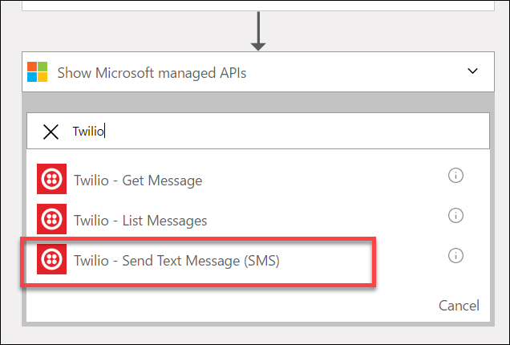

24. Set the Connection Name to Twilio, specify your Twilio **Account SID** and **Authentication Token**, then click the **Create** button.

    ")

25. Using the drop-down, select your Twilio number for the **FROM PHONE NUMBER** field. Specify a place holder phone number in the **TO PHONE NUMBER**, and a **TEXT** message.\
    ")

26. On the Logic App toolbar click the **Code View** button.

    

27. Find the **Send\_Text\_Message\_(SMS)** action, and modify the body property of the Twilio action:

    

    Add the following code between Hello and the comma.

    **@{item()\[\'FirstName\'\]}**

    

28. Modify the **to** property to pull the phone number from the item.

    **@{item()\[\'Phone\'\]}**

    

29. Immediately before the **Send\_Text\_Message\_(SMS)**, create a new line, and add the following code:
    ```
    \"forEach\_email\": {

    \"type\": \"Foreach\",

    \"foreach\": \"\@body(\'Execute\_stored\_procedure\_2\')\[\'ResultSets\'\]\[\'Table1\'\]\",

    \"actions\": {
    ```

30. Remove the **runAfter** block from the **Send\_Text\_Message\_(SMS)** action.\
    

31. Locate the closing bracket of the **Send\_Text\_Message\_(SMS)** action, create a new line after it, and add the following code:
    ```
    },

    \"runAfter\": {

    \"Execute\_stored\_procedure\_2\": \[

    \"Succeeded\"

    \]

    }

    }
    ```

32. After the code for the **Send\_Text\_Message\_(SMS)** has been modified to be contained within the **forEach\_email** action, it should look like the following:

    

33. Click **Save** on the toolbar to enable the logic app.

    

34. Your workflow should look like below, and you should receive a text for each order you have placed.

    

## After the hands-on lab 

Duration: 10 minutes

### Task 1: Delete resources

1.  Since the HOL is now complete, go ahead and delete all of the Resource Groups that were created for this HOL. You will no longer need those resources and it will be beneficial to clean up your Azure Subscription.

You should follow all steps provided *after* attending the hands-on lab.

