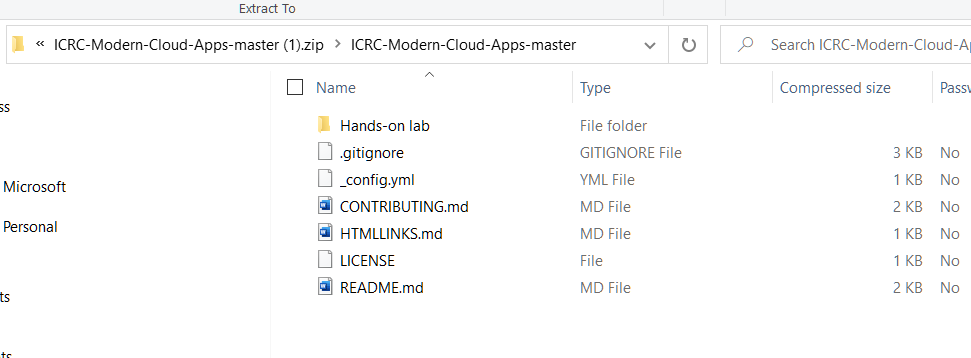

Modern cloud apps

Before the hands-on lab setup guide

June 2019

Information in this document, including URL and other Internet Web site references, is subject to change without notice. Unless otherwise noted, the example companies, organizations, products, domain names, e-mail addresses, logos, people, places, and events depicted herein are fictitious, and no association with any real company, organization, product, domain name, e-mail address, logo, person, place or event is intended or should be inferred. Complying with all applicable copyright laws is the responsibility of the user. Without limiting the rights under copyright, no part of this document may be reproduced, stored in or introduced into a retrieval system, or transmitted in any form or by any means (electronic, mechanical, photocopying, recording, or otherwise), or for any purpose, without the express written permission of Microsoft Corporation.

Microsoft may have patents, patent applications, trademarks, copyrights, or other intellectual property rights covering subject matter in this document. Except as expressly provided in any written license agreement from Microsoft, the furnishing of this document does not give you any license to these patents, trademarks, copyrights, or other intellectual property.

The names of manufacturers, products, or URLs are provided for informational purposes only and Microsoft makes no representations and warranties, either expressed, implied, or statutory, regarding these manufacturers or the use of the products with any Microsoft technologies. The inclusion of a manufacturer or product does not imply endorsement of Microsoft of the manufacturer or product. Links may be provided to third party sites. Such sites are not under the control of Microsoft and Microsoft is not responsible for the contents of any linked site or any link contained in a linked site, or any changes or updates to such sites. Microsoft is not responsible for webcasting or any other form of transmission received from any linked site. Microsoft is providing these links to you only as a convenience, and the inclusion of any link does not imply endorsement of Microsoft of the site or the products contained therein.

© 2019 Microsoft Corporation. All rights reserved.

Microsoft and the trademarks listed at <https://www.microsoft.com/en-us/legal/intellectualproperty/Trademarks/Usage/General.aspx> are trademarks of the Microsoft group of companies. All other trademarks are property of their respective owners.# Modern Cloud Apps setup

**Contents**

<!-- TOC -->

- [Modern cloud apps before the hands-on lab setup guide](#Modern-cloud-apps-before-the-hands-on-lab-setup-guide)
  - [Requirements](#Requirements)
  - [Before the hands-on lab](#Before-the-hands-on-lab)
    - [Task 1: Download GitHub resources](#Task-1-Download-GitHub-resources)
    - [Task 2: Deploy resources to Azure](#Task-2-Deploy-resources-to-Azure)
    - [Task 3: Explore the Contoso Sports League sample](#Task-3-Explore-the-Contoso-Sports-League-sample)

<!-- /TOC -->

# Modern cloud apps before the hands-on lab setup guide 

## Requirements

- Microsoft Azure MSDN subscription

- Local machine or Azure virtual machine configured with:

  - Visual Studio 2019 Community Edition or later
  - Windows Server 2016

## Before the hands-on lab

Duration: 30 minutes

Before initiating the hands-on lab, you will setup an environment to use for the rest of the exercises.

### Task 1: Download GitHub resources

1. Open a browser window to the Cloud Workshop GitHub repository (<https://github.com/microsoft/MCW-Modern-cloud-apps>).

2. Select **Clone or download**, then select **Download Zip**.

    

3. Extract the zip file to your local machine, be sure to keep note of where you have extracted the files. You should now see a set of folders:

    

### Task 2: Deploy resources to Azure

1. Open your Azure Portal.

2. Select Resource groups.

3. Select +Add.
 
4. Type a resource group name, such as *ContosoSports-[your initials or first name]*.

5. Select Review + Create, then select Create.

6. Select Refresh to see your new resource group displayed and select it.

7. Select Export template, and then select Deploy.

    

8. Select **Build your own template in the editor**.

9. In the extracted folder, open the **\Hands-on lab\Scripts\template.json** file.

10. Copy and paste it into the window.

11. Select **Save**

12. Select **Edit parameters**

    

13. In the extracted folder, open the **\Hands-on lab\Scripts\parameters.json** file.

14. Copy and paste it into the window.

15. Select **Save**

16. Check the **I agree to the terms and conditions stated above** checkbox.

17. Select **Purchase**.

    

18. The deployment will take 15-30 minutes to complete. To view the progress, select the **Deployments** link, then select the **Microsoft.Template** deployment.

    

19. **Note**: A configuration script to install SSMS and the require lab files will run after the deployment of the LabVM completes. The task will be listed on the deployment progress screen as `LabVM/CustomScriptExtension`. You should wait for this task to complete before attempting to log into the LabVM in the next task, as it downloads and installs files you will need for the next task.

    

### Task 3: Explore the Contoso Sports League sample

1. Connect to the **LabVM** that was deployed using the previous template using Remote Desktop, using these credentials:

    - **Admin username**: demouser
    - **Admin password**: demo@pass123

2. Open the **C:\MCW**` folder.

3. From the **Contoso Sports League** folder under **MCW**, open the Visual Studio Solution file: **Contoso.Apps.SportsLeague.sln**.

4. The solution contains the following projects:

    |    |            |
    |----------|:-------------:|
    | Contoso.Apps.SportsLeague.Web |   Contoso Sports League e-commerce application |
    | Contoso.Apps.SportsLeague.Admin |   Contoso Sports League call center admin application |
    | Contoso.Apps.Common  |   Shared tier |
    | Contoso.Apps.SportsLeague.Data  |   Shared tier |
    | Contoso.Apps.FunctionApp  |   Function app tier |
    | Contoso.Apps.SportsLeague.Offers |  API for returning list of available products |
    | Contoso.Apps.PaymentGateway   |     API for payment processing |

You should follow all of the steps provided *before* performing the Hands-on lab.
