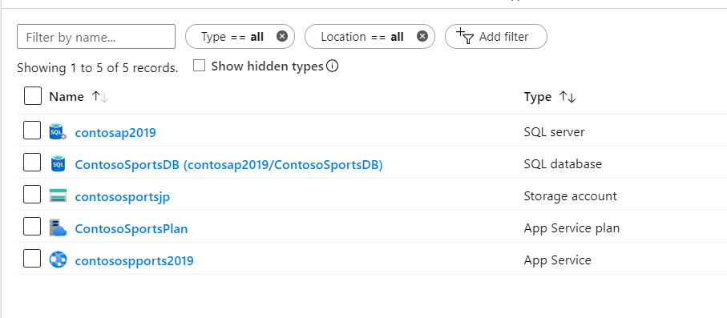

ICRC Modern cloud apps

Hands-on lab step-by-step

December 2019

Information in this document, including URL and other Internet Web site references, is subject to change without notice. Unless otherwise noted, the example companies, organizations, products, domain names, e-mail addresses, logos, people, places, and events depicted herein are fictitious, and no association with any real company, organization, product, domain name, e-mail address, logo, person, place or event is intended or should be inferred. Complying with all applicable copyright laws is the responsibility of the user. Without limiting the rights under copyright, no part of this document may be reproduced, stored in or introduced into a retrieval system, or transmitted in any form or by any means (electronic, mechanical, photocopying, recording, or otherwise), or for any purpose, without the express written permission of Microsoft Corporation.

Microsoft may have patents, patent applications, trademarks, copyrights, or other intellectual property rights covering subject matter in this document. Except as expressly provided in any written license agreement from Microsoft, the furnishing of this document does not give you any license to these patents, trademarks, copyrights, or other intellectual property.

The names of manufacturers, products, or URLs are provided for informational purposes only and Microsoft makes no representations and warranties, either expressed, implied, or statutory, regarding these manufacturers or the use of the products with any Microsoft technologies. The inclusion of a manufacturer or product does not imply endorsement of Microsoft of the manufacturer or product. Links may be provided to third party sites. Such sites are not under the control of Microsoft and Microsoft is not responsible for the contents of any linked site or any link contained in a linked site, or any changes or updates to such sites. Microsoft is not responsible for webcasting or any other form of transmission received from any linked site. Microsoft is providing these links to you only as a convenience, and the inclusion of any link does not imply endorsement of Microsoft of the site or the products contained therein.

© 2019 Microsoft Corporation. All rights reserved.

Microsoft and the trademarks listed at <https://www.microsoft.com/en-us/legal/intellectualproperty/Trademarks/Usage/General.aspx> are trademarks of the Microsoft group of companies. All other trademarks are property of their respective owners.

**Contents**

<!-- TOC -->
- [Modern cloud apps hands-on lab step-by-step](#modern-cloud-apps-hands-on-lab-step-by-step)
  - [Abstract and learning objectives](#abstract-and-learning-objectives)
  - [Overview](#overview)
  - [Solution architecture](#solution-architecture)
  - [Requirements](#requirements)
  - [Help references](#help-references)
  - [Exercise 1: Deploy Azure Lab VM - Morning Session](#exercise-1-deploy-the-azure-lab-vm)
    - [Task 1: Download GitHub Resources](#task-1-download-github-resources)
    - [Task 2: Deploy Resources to Azure](#task-2-deploy-resources-to-azure)
    - [Task 3: Explore the Contoso Sports League Sample(s)](#task-3-Explore-the-contoso-sports-league-samples)
  - [Exercise 2: Proof of concept deployment - Afternoon Session](#exercise-2-proof-of-concept-deployment)
    - [Task 1: Deploy the e-commerce website, SQL Database, and storage](#task-1-deploy-the-e-commerce-website-sql-database-and-storage)
      - [Subtask 1: Create the Web App and SQL database instance](#subtask-1-create-the-web-app-and-sql-database-instance)
      - [Subtask 2: Provision the storage account](#subtask-2-provision-the-storage-account)
      - [Subtask 3: Update the configuration in the starter project](#subtask-3-update-the-configuration-in-the-starter-project)
      - [Subtask 4: Deploy the e-commerce Web App from Visual Studio](#subtask-4-deploy-the-e-commerce-web-app-from-visual-studio)
    - [Task 2: Setup SQL Database Geo-Replication](#task-2-setup-sql-database-geo-replication)
      - [Subtask 1: Add secondary database](#subtask-1-add-secondary-database)
      - [Subtask 2: Failover secondary SQL database](#subtask-2-failover-secondary-sql-database)
      - [Subtask 3: Test e-commerce Web App after Failover](#subtask-3-test-e-commerce-web-app-after-failover)
      - [Subtask 4: Revert Failover back to Primary database](#subtask-4-revert-failover-back-to-primary-database)
      - [Subtask 5: Test e-commerce Web App after reverting failover](#subtask-5-test-e-commerce-web-app-after-reverting-failover)
    - [Task 3: Deploying the Call Center admin website](#task-3-deploying-the-call-center-admin-website)
      - [Subtask 1: Provision the call center admin Web App](#subtask-1-provision-the-call-center-admin-web-app)
      - [Subtask 2: Update the configuration in the starter project](#subtask-2-update-the-configuration-in-the-starter-project)
      - [Subtask 3: Deploy the call center admin Web App from Visual Studio](#subtask-3-deploy-the-call-center-admin-web-app-from-visual-studio)
    - [Task 4: Deploying the payment gateway](#task-4-deploying-the-payment-gateway)
      - [Subtask 1: Provision the payment gateway API app](#subtask-1-provision-the-payment-gateway-api-app)
      - [Subtask 2: Deploy the Contoso.Apps.PaymentGateway project in Visual Studio](#subtask-2-deploy-the-contosoappspaymentgateway-project-in-visual-studio)
    - [Task 5: Deploying the Offers Web API](#task-5-deploying-the-offers-web-api)
      - [Subtask 1: Provision the Offers Web API app](#subtask-1-provision-the-offers-web-api-app)
      - [Subtask 2: Configure Cross-Origin Resource Sharing (CORS)](#subtask-2-configure-cross-origin-resource-sharing-cors)
      - [Subtask 3: Update the configuration in the starter project](#subtask-3-update-the-configuration-in-the-starter-project-1)
      - [Subtask 4: Deploy the Contoso.Apps.SportsLeague.Offers project in Visual Studio](#subtask-4-deploy-the-contosoappssportsleagueoffers-project-in-visual-studio)
    - [Task 6: Update and deploy the e-commerce website](#task-6-update-and-deploy-the-e-commerce-website)
      - [Subtask 1: Update the Application Settings for the Web App that hosts the Contoso.Apps.SportsLeague.Web project](#subtask-1-update-the-application-settings-for-the-web-app-that-hosts-the-contosoappssportsleagueweb-project)
      - [Subtask 2: Validate App Settings are correct](#subtask-2-validate-app-settings-are-correct)
  - [After the hands-on lab](#after-the-hands-on-lab)
    - [Task 1: Delete resources](#task-1-delete-resources)

<!-- /TOC -->

# Modern cloud apps hands-on lab step-by-step

## Abstract and learning objectives

In this hands-on lab, you will be challenged to implement an end-to-end scenario using a supplied sample that is based on Azure App Services, Azure SQL Database and related services. The scenario will include implementing compute, storage, workflows, and monitoring, using various components of Microsoft Azure.

The hands-on lab can be implemented on your own, but it is highly recommended to pair up with other members working on the lab to model a real-world experience and to allow each member to share their expertise for the overall solution.

By the end of this hands-on lab, you will have learned how to use several key services within Azure to improve overall functionality of the original solution, and to increase the security and scalability of the new and improved design.

## Overview

The Cloud Workshop: Modern Cloud Apps lab is a hands-on exercise that will challenge you to implement an end-to-end scenario using a supplied sample that is based on Microsoft Azure App Services and related services. The scenario will include implementing compute, storage, security, and scale using various components of Microsoft Azure. The lab can be implemented on your own, but it is highly recommended to pair up with additional team members to more closely model a real-world experience, and to allow members to share their expertise for the overall solution.

## Solution architecture

## Requirements

1. Microsoft Azure subscription - You will be given an Azure pass code to activate $200 (30-days) worth of credit 
2. Microsoft account - i.e bob.smith@outlook.com

## Help references

|    |            |
|----------|:-------------|
| **Description** | **Links** |
| GitHub | <https://help.github.com/en/github/getting-started-with-github> |
| Azure | <https://azure.microsoft.com/en-us/overview/what-is-azure/> |
| Azure ARM | <https://docs.microsoft.com/en-us/azure/azure-resource-manager/resource-group-overview> |
| Azure VM | <https://docs.microsoft.com/en-us/azure/virtual-machines/windows/overview> |
| Azure SQL | <https://docs.microsoft.com/en-us/azure/sql-database/sql-database-technical-overview> |
| SQL firewall | <https://azure.microsoft.com/en-us/documentation/articles/sql-database-configure-firewall-settings/> |
| Deploying a Web App | <https://azure.microsoft.com/en-us/documentation/articles/web-sites-deploy/> |
| Deploying an API app | <https://azure.microsoft.com/en-us/documentation/articles/app-service-dotnet-deploy-api-app/> |
| Accessing an API app from a JavaScript client | <https://azure.microsoft.com/en-us/documentation/articles/app-service-api-javascript-client/> |
| SQL Database Geo-Replication overview | <https://azure.microsoft.com/en-us/documentation/articles/sql-database-geo-replication-overview/> |
| Azure Web Apps authentication | <http://azure.microsoft.com/blog/2014/11/13/azure-websites-authentication-authorization/> |
| View your access and usage reports | <https://msdn.microsoft.com/en-us/library/azure/dn283934.aspx> |
| Detect failures | <https://azure.microsoft.com/en-us/documentation/articles/app-insights-asp-net-exceptions/> |
| Monitor performance problems | <https://azure.microsoft.com/en-us/documentation/articles/app-insights-web-monitor-performance/> |
| Visual Studio | <https://docs.microsoft.com/en-us/visualstudio/windows/?view=vs-2019> |

## Important - Before commencing the hands-on lab you must redeem your Azure pass code

## Redeem FREE Microsoft Azure pass

You should of been given an Azure Pass **"promo code"** - PLEASE ask if you have not 

1. Navigate to the following webpage https://www.microsoftazurepass.com/Home/HowTo 

2. Follow the instuructions to activate Azure pass - **YOU MUST HAVE A MICROSOFT ACCOUNT** i.e bob.smith@outlook.com

## Exercise 1: Deploy the Azure lab VM

Duration: 60 minutes

Before initiating this afternoons hands-on lab, you will setup an environment to use for the rest of the exercises.

### Task 1: Download GitHub resources

1. Open a browser window to the Cloud Workshop GitHub repository (<https://github.com/jamespearse80/ICRC-Modern-Cloud-Apps>).

2. Select **Clone or download**, then select **Download Zip**.

    

3. Extract the zip file to your local machine, be sure to keep note of where you have extracted the files. You should now see a set of folders:

    

### Task 2: Deploy resources to Azure

1. Open your Azure Portal.

2. Select **Resource groups**.

3. Select **+Add**.
 
4. Type a resource group name, such as *ContosoSports-[your initials or first name]*.

5. Select **Review + Create**, then select **Create**.

6. Select **Refresh** to see your new resource group displayed and select it.

7. Select **Export template**, and then select **Deploy**.

    

8. Select **Build your own template in the editor**.

9. In the extracted folder, open the `\Hands-on lab\Scripts\template.json` file.

10. Copy and paste it into the window.

11. Select **Save**

12. Select **Edit parameters**

    

13. In the extracted folder, open the **\Hands-on lab\Scripts\parameters.json** file.

14. Copy and paste it into the window.

15. Select **Save**.

16. Check the **I agree to the terms and conditions stated above** checkbox.

17. Select **Purchase**.

    

18. The deployment will take **15-30 minutes to complete**. To view the progress, select the **Deployments** link, then select the **Microsoft.Template** deployment.

    

19. **Note**: A configuration script to install SSMS and the require lab files will run after the deployment of the LabVM completes. The task will be listed on the deployment progress screen as `LabVM/CustomScriptExtension`. You should wait for this task to complete before attempting to log into the LabVM in the next task, as it downloads and installs files you will need for the next task.

    

### Task 3: Explore the Contoso Sports League sample

1. Connect to the **LabVM** that was deployed using the previous template using Remote Desktop, using these credentials:

    - **Admin username**: `demouser`
    - **Admin password**: `demo@pass123`

2. Open the `C:\MCW` folder.

3. From the **Contoso Sports League** folder under **MCW**, open the Visual Studio Solution file: `Contoso.Apps.SportsLeague.sln`.

4. The solution contains the following projects:

    |    |            |
    |----------|:-------------:|
    | Contoso.Apps.SportsLeague.Web |   Contoso Sports League e-commerce application |
    | Contoso.Apps.SportsLeague.Admin |   Contoso Sports League call center admin application |
    | Contoso.Apps.Common  |   Shared tier |
    | Contoso.Apps.SportsLeague.Data  |   Shared tier |
    | Contoso.Apps.FunctionApp  |   Function app tier |
    | Contoso.Apps.SportsLeague.Offers |  API for returning list of available products |
    | Contoso.Apps.PaymentGateway   |     API for payment processing |

You should follow all of the steps provided *before* performing Exercise 2 of todays Hands-on lab.

## Exercise 2: Proof of concept deployment

Duration: 120 minutes

Contoso has asked you to create a proof of concept deployment in Microsoft Azure by deploying the web, database, and API applications for the solution as well as validating that the core functionality of the solution works. Ensure all resources use the same resource group previously created for the App Service Environment.

### Task 1: Deploy the e-commerce website, SQL Database, and storage

In this exercise, you will provision a website via the Azure **Web App + SQL** template using the Microsoft Azure Portal. You will then edit the necessary configuration files in the starter project and deploy the e-commerce website.

#### Subtask 1: Create the Web App and SQL database instance

1. Navigate to the Azure Management portal, [http://portal.azure.com](http://portal.azure.com/), using a new tab or instance and login with your Azure credentials.

2. In the navigation menu to the left, select **+Create a resource** and in the Marketplace search text box, enter **Web App + SQL** and select the appropriate auto-suggestion.

    

3. In the new product blade, select **Create**.

    

4. On the Web App blade, specify the following configuration:

   - A unique and valid name (until the green check mark appears). We've used ContosoAp2010. Make note of your selection.

   - Select **contososports** resource group.

   - **ContosoSportsPlan** as a new App Service Plan. Make sure it's in the same location as the **contososports** resource group you created earlier. Use the default **Standard S1** pricing tier.

    

    - Select **OK**

5. Select **SQL Database *Configure required settings***, and then **+ Create a new database**.

    

6. On the **SQL Database** blade, specify **ContosSportsDB** as the database name and then select **Target** **Server *Configure required settings***.

    

7. On the **New server** blade, specify the following configuration:

   - Server name: **A unique value (ensure the green checkmark appears)**

   - Server admin login: **demouser**

   - Password and Confirm Password: **Password.1!!**

   - Ensure the **Target server** is the same region as the Web app.

8. Once the values are accepted in the **New server** blade, click **Select**.

    

9. On the **SQL Database** blade, click **Select**.

    

11. Application Insights should be disabled.

    

12. After the values are accepted on the **Web App + SQL** creation blade, check select **Create**.

    

    >**Note**: This may take a couple minutes to provision the Web App and SQL Database resources.

    

12. After the Web App and SQL Database are provisioned, click **SQL databases** in the left-hand navigation menu followed by the name of the SQL Database you just created and select it.

    

13. On the **SQL Database** blade, click the **Show database connection strings** link.

    

14. On the **Database connection strings** blade, select and copy the **ADO.NET** connection string. Then, save it in **Notepad** for use later, being sure to replace the placeholders with your username and password with **demouser** and **Password.1!!**, respectively.

    

15. On the **Overview** screen of the **SQL Server** blade, click **Set server firewall** link at the top.

    

16. On the **Firewall Settings** blade, specify a new rule named **ALL**, with START IP **0.0.0.0**, and END IP **255.255.255.255**.

    

    >**Note**: This is only done to make the lab easier to do. In production, you do **NOT** want to open up your SQL Database to all IP Addresses this way. Instead, you will want to specify just the IP Addresses you wish to allow through the Firewall.

17. Click **Save**.

    

18. Update progress can be found by clicking on the **Notifications** link located at the top of the page.

    

19. Close all configuration blades.

#### Subtask 2: Provision the storage account

1. Using a new tab or instance of your browser, navigate to the Azure Management portal <http://portal.azure.com>.

2. From the navigation menu to the left, click **Storage Accounts** and then click **+Add** at the top of the new blade.

    

3. On the **Create storage account** blade, specify the following configuration options:

   - Name: Unique value for the storage account (ensure the green check mark appears).

   - Specify the existing resource group **contososports**.

   - Specify the same **Location** as the Contoso Sports resource group.

   - Accept the defaults for all other settings.

    

4. Click **Review + create**.

    

5. Click **Create** after Validation passed.

    

6. Once the storage account has completed provisioning, open the storage account by clicking **Storage accounts** in the navigation menu to the left and clicking on the storage account name.

    

7. On the **Storage account** blade, scroll down, and, under the **SETTINGS** menu area, select the **Access keys** option.

    

8. On the **Access keys** blade, click the copy button by the **Connection String** field in the **key1** section. Paste the value into **Notepad** for later usage. 

    

#### Subtask 3: Update the configuration in the starter project

1. In the Azure Portal, click on **Resource Groups**. Then, click on the **contososports** resource group.

    

2. Click on the **Web App** (App Service type) created previously.

    

3. Copy the web app URL to Notepad.

    - Click on the **Overview** link.
    - Copy the URL to Notepad for later use. Use the **Copy to clipboard** link.

    

4. On the **App Service** blade, scroll down in the left pane. Under the **Settings** menu, click on **Configuration**.

    

6. Add a new **Application setting** with the following values:

   - Key: `AzureQueueConnectionString`

   - Value: Enter the Connection String for the **Azure Storage Account** you just created and saved to your notepad, and then hit OK

    

7. Locate **Connection Strings** section below **Application Settings**.

    

8. Add a new **Connection String** with the following values:

   - Name: `ContosoSportsLeague`

   - Value: **Enter the Connection String for the SQL Database just created**

   - Type: `SQLAzure`

    >**Important**: Ensure you replace the string placeholder values **{your\_username}** **{your\_password\_here}** with the username and password you setup during previously. Please note: make sure you remove the {} brackets

    

   - Hit OK

9. Click **Save**.

#### Subtask 4: Deploy the e-commerce Web App from Visual Studio - Using your LabVM

1. Connect to LabVM and open Visual Studio Community edition 2019 (shortcut is on the desktop)

2. Navigate to the **Contoso.Apps.SportsLeague.Web** project located in the **Web** folder using the **Solution Explorer** of Visual Studio.

    

3. Right-click the **Contoso.Apps.SportsLeague.Web** project, and click **Publish**.

    >Note: Don't publish if the configuration does not show your settings. Choose **New Profile** to publish to your Azure portal.
    > 

4. Choose **Azure App Service** as the publish target, and choose **Select Existing** and then **Publish** at the bottom of the wizard.

    

    

5. If prompted, log on with your Azure Subscription credentials.

    >**Note:** If you Sign In and nothing happens, shut down Visual Studio reopen to the solution. Repeat the publishing steps.

6. Select the **Contoso Sports Web App** (with the name you created previously).

    

7. Click **OK**, and click **Publish** to publish the Web application.

8. In the Visual Studio **Output** view, you will see a status that indicates the Web App was published successfully.

    

    >**Note:** Your URL will differ from the one shown in the Output screenshot because it has to be globally unique.

9. A new browser should automatically open the new web applications. Validate the website by clicking the **Store** link on the menu. You should see product items. As long as products return, the connection to the database is successful.

    

    >**Troubleshooting**: If the web site fails to show products, go back and double check all of your connection string entries and passwords web application settings.

### Task 2: Setup SQL Database Geo-Replication

In this exercise, you will provision a secondary SQL Database and configure Geo-Replication using the Microsoft Azure Portal.

#### Subtask 1: Add secondary database

1. Using a new tab or instance of your browser, navigate to the Azure Management Portal <http://portal.azure.com>.

2. Click **SQL databases** in the navigation menu to the left, and click the name of the SQL Database you created previously.

    

3. Under the **SETTINGS** menu area, click on **Geo-Replication**.

    

4. Select the Azure Region to place the Secondary within.

    

    The Secondary Azure Region should be the Region Pair for the region the SQL Database is hosted in. Consult <https://docs.microsoft.com/en-us/azure/best-practices-availability-paired-regions> to see which region pair the location you are using for this lab is in.

    >**Note**: If you choose a region that cannot be used as a secondary region, you will not be able to pick a pricing plan. Choose another region.

    

5. On the **Create secondary** blade, select **Secondary Type** as **Readable**.

6. Select **Target server** ***Configure required settings***.

    

7. On the **New server** blade, specify the following configuration:

   - Server name: **A unique value (ensure the green checkmark appears)**

   - Server admin login: **demouser**

   - Password and Confirm Password: **Password.1!!**

    

8. Once the values are accepted in the **New server** blade, click **Select**.

    

9. On the **Create secondary** blade, select **OK**.

    

    > **Note**: The Geo-Replication will take a few minutes to complete.

10. After the Geo-Replication has finished provisioning, select **SQL Databases** in the navigation menu to the left.

    

11. Click the name of the Secondary SQL Database you just created.

    

12. On the **SQL Database** blade, open the **Show database connection strings** link.

    

13. On the **Database connection strings** blade, select and copy the **ADO.NET** connection string, and save it in Notepad for use later.

    

14. On the SQL database blade in the Essentials section, click the SQL Database Server name link.

    

15. On the **SQL Server** blade, click **Show firewall settings** on the right

    

16. On the **Firewall Settings** blade, specify a new rule named **ALL**, with START IP **0.0.0.0**, and END IP **255.255.255.255**.

    

17. Click **Save**.

    

18. Update progress can be found by clicking on the **Notifications** link located at the top of the page.

    

19. Close all configuration blades.

#### Subtask 2: Failover secondary SQL database

1. Using a new tab or instance of your browser, navigate to the Azure Management Portal <http://portal.azure.com>.

2. In the navigation menu to the left, click **SQL databases**, and click the name of the *primary* SQL Database you created previously.

    

3. On the **Settings** blade, click **Geo-Replication**.

    

4. On the **Geo-Replication** blade, select the *secondary* database.

    

5. Click the **Forced Failover** button.

    

6. On the **Forced Failover** prompt, click **Yes**.

    

The failover may take a few minutes to complete. You can continue with the next Subtask modifying the Web App to point to the Secondary SQL Database while the Failover is pending.

#### Subtask 3: Test e-commerce Web App after Failover

1. Once completed, in the Azure Portal, click on **SQL databases**, and select the NEW **ContosoSportsDB** secondary.

    

2. Next, click on **Show database connection strings**, and copy it off thereby replacing the user and password.

    

3. From the Azure portal, click on **Resource Groups**, and select **contososports**.

    

4. Click on the **Web App** created earlier.

5. On the **App Service** blade, scroll down in the left pane, and click on **Configuration settings**.

    

6. Scroll down, and locate the **Connection strings** section.

7. Update the **ContosoSportsLeague** Connection String to the value of the **original Secondary Azure SQL Database**.

    

    >**Note**: Ensure you replace the string placeholder values **{your\_username}** and **{your\_password\_here}** with the username and password you respectively setup during creation (demouser & Password.1!!).

    

8. Click the **Save** button.

9. On the **App Service** blade, click on **Overview**.

    

10. On the **Overview** pane, click on the **URL** for the Web App to open it in a new browser tab.

    

11. After the e-commerce Web App loads in Internet Explorer, click on **STORE** in the top navigation bar of the website.

    

12. Verify the product list from the database displays.

    

#### Subtask 4: Revert Failover back to Primary database

1. Using a new tab or instance of your browser, navigate to the Azure Management Portal <http://portal.azure.com>.

2. In the new **SQL databases**, and click the name of the SQL Database you created previously.

    

3. On the **Settings** blade, click **Geo-Replication**.

    

4. On the **Geo-Replication** blade, select the Secondary database.

    

5. Click the **Forced Failover** button.

    

6. On the **Forced Failover** prompt, click **Yes**.

    

The failover may take a few minutes to complete. You can continue with the next Subtask modifying the Web App to point back to the Primary SQL Database while the Failover is pending.

#### Subtask 5: Test e-commerce Web App after reverting failover

1. In the Azure Portal, click on **Resource Groups** **\>** **contososports** resource group.

    

2. Click on the **Web App** created in a previous step.

3. On the **App Service** blade, scroll down in the left pane, and click on **Configuration settings**.

    

4. Scroll down, and locate the **Connection strings** section.

5. Update the **ContosoSportsLeague** Connection String back to the value of the Connection String for the **original Primary SQL Database**.

    

    > **Note**: Ensure you replace the string placeholder values **{your\_username}** **{your\_password\_here}** with the username and password you respectively setup during creation (demouser & Password.1!!).

    

6. Click **Save**.

    

7. On the **App Service** blade, click on **Overview**.

    

8. On the **Overview** pane, click on the **URL** for the Web App to open it in a new browser tab.

    

9. After the e-commerce Web App loads in Internet Explorer, click on **STORE** in the top navigation bar of the website.

    

10. Verify the product list from the database displays.

    

### Task 3: Deploying the Call Center admin website

In this exercise, you will provision a website via the Azure Web App template using the Microsoft Azure Portal. You will then edit the necessary configuration files in the Starter Project and deploy the call center admin website.

#### Subtask 1: Provision the call center admin Web App 

1. Using a new tab or instance of your browser, navigate to the Azure Management portal <http://portal.azure.com>.

2. Select **+Create a new resource** **\>** **Web** **\>** **Web App**.

   

3. Specify a **unique URL** for the Web App, and ensure the **same App Service Plan** and **resource group** you have used throughout the lab are selected.

    

4. Click on **Windows Plan**, and select the **ContosoSportsPlan** used by the front-end Web app.

5. After the values are accepted, click **Review and create**, then **Create**.  It will take a few minutes to provision.

#### Subtask 2: Update the configuration in the starter project

1. Navigate to the **App Service** blade for the Call Center Admin App just provisioned.

    

2. On the **App Service** blade, click on **Configuration** in the left pane.

    

3. Scroll down, and locate the **Connection strings** section.

4. Add a new **Connection string** with the following values:

    - Name: `ContosoSportsLeague`

    - Value: **Enter the Connection String for the primary SQL Database**.

    - Type: `SQL Azure`

    

    >**Note**: Ensure you replace the string placeholder values **{your\_username}** **{your\_password\_here}** with the username and password you respectively setup during creation (demouser & Password.1!!).

    

    - Click the **Update** button.

5. Click the **Save** button.

    

#### Subtask 3: Deploy the call center admin Web App from Visual Studio

1. Navigate to the **Contoso.Apps.SportsLeague.Admin** project located in the **Web** folder using the **Solution Explorer** in Visual Studio.

2. Right-click the **Contoso.Apps.SportsLeague.Admin** project, and click **Publish**.

    

3. Choose **App Service** as the publish target, choose **Select Existing**, then click **Publish**

    

4. Select the **Web App** for the Call Center Admin App.

    

5. Click **OK** to deploy the site.

    

6. Once deployment is complete, navigate to the Web App. It should look like the following:

    

### Task 4: Deploying the payment gateway

In this exercise, the attendee will provision an Azure API app template using the Microsoft Azure Portal. The attendee will then deploy the payment gateway API to the API app.

#### Subtask 1: Provision the payment gateway API app

1. Using a new tab or instance of your browser, navigate to the Azure Management Portal <http://portal.azure.com>.

2. Click **+Create a resource**, type **API App** into the marketplace search box, and press **Enter**.  Click the **Create** button.

    

3. On the new **API App** blade, create the following values:

   - **App name:** Specify a unique name for the App Name.
   - **Subscription:** Your Azure Pass subscription.
   - **Resource Group:** select **Use existing** option.
   - **App Service Plan/Location** Select the same primary region used in previous steps.
   - **Application Insights:** **Disabled**

    

4. After the values are accepted, click **Create**.  It will take a few minutes to provision.

#### Subtask 2: Deploy the Contoso.Apps.PaymentGateway project in Visual Studio

1. Navigate to the **Contoso.Apps.PaymentGateway** project located in the **APIs** folder using the **Solution Explorer** in Visual Studio.

2. Right-click the **Contoso.Apps.PaymentGateway** project, and click **Publish**.

    

3. On the **Publish Web** dialog box, select **Azure App Service**, then choose **Select Existing**, and **Publish**.

    > **Note**: If your Azure resource group does not show, choose **New Profile**.

4. Select the Payment Gateway API app created earlier, click **OK**.

    

5. In the Visual Studio **Output** view, you will see a status indicating the Web App was published successfully.

    

6. Copy and paste the gateway **URL** of the deployed **API App** into Notepad for later use.

7. Viewing the Web App in a browser will display the following web page:

   

### Task 5: Deploying the Offers Web API

In this exercise, the attendee will provision an Azure API app template using the Microsoft Azure Portal. The attendee will then deploy the Offers Web API.

#### Subtask 1: Provision the Offers Web API app

1. Using a new tab or instance of your browser, navigate to the Azure Management Portal (<http://portal.azure.com>).

2. In the navigation menu to the left, select **+Create a resource** -\> **Web** -\> **API App**.

3. On the new **API App** blade, specify a unique name for the **API App**, and ensure the previously used Resource Group and App Service Plan are selected.

    

4. After the values are accepted, click the **Create** button.

5. When the Web App template has completed provisioning, open the new API App by, in the navigation menu to the left,
click **App Services** and then clicking the Offer API app you just created.

   

#### Subtask 2: Configure Cross-Origin Resource Sharing (CORS)

1. On the **App Service** blade for the Offers API, under the **API** menu section, scroll down and click **CORS**.

    

2. In the **Allowed Origins** text box, specify `*` to allow all origins, and click **Save**.

    >**Note**: You should not normally do this in a production environment.

    

#### Subtask 3: Update the configuration in the starter project

1. On the **App Service** blade for the Offers API, click on **Configuration**.

    

2. In the **Connection Strings** section, add a new **Connection string** with the following values:

      - Name: `ContosoSportsLeague`

      - Value: **Enter the Connection String for the SQL Database that was created**.

      - Type: `SQL Azure`

        

        >**Note**: Ensure you replace the string placeholder values **{your\_username}** **{your\_password\_here}** with the username and password you respectively setup during creation (demouser & Password.1!!).

        

      - Click the **Update** button.

3. Click the **Save** button.

    

#### Subtask 4: Deploy the Contoso.Apps.SportsLeague.Offers project in Visual Studio

1. Navigate to the **Contoso.Apps.SportsLeague.Offers** project located in the **APIs** folder using the **Solution Explorer** in Visual Studio.

2. Right-click the **Contoso.Apps.SportsLeague.Offers** project, and select **Publish**.

    

3. On the **Publish Web** dialog box, click **Azure App Service**, choose **Select Existing**, and select **Publish**.

    

4. Select the Offers API app created earlier, and click **OK** **\>** **Publish**.

    

5. In the Visual Studio **Output** view, you will see a status the API app was published successfully.

6. Record the value of the deployed API app URL into Notepad for later use.

7. Your browser should open and display the following web page:

   

### Task 6: Update and deploy the e-commerce website

#### Subtask 1: Update the Application Settings for the Web App that hosts the Contoso.Apps.SportsLeague.Web project

1. Using a new tab or instance of your browser, navigate to the Azure Management Portal <http://portal.azure.com>.

2. Click on **Resource groups** **\>** **contososports** resource group.

    

3. Click on the **App Service Web App** for the front-end web application.

    

4. On the **App Service** blade, scroll down, and click on **Configuration** in the left pane.

    

5. Scroll down, and locate the **Applications settings** section.

    

6. Add a new **Application Setting** with the following values:

   - App Setting Name: `paymentsAPIUrl`

   - Value: Enter the **HTTPS** URL for the Payments API App with `/api/nvp` appended to the end.

        >**Example**: `https://paymentsapi0.azurewebsites.net/api/nvp`

    

7. Add another **Application Setting** with the following values:

   - App Setting Name: `offersAPIUrl`

   - Value: Enter the **HTTPS** URL for the Offers API App with `/api/get` appended to the end

    >**Example**: `https://offersapi4.azurewebsites.net/api/get`

    

    >**Note**: Ensure both of the API URLs are using **SSL** (https://), or you will see a CORS errors.

8. Click on **Save**.

#### Subtask 2: Validate App Settings are correct

1. On the **App Service** blade, click on **Overview**.

    

2. In the **Overview** pane, click on the **URL** for the Web App to open it in a new browser tab.

    

3. On the homepage, you should see the latest offers populated from the Offers API.

    

4. Submit several test orders to ensure all pieces of the site are functional.  **Accept the default data during the payment processing.**

    

>**Leader Note:** If the attendee is still experiencing CORS errors, ensure the URLs to the Web App in Azure local host are exact.

## After the hands-on lab

Duration: 10 minutes

### Task 1: Delete resources

1. Since the HOL is now complete, go ahead and delete all of the Resource Groups that were created for this HOL. You will no longer need those resources and it will be beneficial to clean up your Azure Subscription.

You should follow all steps provided *after* attending the hands-on lab.
