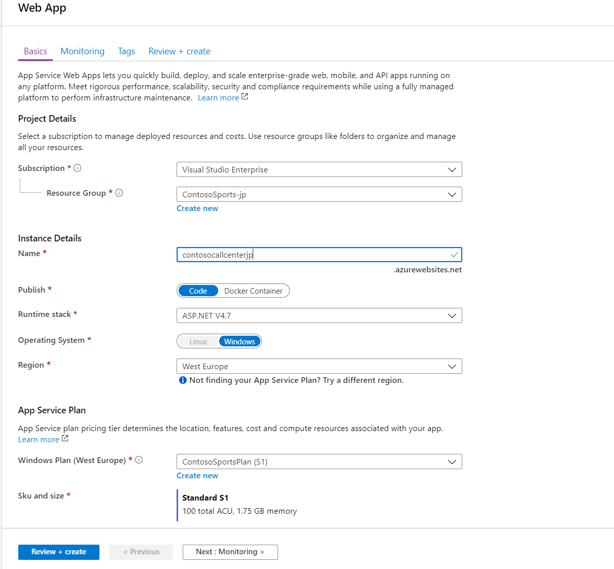

<div class="MCWHeader1">
Modern cloud apps
</div>

<div class="MCWHeader2">
Hands-on lab step-by-step
</div>

<div class="MCWHeader3">
September 2019
</div>

Information in this document, including URL and other Internet Web site references, is subject to change without notice. Unless otherwise noted, the example companies, organizations, products, domain names, e-mail addresses, logos, people, places, and events depicted herein are fictitious, and no association with any real company, organization, product, domain name, e-mail address, logo, person, place or event is intended or should be inferred. Complying with all applicable copyright laws is the responsibility of the user. Without limiting the rights under copyright, no part of this document may be reproduced, stored in or introduced into a retrieval system, or transmitted in any form or by any means (electronic, mechanical, photocopying, recording, or otherwise), or for any purpose, without the express written permission of Microsoft Corporation.

Microsoft may have patents, patent applications, trademarks, copyrights, or other intellectual property rights covering subject matter in this document. Except as expressly provided in any written license agreement from Microsoft, the furnishing of this document does not give you any license to these patents, trademarks, copyrights, or other intellectual property.

The names of manufacturers, products, or URLs are provided for informational purposes only and Microsoft makes no representations and warranties, either expressed, implied, or statutory, regarding these manufacturers or the use of the products with any Microsoft technologies. The inclusion of a manufacturer or product does not imply endorsement of Microsoft of the manufacturer or product. Links may be provided to third party sites. Such sites are not under the control of Microsoft and Microsoft is not responsible for the contents of any linked site or any link contained in a linked site, or any changes or updates to such sites. Microsoft is not responsible for webcasting or any other form of transmission received from any linked site. Microsoft is providing these links to you only as a convenience, and the inclusion of any link does not imply endorsement of Microsoft of the site or the products contained therein.

© 2019 Microsoft Corporation. All rights reserved.

Microsoft and the trademarks listed at <https://www.microsoft.com/en-us/legal/intellectualproperty/Trademarks/Usage/General.aspx> are trademarks of the Microsoft group of companies. All other trademarks are property of their respective owners.

**Contents**

<!-- TOC -->
- [Modern cloud apps hands-on lab step-by-step](#modern-cloud-apps-hands-on-lab-step-by-step)
  - [Abstract and learning objectives](#abstract-and-learning-objectives)
  - [Overview](#overview)
  - [Solution architecture](#solution-architecture)
  - [Requirements](#requirements)
  - [Help references](#help-references)
  - [Exercise 1: Proof of concept deployment](#exercise-1-proof-of-concept-deployment)
    - [Task 1: Deploy the e-commerce website, SQL Database, and storage](#task-1-deploy-the-e-commerce-website-sql-database-and-storage)
      - [Subtask 1: Create the Web App and SQL database instance](#subtask-1-create-the-web-app-and-sql-database-instance)
      - [Subtask 2: Provision the storage account](#subtask-2-provision-the-storage-account)
      - [Subtask 3: Update the configuration in the starter project](#subtask-3-update-the-configuration-in-the-starter-project)
      - [Subtask 4: Deploy the e-commerce Web App from Visual Studio](#subtask-4-deploy-the-e-commerce-web-app-from-visual-studio)
    - [Task 2: Setup SQL Database Geo-Replication](#task-2-setup-sql-database-geo-replication)
      - [Subtask 1: Add secondary database](#subtask-1-add-secondary-database)
      - [Subtask 2: Failover secondary SQL database](#subtask-2-failover-secondary-sql-database)
      - [Subtask 3: Test e-commerce Web App after Failover](#subtask-3-test-e-commerce-web-app-after-failover)
      - [Subtask 4: Revert Failover back to Primary database](#subtask-4-revert-failover-back-to-primary-database)
      - [Subtask 5: Test e-commerce Web App after reverting failover](#subtask-5-test-e-commerce-web-app-after-reverting-failover)
    - [Task 3: Deploying the Call Center admin website](#task-3-deploying-the-call-center-admin-website)
      - [Subtask 1: Provision the call center admin Web App](#subtask-1-provision-the-call-center-admin-web-app)
      - [Subtask 2: Update the configuration in the starter project](#subtask-2-update-the-configuration-in-the-starter-project)
      - [Subtask 3: Deploy the call center admin Web App from Visual Studio](#subtask-3-deploy-the-call-center-admin-web-app-from-visual-studio)
    - [Task 4: Deploying the payment gateway](#task-4-deploying-the-payment-gateway)
      - [Subtask 1: Provision the payment gateway API app](#subtask-1-provision-the-payment-gateway-api-app)
      - [Subtask 2: Deploy the Contoso.Apps.PaymentGateway project in Visual Studio](#subtask-2-deploy-the-contosoappspaymentgateway-project-in-visual-studio)
    - [Task 5: Deploying the Offers Web API](#task-5-deploying-the-offers-web-api)
      - [Subtask 1: Provision the Offers Web API app](#subtask-1-provision-the-offers-web-api-app)
      - [Subtask 2: Configure Cross-Origin Resource Sharing (CORS)](#subtask-2-configure-cross-origin-resource-sharing-cors)
      - [Subtask 3: Update the configuration in the starter project](#subtask-3-update-the-configuration-in-the-starter-project-1)
      - [Subtask 4: Deploy the Contoso.Apps.SportsLeague.Offers project in Visual Studio](#subtask-4-deploy-the-contosoappssportsleagueoffers-project-in-visual-studio)
    - [Task 6: Update and deploy the e-commerce website](#task-6-update-and-deploy-the-e-commerce-website)
      - [Subtask 1: Update the Application Settings for the Web App that hosts the Contoso.Apps.SportsLeague.Web project](#subtask-1-update-the-application-settings-for-the-web-app-that-hosts-the-contosoappssportsleagueweb-project)
      - [Subtask 2: Validate App Settings are correct](#subtask-2-validate-app-settings-are-correct)
  - [Exercise 2: Identity and Security](#exercise-2-identity-and-security)
    - [Task 1: Enable Azure AD Premium Trial](#task-1-enable-azure-ad-premium-trial)
    - [Task 2: Create a new Contoso user](#task-2-create-a-new-contoso-user)
    - [Task 3: Configure access control for the call center administration Web Application](#task-3-configure-access-control-for-the-call-center-administration-web-application)
      - [Subtask 1: Enable Azure AD Authentication](#subtask-1-enable-azure-ad-authentication)
      - [Subtask 2: Verify the call center administration website uses the access control logon](#subtask-2-verify-the-call-center-administration-website-uses-the-access-control-logon)
    - [Task 4: Apply custom branding for the Azure Active Directory logon page](#task-4-apply-custom-branding-for-the-azure-active-directory-logon-page)
    - [Task 5: Verify the branding has been successfully applied to the Azure Active Directory logon page](#task-5-verify-the-branding-has-been-successfully-applied-to-the-azure-active-directory-logon-page)
  - [Exercise 3: Enable Azure B2C for customer site](#exercise-3-enable-azure-b2c-for-customer-site)
    - [Task 1: Create a new directory](#task-1-create-a-new-directory)
    - [Task 2: Add a new application](#task-2-add-a-new-application)
    - [Task 3: Create Policies, Sign up](#task-3-create-policies-sign-up)
    - [Task 4: Create a sign-in policy](#task-4-create-a-sign-in-policy)
    - [Task 5: Create a profile editing policy](#task-5-create-a-profile-editing-policy)
    - [Task 6: Modify the Contoso.App.SportsLeague.Web](#task-6-modify-the-contosoappsportsleagueweb)
    - [Task 7: Send authentication requests to Azure AD](#task-7-send-authentication-requests-to-azure-ad)
    - [Task 8: Display user information](#task-8-display-user-information)
    - [Task 9: Run the sample app](#task-9-run-the-sample-app)
  - [Exercise 4: Enabling Telemetry with Application Insights](#exercise-4-enabling-telemetry-with-application-insights)
    - [Task 1: Configure the application for telemetry](#task-1-configure-the-application-for-telemetry)
      - [Subtask 1: Add Application Insights Telemetry to the e-commerce website project](#subtask-1-add-application-insights-telemetry-to-the-e-commerce-website-project)
      - [Subtask 2: Enable client side telemetry](#subtask-2-enable-client-side-telemetry)
      - [Subtask 3: Deploy the e-commerce Web App from Visual Studio](#subtask-3-deploy-the-e-commerce-web-app-from-visual-studio)
    - [Task 2: Creating the web performance test and load test](#task-2-creating-the-web-performance-test-and-load-test)
      - [Subtask 1: Create the load test](#subtask-1-create-the-load-test)
      - [Subtask 2: View the Application Insights logs](#subtask-2-view-the-application-insights-logs)
  - [Exercise 5: Automating backend processes with Azure Functions and Logic Apps](#exercise-5-automating-backend-processes-with-azure-functions-and-logic-apps)
    - [Task 1: Create an Azure Function to Generate PDF Receipts](#task-1-create-an-azure-function-to-generate-pdf-receipts)
    - [Task 2: Create an Azure Logic App to Process Orders](#task-2-create-an-azure-logic-app-to-process-orders)
    - [Task 3: Use Twilio to send SMS Order Notifications](#task-3-use-twilio-to-send-sms-order-notifications)
      - [Subtask 1: Configure your Twilio trial account](#subtask-1-configure-your-twilio-trial-account)
      - [Subtask 2: Create a new logic app](#subtask-2-create-a-new-logic-app)
  - [After the hands-on lab](#after-the-hands-on-lab)
    - [Task 1: Delete resources](#task-1-delete-resources)

<!-- /TOC -->

# Modern cloud apps hands-on lab step-by-step

## Abstract and learning objectives

In this hands-on lab, you will be challenged to implement an end-to-end scenario using a supplied sample that is based on Azure App Services, Microsoft Azure Functions, Azure SQL Database, Azure Logic Apps, and related services. The scenario will include implementing compute, storage, workflows, and monitoring, using various components of Microsoft Azure. 

Please note that as opposed to the whiteboard design session, the lab is not focused on maintaining PCI compliance and using more advanced security features such as App Service Environment, Network Security Groups, and Application Gateway. The hands-on lab can be implemented on your own, but it is highly recommended to pair up with other members working on the lab to model a real-world experience and to allow each member to share their expertise for the overall solution.

By the end of this hands-on lab, you will have learned how to use several key services within Azure to improve overall functionality of the original solution, and to increase the security and scalability of the new and improved design.

## Overview

The Cloud Workshop: Modern Cloud Apps lab is a hands-on exercise that will challenge you to implement an end-to-end scenario using a supplied sample that is based on Microsoft Azure App Services and related services. The scenario will include implementing compute, storage, security, and scale using various components of Microsoft Azure. The lab can be implemented on your own, but it is highly recommended to pair up with additional team members to more closely model a real-world experience, and to allow members to share their expertise for the overall solution.

## Solution architecture


## Requirements

1. Microsoft Azure subscription
2. Local machine or a virtual machine configured with Visual Studio 2019 Community Edition
3. Twilio account and/or personal cell phone to setup a trial Twilio account

## Help references

|    |            |
|----------|:-------------|
| **Description** | **Links** |
| SQL firewall | <https://azure.microsoft.com/en-us/documentation/articles/sql-database-configure-firewall-settings/> |
| Deploying a Web App | <https://azure.microsoft.com/en-us/documentation/articles/web-sites-deploy/> |
| Deploying an API app | <https://azure.microsoft.com/en-us/documentation/articles/app-service-dotnet-deploy-api-app/> |
| Accessing an API app from a JavaScript client | <https://azure.microsoft.com/en-us/documentation/articles/app-service-api-javascript-client/> |
| SQL Database Geo-Replication overview | <https://azure.microsoft.com/en-us/documentation/articles/sql-database-geo-replication-overview/> |
| What is Azure AD? | <https://azure.microsoft.com/en-us/documentation/articles/active-directory-whatis/> |
| Azure Web Apps authentication | <http://azure.microsoft.com/blog/2014/11/13/azure-websites-authentication-authorization/> |
| View your access and usage reports | <https://msdn.microsoft.com/en-us/library/azure/dn283934.aspx> |
| Custom branding an Azure AD Tenant | <https://msdn.microsoft.com/en-us/library/azure/Dn532270.aspx> |
| Service Principal Authentication | <https://docs.microsoft.com/en-us/azure/app-service-api/app-service-api-dotnet-service-principal-auth> |
| Consumer Site B2C | <https://docs.microsoft.com/en-us/azure/active-directory-b2c/active-directory-b2c-devquickstarts-web-dotnet> |
| Getting Started with Active Directory B2C | <https://azure.microsoft.com/en-us/trial/get-started-active-directory-b2c/> |
| How to Delete an Azure Active Directory | <https://blog.nicholasrogoff.com/2017/01/20/how-to-delete-an-azure-active-directory-add-tenant/> |
| Run performance tests on your app | <http://blogs.msdn.com/b/visualstudioalm/archive/2015/09/15/announcing-public-preview-for-performance-load-testing-of-azure-webapp.aspx> |
| Application Insights Custom Events | <https://azure.microsoft.com/en-us/documentation/articles/app-insights-api-custom-events-metrics/> |
| Enabling Application Insights | <https://azure.microsoft.com/en-us/documentation/articles/app-insights-start-monitoring-app-health-usage/> |
| Detect failures | <https://azure.microsoft.com/en-us/documentation/articles/app-insights-asp-net-exceptions/> |
| Monitor performance problems | <https://azure.microsoft.com/en-us/documentation/articles/app-insights-web-monitor-performance/> |
| Creating a Logic App | <https://azure.microsoft.com/en-us/documentation/articles/app-service-logic-create-a-logic-app/> |
| Logic app connectors | <https://azure.microsoft.com/en-us/documentation/articles/app-service-logic-connectors-list/> |
| Logic Apps Docs | <https://docs.microsoft.com/en-us/azure/logic-apps/logic-apps-what-are-logic-apps> |
| Azure Functions -- create first function | <https://docs.microsoft.com/en-us/azure/azure-functions/functions-create-first-azure-function> |
| Azure Functions docs | <https://docs.microsoft.com/en-us/azure/logic-apps/logic-apps-azure-functions> |

## Exercise 1: Proof of concept deployment

Duration: 60 minutes

Contoso has asked you to create a proof of concept deployment in Microsoft Azure by deploying the web, database, and API applications for the solution as well as validating that the core functionality of the solution works. Ensure all resources use the same resource group previously created for the App Service Environment.

### Task 1: Deploy the e-commerce website, SQL Database, and storage

In this exercise, you will provision a website via the Azure **Web App + SQL** template using the Microsoft Azure Portal. You will then edit the necessary configuration files in the starter project and deploy the e-commerce website.

#### Subtask 1: Create the Web App and SQL database instance

1. Navigate to the Azure Management portal, [http://portal.azure.com](http://portal.azure.com/), using a new tab or instance and login with your lab-provided Azure credentials.

2. In the navigation menu to the left, select **+Create a resource** and in the Marketplace search text box, enter **Web App + SQL** and select the appropriate auto-suggestion.

    

3. In the new product blade, select **Create**.

    

4. On the Web App blade, specify the following configuration:

   - A unique and valid name (until the green check mark appears). We've used ContosoAp2010. Make note of your selection.

   - Select **contososports** resource group.

   - **ContosoSportsPlan** as a new App Service Plan. Make sure it's in the same location as the **contososports** resource group you created earlier. Use the default **Standard S1** pricing tier.

    

    - Select **OK**

5. Select **SQL Database *Configure required settings***, and then **+ Create a new database**.

    

6. On the **SQL Database** blade, specify **ContosSportsDB** as the database name and then select **Target** **Server *Configure required settings***.

    

7. On the **New server** blade, specify the following configuration:

   - Server name: **A unique value (ensure the green checkmark appears)**

   - Server admin login: **demouser**

   - Password and Confirm Password: **Password.1!!**

   - Ensure the **Target server** is the same region as the Web app.

8. Once the values are accepted in the **New server** blade, click **Select**.

    

9. On the **SQL Database** blade, click **Select**.

    

11. Application Insights should be disabled.

    

12. After the values are accepted on the **Web App + SQL** creation blade, check select **Create**.

    

    >**Note**: This may take a couple minutes to provision the Web App and SQL Database resources.

    

12. After the Web App and SQL Database are provisioned, click **SQL databases** in the left-hand navigation menu followed by the name of the SQL Database you just created and select it.

    

13. On the **SQL Database** blade, click the **Show database connection strings** link.

    

14. On the **Database connection strings** blade, select and copy the **ADO.NET** connection string. Then, save it in **Notepad** for use later, being sure to replace the placeholders with your username and password with **demouser** and **Password.1!!**, respectively.

    

15. On the **Overview** screen of the **SQL Server** blade, click **Set server firewall** link at the top.

    

16. On the **Firewall Settings** blade, specify a new rule named **ALL**, with START IP **0.0.0.0**, and END IP **255.255.255.255**.

    

    >**Note**: This is only done to make the lab easier to do. In production, you do **NOT** want to open up your SQL Database to all IP Addresses this way. Instead, you will want to specify just the IP Addresses you wish to allow through the Firewall.

17. Click **Save**.

    

18. Update progress can be found by clicking on the **Notifications** link located at the top of the page.

    

19. Close all configuration blades.

#### Subtask 2: Provision the storage account

>**Note:** You can skip the storage account provisioning steps if you use the storage account created during the Lab VM provisioning.

1. Using a new tab or instance of your browser, navigate to the Azure Management portal <http://portal.azure.com>.

2. From the navigation menu to the left, click **Storage Accounts** and then click **+Add** at the top of the new blade.

    

3. On the **Create storage account** blade, specify the following configuration options:

   - Name: Unique value for the storage account (ensure the green check mark appears).

   - Specify the existing resource group **contososports**.

   - Specify the same **Location** as the Contoso Sports resource group.

   - Accept the defaults for all other settings.

    

4. Click **Review + create**.

    

5. Click **Create** after Validation passed.

    

6. Once the storage account has completed provisioning, open the storage account by clicking **Storage accounts** in the navigation menu to the left and clicking on the storage account name.

    

7. On the **Storage account** blade, scroll down, and, under the **SETTINGS** menu area, select the **Access keys** option.

    

8. On the **Access keys** blade, click the copy button by the **Connection String** field in the **key1** section. Paste the value into **Notepad** for later usage. 

    

#### Subtask 3: Update the configuration in the starter project

1. In the Azure Portal, click on **Resource Groups**. Then, click on the **contososports** resource group.

    

2. Click on the **Web App** (App Service type) created previously.

    

3. Copy the web app URL to Notepad.

    - Click on the **Overview** link.
    - Copy the URL to Notepad for later use. Use the **Copy to clipboard** link.

    

4. On the **App Service** blade, scroll down in the left pane. Under the **Settings** menu, click on **Configuration**.

    

6. Add a new **Application setting** with the following values:

   - Key: `AzureQueueConnectionString`

   - Value: Enter the Connection String for the **Azure Storage Account** just created.

    

7. Locate **Connection Strings** section below **Application Settings**.

    

8. Add a new **Connection String** with the following values:

   - Name: `ContosoSportsLeague`

   - Value: **Enter the Connection String for the SQL Database just created**

   - Type: `SQLAzure`

    >**Important**: Ensure you replace the string placeholder values **{your\_username}** **{your\_password\_here}** with the username and password you setup during previously.

    

9. Click **Save**.

#### Subtask 4: Deploy the e-commerce Web App from Visual Studio

1. Navigate to the **Contoso.Apps.SportsLeague.Web** project located in the **Web** folder using the **Solution Explorer** of Visual Studio.

    

2. Right-click the **Contoso.Apps.SportsLeague.Web** project, and click **Publish**.

    >Note: Don't publish if the configuration does not show your settings. Choose **New Profile** to publish to your Azure portal.
    > 

3. Choose **Azure App Service** as the publish target, and choose **Select Existing** and then **Publish** at the bottom of the wizard.

    

    

4. If prompted, log on with your Azure Subscription credentials.

    >**Note:** If you Sign In and nothing happens, shut down Visual Studio reopen to the solution. Repeat the publishing steps.

5. Select the **Contoso Sports Web App** (with the name you created previously).

    

6. Click **OK**, and click **Publish** to publish the Web application.

7. In the Visual Studio **Output** view, you will see a status that indicates the Web App was published successfully.

    

    >**Note:** Your URL will differ from the one shown in the Output screenshot because it has to be globally unique.

8. A new browser should automatically open the new web applications. Validate the website by clicking the **Store** link on the menu. You should see product items. As long as products return, the connection to the database is successful.

    

    >**Troubleshooting**: If the web site fails to show products, go back and double check all of your connection string entries and passwords web application settings.

### Task 2: Setup SQL Database Geo-Replication

In this exercise, the attendee will provision a secondary SQL Database and configure Geo-Replication using the Microsoft Azure Portal.

#### Subtask 1: Add secondary database

1. Using a new tab or instance of your browser, navigate to the Azure Management Portal <http://portal.azure.com>.

2. Click **SQL databases** in the navigation menu to the left, and click the name of the SQL Database you created previously.

    

3. Under the **SETTINGS** menu area, click on **Geo-Replication**.

    

4. Select the Azure Region to place the Secondary within.

    

    The Secondary Azure Region should be the Region Pair for the region the SQL Database is hosted in. Consult <https://docs.microsoft.com/en-us/azure/best-practices-availability-paired-regions> to see which region pair the location you are using for this lab is in.

    >**Note**: If you choose a region that cannot be used as a secondary region, you will not be able to pick a pricing plan. Choose another region.

    

5. On the **Create secondary** blade, select **Secondary Type** as **Readable**.

6. Select **Target server** ***Configure required settings***.

    

7. On the **New server** blade, specify the following configuration:

   - Server name: **A unique value (ensure the green checkmark appears)**

   - Server admin login: **demouser**

   - Password and Confirm Password: **Password.1!!**

    

8. Once the values are accepted in the **New server** blade, click **Select**.

    

9. On the **Create secondary** blade, click **OK**.

    

    > **NOTE:** The Geo-Replication will take a few minutes to complete.

10. After the Geo-Replication has finished provisioning, click **SQL Databases** in the navigation menu to the left.

    

11. Click the name of the Secondary SQL Database you just created.

    

12. On the **SQL Database** blade, click the **Show database connection strings** link.

    

13. On the **Database connection strings** blade, select and copy the **ADO.NET** connection string, and save it in Notepad for use later.

    

14. On the SQL database blade in the Essentials section, click the SQL Database Server name link.

    

15. On the **SQL Server** blade, click **Set Server Firewall** at the top.

    

16. On the **Firewall Settings** blade, specify a new rule named **ALL**, with START IP **0.0.0.0**, and END IP **255.255.255.255**.

    

17. Click **Save**.

    

18. Update progress can be found by clicking on the **Notifications** link located at the top of the page.

    

19. Close all configuration blades.

#### Subtask 2: Failover secondary SQL database

>**Note:** This is optional.

Since the Replication and Failover process can take anywhere from 10 to 30 minutes to complete, you have the choice to skip Subtask 2 through 5, and skip directly to Task 3. However, if you have the time, it is recommended that you complete these steps.

1. Using a new tab or instance of your browser, navigate to the Azure Management Portal <http://portal.azure.com>.

2. In the navigation menu to the left, click **SQL databases**, and click the name of the *primary* SQL Database you created previously.

    

3. On the **Settings** blade, click **Geo-Replication**.

    

4. On the **Geo-Replication** blade, select the *secondary* database.

    

5. Click the **Forced Failover** button.

    

6. On the **Forced Failover** prompt, click **Yes**.

    

The failover may take a few minutes to complete. You can continue with the next Subtask modifying the Web App to point to the Secondary SQL Database while the Failover is pending.

#### Subtask 3: Test e-commerce Web App after Failover

1. Once completed, in the Azure Portal, click on **SQL databases**, and select the NEW **ContosoSportsDB** secondary.

    

2. Next, click on **Show database connection strings**, and copy it off thereby replacing the user and password.

    

3. From the Azure portal, click on **Resource Groups**, and select **contososports**.

    

4. Click on the **Web App** created earlier.

5. On the **App Service** blade, scroll down in the left pane, and click on **Configuration settings**.

    

6. Scroll down, and locate the **Connection strings** section.

7. Update the **ContosoSportsLeague** Connection String to the value of the **original Secondary Azure SQL Database**.

    

    >**Note**: Ensure you replace the string placeholder values **{your\_username}** and **{your\_password\_here}** with the username and password you respectively setup during creation (demouser & Password.1!!).

    

8. Click the **Save** button.

9. On the **App Service** blade, click on **Overview**.

    

10. On the **Overview** pane, click on the **URL** for the Web App to open it in a new browser tab.

    

11. After the e-commerce Web App loads in Internet Explorer, click on **STORE** in the top navigation bar of the website.

    

12. Verify the product list from the database displays.

    

#### Subtask 4: Revert Failover back to Primary database

1. Using a new tab or instance of your browser, navigate to the Azure Management Portal <http://portal.azure.com>.

2. In the new **SQL databases**, and click the name of the SQL Database you created previously.

    

3. On the **Settings** blade, click **Geo-Replication**.

    

4. On the **Geo-Replication** blade, select the Secondary database.

    

5. Click the **Forced Failover** button.

    

6. On the **Forced Failover** prompt, click **Yes**.

    

The failover may take a few minutes to complete. You can continue with the next Subtask modifying the Web App to point back to the Primary SQL Database while the Failover is pending.

#### Subtask 5: Test e-commerce Web App after reverting failover

1. In the Azure Portal, click on **Resource Groups** **\>** **contososports** resource group.

    

2. Click on the **Web App** created in a previous step.

3. On the **App Service** blade, scroll down in the left pane, and click on **Configuration settings**.

    

4. Scroll down, and locate the **Connection strings** section.

5. Update the **ContosoSportsLeague** Connection String back to the value of the Connection String for the **original Primary SQL Database**.

    

    > **Note**: Ensure you replace the string placeholder values **{your\_username}** **{your\_password\_here}** with the username and password you respectively setup during creation (demouser & Password.1!!).

    

6. Click **Save**.

    

7. On the **App Service** blade, click on **Overview**.

    

8. On the **Overview** pane, click on the **URL** for the Web App to open it in a new browser tab.

    

9. After the e-commerce Web App loads in Internet Explorer, click on **STORE** in the top navigation bar of the website.

    

10. Verify the product list from the database displays.

    

### Task 3: Deploying the Call Center admin website

In this exercise, you will provision a website via the Azure Web App template using the Microsoft Azure Portal. You will then edit the necessary configuration files in the Starter Project and deploy the call center admin website.

#### Subtask 1: Provision the call center admin Web App 

1. Using a new tab or instance of your browser, navigate to the Azure Management portal <http://portal.azure.com>.

2. Select **+Create a new resource** **\>** **Web** **\>** **Web App**.

   

3. Specify a **unique URL** for the Web App, and ensure the **same App Service Plan** and **resource group** you have used throughout the lab are selected.

    

4. Click on **Windows Plan**, and select the **ContosoSportsPlan** used by the front-end Web app.

5. After the values are accepted, click **Review and create**, then **Create**.  It will take a few minutes to provision.

#### Subtask 2: Update the configuration in the starter project

1. Navigate to the **App Service** blade for the Call Center Admin App just provisioned.

    

2. On the **App Service** blade, click on **Configuration** in the left pane.

    

3. Scroll down, and locate the **Connection strings** section.

4. Add a new **Connection string** with the following values:

    - Name: `ContosoSportsLeague`

    - Value: **Enter the Connection String for the primary SQL Database**.

    - Type: `SQL Azure`

    

    >**Note**: Ensure you replace the string placeholder values **{your\_username}** **{your\_password\_here}** with the username and password you respectively setup during creation (demouser & Password.1!!).

    

    - Click the **Update** button.

5. Click the **Save** button.

    

#### Subtask 3: Deploy the call center admin Web App from Visual Studio

1. Navigate to the **Contoso.Apps.SportsLeague.Admin** project located in the **Web** folder using the **Solution Explorer** in Visual Studio.

2. Right-click the **Contoso.Apps.SportsLeague.Admin** project, and click **Publish**.

    

3. Choose **App Service** as the publish target, choose **Select Existing**, then click **Publish**

    

4. Select the **Web App** for the Call Center Admin App.

    

5. Click **OK** to deploy the site.

    

6. Once deployment is complete, navigate to the Web App. It should look like the following:

    

### Task 4: Deploying the payment gateway

In this exercise, the attendee will provision an Azure API app template using the Microsoft Azure Portal. The attendee will then deploy the payment gateway API to the API app.

#### Subtask 1: Provision the payment gateway API app

1. Using a new tab or instance of your browser, navigate to the Azure Management Portal <http://portal.azure.com>.

2. Click **+Create a resource**, type **API App** into the marketplace search box, and press **Enter**.  Click the **Create** button.

    

3. On the new **API App** blade, create the following values:

   - **App name:** Specify a unique name for the App Name.
   - **Subscription:** Your Azure MSDN subscription.
   - **Resource Group:** select **Use existing** option.
   - **App Service Plan/Location** Select the same primary region used in previous steps.
   - **Application Insights:** **Disabled**

    

4. After the values are accepted, click **Create**.  It will take a few minutes to provision.

#### Subtask 2: Deploy the Contoso.Apps.PaymentGateway project in Visual Studio

1. Navigate to the **Contoso.Apps.PaymentGateway** project located in the **APIs** folder using the **Solution Explorer** in Visual Studio.

2. Right-click the **Contoso.Apps.PaymentGateway** project, and click **Publish**.

    

3. On the **Publish Web** dialog box, click **Azure App Service**, then choose **Select Existing**, and select **Publish**.

    > **NOTE:** If your Azure resource group does not show, choose **New Profile**.

4. Select the Payment Gateway API app created earlier, click **OK**.

    

5. In the Visual Studio **Output** view, you will see a status indicating the Web App was published successfully.

    

6. Copy and paste the gateway **URL** of the deployed **API App** into Notepad for later use.

7. Viewing the Web App in a browser will display the following web page:

   

### Task 5: Deploying the Offers Web API

In this exercise, the attendee will provision an Azure API app template using the Microsoft Azure Portal. The attendee will then deploy the Offers Web API.

#### Subtask 1: Provision the Offers Web API app

1. Using a new tab or instance of your browser, navigate to the Azure Management Portal (<http://portal.azure.com>).

2. In the navigation menu to the left, click **+Create a resource** -\> **Web** -\> **API App**.

3. On the new **API App** blade, specify a unique name for the **API App**, and ensure the previously used Resource Group and App Service Plan are selected.

    

4. After the values are accepted, click the **Create** button.

5. When the Web App template has completed provisioning, open the new API App by, in the navigation menu to the left,
click **App Services** and then clicking the Offer API app you just created.

   

#### Subtask 2: Configure Cross-Origin Resource Sharing (CORS)

1. On the **App Service** blade for the Offers API, under the **API** menu section, scroll down and click **CORS**.

    

2. In the **Allowed Origins** text box, specify `*` to allow all origins, and click **Save**.

    >**Note**: You should not normally do this in a production environment.

    

#### Subtask 3: Update the configuration in the starter project

1. On the **App Service** blade for the Offers API, click on **Configuration**.

    

2. In the **Connection Strings** section, add a new **Connection string** with the following values:

      - Name: `ContosoSportsLeague`

      - Value: **Enter the Connection String for the SQL Database that was created**.

      - Type: `SQL Azure`

        

        >**Note**: Ensure you replace the string placeholder values **{your\_username}** **{your\_password\_here}** with the username and password you respectively setup during creation (demouser & Password.1!!).

        

      - Click the **Update** button.

3. Click the **Save** button.

    

#### Subtask 4: Deploy the Contoso.Apps.SportsLeague.Offers project in Visual Studio

1. Navigate to the **Contoso.Apps.SportsLeague.Offers** project located in the **APIs** folder using the **Solution Explorer** in Visual Studio.

2. Right-click the **Contoso.Apps.SportsLeague.Offers** project, and select **Publish**.

    

3. On the **Publish Web** dialog box, click **Azure App Service**, choose **Select Existing**, and select **Publish**.

    

4. Select the Offers API app created earlier, and click **OK** **\>** **Publish**.

    

5. In the Visual Studio **Output** view, you will see a status the API app was published successfully.

6. Record the value of the deployed API app URL into Notepad for later use.

7. Your browser should open and display the following web page:

   

### Task 6: Update and deploy the e-commerce website

#### Subtask 1: Update the Application Settings for the Web App that hosts the Contoso.Apps.SportsLeague.Web project

1. Using a new tab or instance of your browser, navigate to the Azure Management Portal <http://portal.azure.com>.

2. Click on **Resource groups** **\>** **contososports** resource group.

    

3. Click on the **App Service Web App** for the front-end web application.

    

4. On the **App Service** blade, scroll down, and click on **Configuration** in the left pane.

    

5. Scroll down, and locate the **Applications settings** section.

    

6. Add a new **Application Setting** with the following values:

   - App Setting Name: `paymentsAPIUrl`

   - Value: Enter the **HTTPS** URL for the Payments API App with `/api/nvp` appended to the end.

        >**Example**: `https://paymentsapi0.azurewebsites.net/api/nvp`

    

7. Add another **Application Setting** with the following values:

   - App Setting Name: `offersAPIUrl`

   - Value: Enter the **HTTPS** URL for the Offers API App with `/api/get` appended to the end

    >**Example**: `https://offersapi4.azurewebsites.net/api/get`

    

    >**Note**: Ensure both of the API URLs are using **SSL** (https://), or you will see a CORS errors.

8. Click on **Save**.

#### Subtask 2: Validate App Settings are correct

1. On the **App Service** blade, click on **Overview**.

    

2. In the **Overview** pane, click on the **URL** for the Web App to open it in a new browser tab.

    

3. On the homepage, you should see the latest offers populated from the Offers API.

    

4. Submit several test orders to ensure all pieces of the site are functional.  **Accept the default data during the payment processing.**

    

>**Leader Note:** If the attendee is still experiencing CORS errors, ensure the URLs to the Web App in Azure local host are exact.

## Exercise 2: Identity and Security

Duration: 75 Minutes

The Contoso call center admin application will only be accessible by users of the Contoso Active Directory environment. You have been asked to create a new Azure AD Tenant and secure the application so only users from the tenant can log on.

### Task 1: Enable Azure AD Premium Trial

>**Note**: This task is **optional**, and it is valid only if you are a global administrator on the Azure AD tenant associated with your subscription.

1. Navigate to the Azure Management portal, [http://portal.azure.com](http://portal.azure.com/), using a new tab or instance.

2. In the left-hand navigation menu, click **Azure Active Directory**.

    

3. On the **Azure Active Directory** blade, locate and click on the **Company branding** option.

    

4. In the right pane, click the **Get a free Premium trial...** link.

    

    If you already have a Premium Azure Active Directory, skip to Task 2.

5. On the **Activate** blade, click on the **Free Trial** link within the **Azure AD Premium P2**, then click **Activate**.

    

6. Close the **Azure Active Directory** blades.

### Task 2: Create a new Contoso user

>**Note**: This task is **optional**, and it is valid only if you are a global administrator on the Azure AD tenant associated with your subscription.

1. Navigate to the Azure Management portal, [http://portal.azure.com](http://portal.azure.com/), using a new tab or instance

2. Click **Azure Active Directory** in the navigation menu to the left.

    

3. On the **Azure Active Directory** blade, click on **Custom Domain names**.

    

4. Copy the **Domain Name** for your Azure AD Tenant. It will be in the format: *[your tenant\].onmicrosoft.com*.
    This will be used for creating the new user's Username.

    

5. On the **Azure Active Directory** blade, click on **Users**.

    

6. Click on **+ New User** to add a new user.

    

7. On the **User** blade, specify a user's **Name** and **Username**. Specify the **Username** to be at the domain name for your Azure AD Tenant. For example: *tbaker@\[your tenant\].onmicrosoft.com*.

    

8. Click on the **Show Password** checkbox, and make a note of the password for use later.

    

9. Click **Create**.

    

### Task 3: Configure access control for the call center administration Web Application

>**Note**: This task is **optional**, and it is valid only if you have the right to create applications in your Azure AD Tenant.

#### Subtask 1: Enable Azure AD Authentication

1. On the left navigation of the Azure Portal, select **App Services**.

    

2. On the **Web Apps** page, select the **Call Center Administration Web app**.

    

3. Click the **Authentication / Authorization** tile.

    

4. Change **App Service Authentication** to **On**, and change the dropdown to **Log in with Azure Active Directory**.

    

5. Click on the **Azure Active Directory**.

    

6. On the **Azure Active Directory Settings** blade, change **Management mode** to **Express**.

    

7. Click **OK**.

    

8. Change the **Action to take when request is not authenticated** option to **Login with Azure Active Directory**.

    

9. In the **Authentication / Authorization** blade, click **Save**.

    

#### Subtask 2: Verify the call center administration website uses the access control logon

1. Close your browser (or use an alternative), and launch a browser is InPrivate or Incognito mode. Navigate to the **Call Center Administration** website.

2. The browser will redirect to the non-branded Access Control logon URL. You can log on with your Microsoft account or the **Contoso test user** you created earlier.

    

3. After you log on and **accept the consent**, your browser will be redirected to the Contoso Sports League Admin webpage.

    

4. Verify in the upper-right corner you see the link **Logged In**. If it is not configured, you will see **Sign in**.

     

### Task 4: Apply custom branding for the Azure Active Directory logon page

>**Note**: this task is **optional**, and it is valid only if you are a global administrator on the Azure AD tenant associated with your subscription, and you completed the Enabling Azure AD Premium exercise.

1. Navigate to the Azure Management portal, [http://portal.azure.com](http://portal.azure.com/), using a new tab or instance.

2. In the navigation menu to the left, select **Azure Active Directory**.

    

3. On the **Azure Active Directory** blade, click on **Company branding**.

    

4. Click on the **Configure...** information box.

    

5. On the **Configure company branding** blade, select the `default_signin_illustration.jpg` image file from `C:\MCW` for the **Sign-in page image**.

    

6. Select the `logo-60-280.png` image file from the supplementary files for the **Banner image**.

    

7. Click **Save**.

    

### Task 5: Verify the branding has been successfully applied to the Azure Active Directory logon page

1. Close any previously authenticated browser sessions to the call center administration website, reopen using InPrivate or Incognito mode, and navigate to the **call center administration** website.

2. The browser will redirect to the branded access control logon URL.

    

3. After you log on, your browser will be redirected to the Contoso Sports League Admin webpage.

    

4. Verify in the upper-right corner you see the link **Logged in**.

    

    >**Note:** If you run the app using localhost, ensure connection strings for all of the web.config files in the solution have the placeholders removed with actual values. Search on web.config in the Visual Studio Solution Explorer to come up with the list.

    

## Exercise 3: Enable Azure B2C for customer site

Duration: 75 minutes

In this exercise, you will configure an Azure AD Business to Consumer (B2C) instance to enable authentication and policies for sign-in, sign-out and profile policies for the Contoso E-Commerce site.

### Task 1: Create a new directory

1. Log in to the Azure portal by using your existing Azure subscription or by starting a free trial. In the left-hand navigation menu, click **+Create a resource**. Then, search for and select **Azure Active Directory B2C** and click **Create** on the new blade that pops up.

    

2. In the new blade, select **Create a new Azure AD B2C Tenant**. Then, enter the name as **ContosoB2C** and a unique domain name and region. Then, click **Create**. After directory creation completes, click the link in the new information tile that reads **Click here to manage your new directory**.

    

    

3. Click on the orange **No Subscription** message for instructions on how to link to an active subscription.

    

    

    >**Note**: Essentially, you will need to switch back to your previous Azure AD tenant, and then launch the Azure AD B2C creation wizard again.

4. Click on **Link an existing Azure AD B2C Tenant to my Azure subscription,** and select the Tenant you just created in the dropdown list and the existing resource group **contososports**. Then, click **Create**.

    

5. After creation completes, open the new Azure AD B2C tenant by clicking **Resource Groups** in the navigation menu to the left and, then, **contososports**. Then, in the new blade, click the B2C tenant you just created.

    

6. In the new blade, click the **B2C Settings** tile for the new B2C tenant. You will be taken to the new subscription for this tenant.

    

7. In the new tab that opened, under the **MANAGE** menu area of the open **Azure AD B2C** blade, select **Applications**. Then, in the new pane, click **+Add**.

    

### Task 2: Add a new application

1. Specify the following configuration options for the Web App:

   - Name: **Contoso B2C Application**

   - Reply URL: **https://\[your web url\].azurewebsites.net** (This should be the HTTPS URL to the Contoso E-Commerce Site.)

   - Include Web App / web API: **Yes**

   - Allow Implicit Flow: **Yes**

    

2. Click **Create**.

3. Back on the **Azure AD B2C** blade in the **Applications** screen, copy the  application ID of your new application to Notepad to use later. Keep this tab open for the next task.

     

### Task 3: Create Policies, Sign up

1. Navigate back to the **Azure AD B2C** blade that was opened in the last task.

2. To enable sign-up on your application, you will need to create a sign-up policy. This policy describes the experiences consumers will go through during sign-up and the contents of tokens the application will receive on successful sign-ups. Click **User flows (policies)** link on the left menu and then **+New user flow** link at the top of the blade.

    

    - Click the **Sign up and sign in** link.
  
    

3. Enter **SignUp** in the **Name** field.

    

4. Click **Identity providers**, and select **Email Signup**. Optionally, you can also select social identity providers (if previously configured for the tenant). Click **OK**.

    

5. **Multifactor authentication** set to **Disabled**.
6. **User attributes and claims**.
    - Click the **Show more...** link

    

   - Select the following **Collect attributes**:

      - **Country/Region**
      - **Display Name**
      - **Postal Code**

7. Select **Return claims**:

    - **Display Name**
    - **Identity Provider**
    - **Postal Code**
    - **User is new**
    - **User's Object ID**
  
8. Review your selections, click **OK**.

    

9. Click **Create**. Observe the policy just created appears as **B2C\_1\_SignUp** (the **B2C\_1\_** fragment is automatically added) in the **Sign-up policies** blade.

    >**Note**: The page may take a few minutes to load/refresh after you start creating the policy.

    

10. Open the policy by clicking the link in the list e.g. **B2C\_1\_SignUp**.

11. Click **Run user flow** and open the dialog.
    

12. **Run user flow** - Choose application and run user flow. 

    

    - Test user flow

    

    - Click **Sign up now**.

    

### Task 4: Create a sign-in policy

To enable ``sign-in`` on your application, you will need to create a ``sign-in`` policy. This policy describes the experiences consumers will go through during sign-in and the contents of tokens the application will receive on successful sign-ins. Many of the previous steps will be repeated for this policy.

1. Click **User flows (polices)** link on the left blade.

2. Click **+ New user flow** link at the top of the blade.

3. Click the **All** tab link.

    

4. Click **Sign in**.
5. Enter **Name** value **SignIn**.
6. Select the Local Account Sign-in checkbox.

    

7. Click **Show more...**. Here you choose return claims that you want returned in the tokens sent back to your application after a successful sign-in experience. For now, select:

    - **Display Name**
    - **Identity Provider**
    - **Postal Code**
    - **User's Object ID**

    

      - Click the **OK** button.

8. Click **Create**. Observe the policy just created appears as **B2C\_1\_SignIn** (the **B2C\_1\_** fragment is automatically added) in the **Sign-in policies** blade.

9. Open the policy by clicking **B2C\_1\_SignIn**.

10. You should see the **Contonso B2C Application** selected from the dropdown, if not choose it.  Leave the defaults selected.

11. Click **Run user flow**. A new browser tab opens, and you can run through the consumer experience of signing into your application.

    

### Task 5: Create a profile editing policy

To enable profile editing on your application, you will need to create a profile editing policy. This policy describes the experiences that consumers will go through during profile editing and the contents of tokens that the application will receive on successful completion.

1. Click **User flows (polices)** link on the left blade.

2. Click **+ New user flow** link at the top of the blade.

3. Click the **All** tab link.

    

4. The Name determines the profile editing policy name used by your application. For example, enter **EditProfile**.

5. Click Identity providers, and select \"**Local Account SignIn**."

    

6. Click the Show more... link

7. Click **Collect attributes**. Here, you choose attributes the consumer can view and edit. For now, select:

    - **Country/Region**
    - **Display Name**
    - **Job Title**
    - **Postal Code**
    - **State/Province**
    - **Street Address**

8. Click **Return claims**. Here, you choose claims you want returned in the tokens sent back to your application after a successful profile editing experience. For now, select:

    - **Display Name**
    - **Postal Code**

    

    Click **OK**.

9. Click **Create**. Observe the policy just created appears as \"**B2C\_1\_EditProfile**\" (the **B2C\_1\_** fragment is automatically added) in the **Profile editing policies** blade.

10. Open the policy by clicking **B2C\_1\_EditProfile**.

11. Select **Contoso B2C application** in the **Select Application** drop-down.

12. Click **Run user flow**. A new browser tab opens, and you can run through the profile editing consumer experience in your application.

### Task 6: Modify the Contoso.App.SportsLeague.Web

1. Expand the **Contoso.Apps.SportsLeague.Web** project. Find the **Web.config** file and update the AppSetting key, ```<add key="owin:AutomaticAppStartup" value="false"/>``` to **true** or delete the key. This step is necessary because the Owin libraries, already installed, will try to look for dependent files like **Startup.cs** which you are about to create. There would have been several errors in the beginning of the lab without this key.

    

2. Locate the Azure AD B2C name by navigating to your resource group. Copy the name to Notepad.

    

3. Next, using the Azure Management Portal, using your main subscription, open the Contoso Web App blade, and click on **Configuration**.

4. Add the following settings in the **Application Settings** section:

   - ida:Tenant - **\[your Azure AD B2C name\].onmicrosoft.com**

   - ida:ClientId - **\[B2C Application ID you copied down earlier\]**

   - ida:RedirectUri - **https://\[your web app url\].azurewebsites.net**

   - ida:SignupPolicyId - **B2C\_1\_SignUp**

   - ida:SignInPolicyId - **B2C\_1\_SignIn**

   - ida:UserProfilePolicyId - **B2C\_1\_EditProfile**

   - ida:AadInstance - https://login.microsoftonline.com/{0}/v2.0/.well-known/openid-configuration?p={1}

   Example of settings:

   

5. Click **Save** when you are complete.

6. Within Visual Studio, **right** click on the **Contoso.Apps.SportsLeague.Web** project, and click **Add -\> New Item.**

    

7. In the **Search Installed Templates** search box, search for **OWIN**. Click the **OWIN Startup** class, change the name to **Startup.cs**, and then click **Add**.

    

8. In the new class, insert the word partial in between public and class to make this a partial class.

    

9. Add the following code between the brackets of the Configuration method:

    ```csharp
    ConfigureAuth(app);
    ```

    Your **Startup** class code should look like:

    ```csharp
    // Startup.cs

    public partial class Startup
    {
        public void Configuration(IAppBuilder app)
        {
            ConfigureAuth(app);
        }
    }
    ```

    >**Note**: The OWIN middleware will invoke the Configuration(\...) method when your app starts.

10. In the **Solution Explorer**, under **Contoso.Apps.SportsLeague.Web**, right-click on the **App\_Start** folder, and click **Add -\> Class**.

    

11. Select **Visual C\#** category and **Class** and name the new file **Startup.Auth.cs**.

    

12. Replace the entire contents of Startup.Auth.cs with the following code and Save.

    ```csharp
    // App_Start\Startup.Auth.cs
    using System;
    using Owin;
    using Microsoft.Owin.Security;
    using Microsoft.Owin.Security.Cookies;
    using Microsoft.Owin.Security.OpenIdConnect;
    using System.Threading.Tasks;
    using Microsoft.Owin.Security.Notifications;
    using Microsoft.IdentityModel.Protocols;

    using System.Configuration;
    using System.IdentityModel.Tokens;
    using System.Web.Helpers;
    using System.IdentityModel.Claims;

    namespace Contoso.Apps.SportsLeague.Web
    {
        public partial class Startup
        {
            // App config settings
            private static string clientId = ConfigurationManager.AppSettings["ida:ClientId"];
            private static string aadInstance = ConfigurationManager.AppSettings["ida:AadInstance"];
            private static string tenant = ConfigurationManager.AppSettings["ida:Tenant"];
            private static string redirectUri = ConfigurationManager.AppSettings["ida:RedirectUri"];

            // B2C policy identifiers
            public static string SignUpPolicyId = ConfigurationManager.AppSettings["ida:SignUpPolicyId"];
            public static string SignInPolicyId = ConfigurationManager.AppSettings["ida:SignInPolicyId"];
            public static string ProfilePolicyId = ConfigurationManager.AppSettings["ida:UserProfilePolicyId"];

            public void ConfigureAuth(IAppBuilder app)
            {
                app.SetDefaultSignInAsAuthenticationType(CookieAuthenticationDefaults.AuthenticationType);

                app.UseCookieAuthentication(new CookieAuthenticationOptions());

                // Configure OpenID Connect middleware for each policy
                app.UseOpenIdConnectAuthentication(CreateOptionsFromPolicy(SignUpPolicyId));
                app.UseOpenIdConnectAuthentication(CreateOptionsFromPolicy(ProfilePolicyId));
                app.UseOpenIdConnectAuthentication(CreateOptionsFromPolicy(SignInPolicyId));
                AntiForgeryConfig.UniqueClaimTypeIdentifier = ClaimTypes.NameIdentifier;
            }

            // Used for avoiding yellow-screen-of-death
            private Task AuthenticationFailed(AuthenticationFailedNotification<OpenIdConnectMessage, OpenIdConnectAuthenticationOptions> notification)
            {
                notification.HandleResponse();
                if (notification.Exception.Message == "access_denied")
                {
                    notification.Response.Redirect("/");
                }
                else
                {
                    notification.Response.Redirect("/Home/Error?message=" + notification.Exception.Message);
                }

                return Task.FromResult(0);
            }

            private OpenIdConnectAuthenticationOptions CreateOptionsFromPolicy(string policy)
            {
                return new OpenIdConnectAuthenticationOptions
                {
                    // For each policy, give OWIN the policy-specific metadata address, and
                    // set the authentication type to the id of the policy
                    MetadataAddress = String.Format(aadInstance, tenant, policy),
                    AuthenticationType = policy,

                    // These are standard OpenID Connect parameters, with values pulled from web.config
                    ClientId = clientId,
                    RedirectUri = redirectUri,
                    PostLogoutRedirectUri = redirectUri,
                    Notifications = new OpenIdConnectAuthenticationNotifications
                    {
                        AuthenticationFailed = AuthenticationFailed,
                    },
                    Scope = "openid",
                    ResponseType = "id_token",

                    // This piece is optional - it is used for displaying the user's name in the navigation bar.
                    TokenValidationParameters = new TokenValidationParameters
                    {
                        NameClaimType = "name",
                    },
                };
            }
        }
    }
    ```

    > **Note**: The parameters you provide in **OpenIdConnectAuthenticationOptions** serve as coordinates for your app to communicate with Azure AD. You also need to set up cookie authentication. The OpenID Connect middleware uses cookies to maintain user sessions, among other things.

### Task 7: Send authentication requests to Azure AD

Your app is now properly configured to communicate with Azure AD B2C by using the OpenID Connect authentication protocol. OWIN has taken care of all of the details of crafting authentication messages, validating tokens from Azure AD, and maintaining user session. All that remains is to initiate each user's flow.

1. Right click on the **Controllers** folder, and click **Add** -\> **Controller**.

    

2. Select **MVC 5 Controller -- Empty** and then click **Add**. Replace **DefaultController** value with **AccountController** in the **Add Controller** dialog box.

    

3. Add the following using statement to the top of the controller:

    ```csharp
    using Microsoft.Owin.Security;
    ```

4. Replace the default controller method Index... and Save.

    

    with the following code:

    ```csharp
    // Controllers\AccountController.cs

    public void SignIn()
    {
        if (!Request.IsAuthenticated)
        {
            // To execute a policy, you simply need to trigger an OWIN challenge.
            // You can indicate which policy to use by specifying the policy id as the AuthenticationType
            HttpContext.GetOwinContext().Authentication.Challenge(
                new AuthenticationProperties () { RedirectUri = "/" }, Startup.SignInPolicyId);
        }
    }

    public void SignUp()
    {
        if (!Request.IsAuthenticated)
        {
            HttpContext.GetOwinContext().Authentication.Challenge(
                new AuthenticationProperties() { RedirectUri = "/" }, Startup.SignUpPolicyId);
        }
    }


    public void Profile()
    {
        if (Request.IsAuthenticated)
        {
            HttpContext.GetOwinContext().Authentication.Challenge(
                new AuthenticationProperties() { RedirectUri = "/" }, Startup.ProfilePolicyId);
        }
    }

    ```

### Task 8: Display user information

When you authenticate users by using OpenID Connect, Azure AD returns an ID token to the app that contains **claims**. These are assertions about the user. You can use claims to personalize your app. You can access user claims in your controllers via the ClaimsPrincipal.Current security principal object.

1. Open the **Controllers\\HomeController.cs** file and add the following using statements at the end of the other using statements at the top of the file.

    ```csharp
    using System.Linq;
    using System.Security.Claims;
    ```

2. Still in the **Controllers\\HomeController.cs** file, add the following method to the **HomeController** class:

    ```csharp
    [Authorize]
    public ActionResult Claims()
    {
        Claim displayName = ClaimsPrincipal.Current.FindFirst(ClaimsPrincipal.Current.Identities.First().NameClaimType);
        ViewBag.DisplayName = displayName != null ? displayName.Value : string.Empty;
        return View();
    }
    ```

3. You can access any claim that your application receives in the same way. A list of all the claims the app receives is available for you on the **Claims** page. In Visual Studio on the Contoso.Apps.SportsLeague.Web object, right click on **Views -\> Home,** click **Add -\> MVC 5 View Page (Razor)** and name it **Claims.**  Select **OK**.

    

4. Open the **Claims.cshtml** file and replace the code with the following:

    ```csharp
    @using System.Security.Claims
    @{
        ViewBag.Title = "Claims";
    }
    <h2>@ViewBag.Title</h2>

    <h4>Claims Present in the Claims Identity: @ViewBag.DisplayName</h4>

    <table class="table-hover claim-table">
        <tr>
            <th class="claim-type claim-data claim-head">Claim Type</th>
            <th class="claim-data claim-head">Claim Value</th>
        </tr>

        @foreach (Claim claim in ClaimsPrincipal.Current.Claims)
        {
            <tr>
                <td class="claim-type claim-data">@claim.Type</td>
                <td class="claim-data">@claim.Value</td>
            </tr>
        }
    </table>

    ```

5. Right click on the **Views -\> Shared** folder, click **Add**, and add a new **MVC 5 Partial Page (Razor)**. Specify **\_LoginPartial** for the name.

    

6. Add the following code to the razor partial view to provide a sign-in and sign-out link as well as a link to edit the user's profile:

    ```html
    @if (Request.IsAuthenticated)
    {
        <text>
            <ul class="nav navbar-nav navbar-right">
                <li>
                    <a id="profile-link">@User.Identity.Name</a>
                    <div id="profile-options" class="nav navbar-nav navbar-right">
                        <ul class="profile-links">
                            <li class="profile-link">
                                @Html.ActionLink("Edit Profile", "Profile", "Account")
                            </li>
                        </ul>
                    </div>
                </li>
                <li>
                    @Html.ActionLink("Sign out", "SignOut", "Account")
                </li>
            </ul>
        </text>
    }
    else
    {
        <ul class="nav navbar-nav navbar-right">
            <li>@Html.ActionLink("Sign up", "SignUp", "Account", routeValues: null, htmlAttributes: new { id = "signUpLink" })</li>
            <li>@Html.ActionLink("Sign in", "SignIn", "Account", routeValues: null, htmlAttributes: new { id = "loginLink" })</li>
        </ul>
    }

    ```

7. Open **Views\\Shared\\\_Layout.cshtml** in Visual Studio. Locate the header-top div. and add the line that starts with **@Html.ActionLink** and the line that starts with **@Html.Partial**.

    ```html
    <div class="header-top">
        <div class="container">
            <div class="row">
                <div class="header-top-left">
                <a href="#"><i class="fa fa-twitter"></i></a>
                <a href="#"><i class="fa fa-facebook"></i></a>
                <a href="#"><i class="fa fa-linkedin"></i></a>
                <a href="#"><i class="fa fa-instagram"></i></a>
                </div>
                <div class="header-top-right">
                    <a href="#" class="top-wrap"><span class="icon-phone">Call today: </span> (555) 555-8000</a>
                    @Html.ActionLink("Claims", "Claims", "Home")
                </div>
                @Html.Partial("_LoginPartial")
            </div>
        </div>
    </div>
    ```

### Task 9: Run the sample app

1. Right click on the **Contoso.Apps.SportsLeague.Web** project, and click **Publish**. Follow the steps to deploy the updated application to the Microsoft Azure Web App.

    Launch a browser outside of Visual Studio for testing if the page loads in Visual Studio.

2. Test out Sign up. Next, test Sign out.

3. When you click on Claims and are not signed in, it will bring you to the sign-in page and then display the claim information. Sign in, and test Edit Profile.

    

    Claims information page

## Exercise 4: Enabling Telemetry with Application Insights 

To configure the application for logging and diagnostics, you have been asked to configure Microsoft Azure Application Insights and add some custom telemetry.

>**Note**: You may need to create an Application Insights Resource in Azure portal depending on your subscription rights. After it is created, you can configure it and add to the project using the tasks below. To create a new Application Insights resource.

1. Click **+Create a resource**. Search the Marketplace for Application Insights. **Select** Application Insights.

    

2. Click the **Create** button.

    

3. Enter the name as **Contoso.Apps.SportsLeague.Web.** Choose the existing resource group of **contososports**. Location should be the same location as your resource group.

    

### Task 1: Configure the application for telemetry

#### Subtask 1: Add Application Insights Telemetry to the e-commerce website project

1. Open the Solution **Contoso.Apps.SportsLeague** in Visual Studio.

2. Navigate to the **Contoso.Apps.SportsLeague.Web** project located in the **Web** folder using the **Solution Explorer** in Visual Studio.

3. Right-click the **Contoso.Apps.SportsLeague.Web** project, and select **Add \| Application Insights Telemetry..**.

    

4. Expand the **Sending telemetry to** section.

    

5. Click on the **Configure settings...** link.

    

6. In the **Application Insights Configuration** dialog box, change the **Resource Group** to the **contososports** resource group used to host the Web App, and choose the New Application Insights Resource. Next, click **OK**, followed by **Update resource**.

    

7. Press **Finish** on the Application Insights window.

    >**Note**: You may also have to configure Trace Collection depending on your ID and subscription.

    

8. Once it completes, it displays the following Output and opens a new browser window:

    

9. Open the file **\\Helpers\\TelemetryHelper.cs** located in the **Contoso.Apps.SportsLeague.Web** project.

10. Add the following using statement to the top of the file:

    ```csharp
    using Microsoft.ApplicationInsights;
    ```

11. Add the following code to the **TrackException** method to instantiate the telemetry client and track exceptions:

    ```csharp
    var client = new TelemetryClient();
    client.TrackException(new Microsoft.ApplicationInsights.DataContracts.ExceptionTelemetry(exc));
    ```

12. Add the following code to the **TrackEvent** method to instantiate the telemetry client and track event data:

    ```csharp
    var client = new TelemetryClient();
    client.TrackEvent(eventName, properties);
    ```

13. Save the **TelemetryHelper.cs** file.

#### Subtask 2: Enable client side telemetry

1. Open the Azure Management Portal (<http://portal.azure.com>). In the navigation menu to the left, click **All Services**. Filter by **Application Insights** and then select the appropriate result.

    

2. Click the Application Insights instance associated with the Contoso E-Commerce Site.

    

3. Capture the **Instrumentation Key**
       - Click on the **Overview** menu item.
       - Copy the **Instrumentation Key** to Notepad for later use.  

    

4. In the tiles up top, click on **Getting Started**.

    

5. In the portal, navigate to How-to Guides-> Collect data-> Configure applications-> Web Pages -> JavaScript.

    

6. Select and copy the full contents of the JavaScript on the **Client application monitoring and diagnosis** blade.

    

7. Navigate to the **Contoso.Apps.SportsLeague.Web** project located in the **Web** folder using the **Solution Explorer** in Visual Studio.

8. Open **Views \> Shared \> \_Layout.cshtml**.

    

9. Paste in the code before the **\</head\>** tag. Insert your **Instrumentation Key** from Notepad into the JavaScript code ``instrumentationKey:`` value.

    

10. Save the **\_Layout.cshtml** file.

#### Subtask 3: Deploy the e-commerce Web App from Visual Studio

1. Navigate to the **Contoso.Apps.SportsLeague.Web** project located in the **Web** folder using the **Solution Explorer** in Visual Studio.

2. Right-click on the **Contoso.Apps.SportsLeague.Web** project, and select **Publish**.

    

3. Click **Publish** again when the Publish dialog appears.

    Launch a browser **outside of Visual Studio** for testing if the page is loaded in Visual Studio.

4. Click a few links on the published E-Commerce website, and submit several orders to generate some sample telemetry.

    

### Task 2: Creating the web performance test and load test

#### Subtask 1: Create the load test

1. Open the Azure Management Portal (<http://portal.azure.com>). In the navigation menu to the left, click **All Services**. Filter by **Application Insights** and then select the appropriate result.

    

2. Click the Application Insights instance associated with the Contoso E-Commerce Site.

    

3. Click **Performance Testing**.

    

4. Click the **Set Organization** button to associate/create an Azure DevOps account.

    

5. On the Organization Settings tile, click **Or Create New**.

    

6. Specify a unique name for the account and select a region.

    >**Note**: The region may differ from the region you have deployed your resources.

    

7. Click **Subscription**, and select **your Subscription**.

    

8. Click **Select location**. Next, select a Location.

    

    >**Note**: The location tile may disappear after setting your Subscription.

9. Then, click **OK**.

    >**Note**: The Azure DevOps account creation will take a minute to complete.

10. Click **New**.

    

11. Click on **Configure Test Using**.

    

12. Specify the **URL** to the Contoso E-Commerce site, and click **Done**.

    

13. Name the test **ContosoSportsTest**, and click the **Run test** button.

    

14. Wait until the load test has completed. This may take 5-10 minutes.

    

#### Subtask 2: View the Application Insights logs

1. Using a new tab or instance of your browser, navigate to the Azure Management portal <http://portal.azure.com>.

2. On the left menu area, click **All services**.

3. On the **All Services** blade, filter for **Application Insights** and choose the appropriate result.

4. On the **Application Insights** blade, select the Application Insights configuration you created for the e-commerce website.

    

5. Click **Dashboard**.  View the performance timeline to see the overall number of requests and page load time.

    

    

6. Navigate back to the Application Insights overview for ``Contoso.Apps.SportsLeague.Web``. Click on **Performance** to see individual endpoint render performance.
  
    

    

7. Under **Usage** menu area. click the **Events** menu option. Click the **View More Insights** button.

    

8. View Event metrics.  Scroll down to see event list.

    

## Exercise 5: Automating backend processes with Azure Functions and Logic Apps

Contoso wants to automate the process of generating receipts in PDF format and alerting users when their orders have been processed using Azure Logic App and Functions. To run custom snippets of C\# or node.js in logic apps, you can create custom functions through Azure Functions. [Azure Functions](https://docs.microsoft.com/en-us/azure/azure-functions/functions-overview) offers server-free computing in Microsoft Azure and are useful for performing these tasks:

- Advanced formatting or compute of fields in logic apps

- Perform calculations in a workflow

- Extend the logic app functionality with functions that are supported in C\# or node.js

### Task 1: Create an Azure Function to Generate PDF Receipts

1. Click the **+Create a resource** button found on the upper left-hand corner of the Azure portal and then click **Compute \> Function App**. Click **Create** button at the bottom. Then in the new blade, select your Subscription, type a unique App name that identifies your function app e.g. (ContosoFunctionApp), then specify the following settings:

    - [**Resource Group**](https://docs.microsoft.com/en-us/azure/azure-resource-manager/resource-group-overview): Use the existing resource group, **contososports**.

    - [**Hosting plan**](https://docs.microsoft.com/en-us/azure/app-service/azure-web-sites-web-hosting-plans-in-depth-overview): One of the following plans:

    - **Hosting plan**: The default hosting plan type for Azure Functions is **Consumption Plan**. When you choose a consumption plan, you must also choose the **Location**. For now, select **App Service Plan**.
        - **Runtime Stack**: Keep **.NET** value.

        - **App Service plan**: An App Service plan requires you to create an **App Service plan/location** or select an existing one. These settings determine the [location, features, cost, and compute resources](https://azure.microsoft.com/pricing/details/app-service/) associated with your app. For now, select the existing App Service Plan you have been using so far in this lab.

        - **Storage account**: Each function app requires a storage account. Choose the existing storage account by clicking **Select Existing** and choosing the storage account in the **contososports** resource group.
        - **Application Insights** - Disabled

    

2. Click **Create** to provision and deploy the new function app.

    

3. Paste your storage account connection string into Notepad.

    

4. Create Function App Application Settings
    - Navigate to the Function App you just created earlier.

    

    - Click the **+ New application setting** link.
    - Enter the name ``AzureWebJobsStorage``.
    - Enter the value for your storage account connection string.
    - Click the **Update** button.

    - Click the **+ New application setting** link.
    - Enter the name ``contososportsstorage``.
    - Enter the value for your storage account connection string, again.
    - Click the **Update** button.

    

5. Publish the Function App.

    - Open the Visual Studio solution.
    - Right click on the **ContosoFunctionApp** project.
    - Select **Publish**.

    

    - Select your Function App.

    

    - Check for errors in the Output window.

    

6. Test your newly published Function App.

    - Navigate back to your Contoso Function App in the Azure Portal. You should see the newly created **ContosoMakePDF** function listed in the functions.  Select it.

    - Click on the **Test** link located on the right-hand blade.

        

    - Select POST for the HTTP method.

    - Open the **sample.dat** file found in your lab files Contoso.CreatePDFReport directory.  Copy the contents into the **Request body** text box.

        

    - Click the **Run** button located at the bottom of the blade.

        

    After a few seconds, you should see logs similar to the image below. You should see return status code of 200.  The **Output** text box should show recent Contoso purchase data. You should see a message stating the file has been created and stored in the blob storage.

    

7. Check your receipt PDF in the storage account blob.

    - Navigate to the ContosoSports storage account.
    - Click on the **Blobs** link.

        

8. Click the newly created **receipts** blob container.

    

9. Open **ContosoSportsLeague-Store-Receipt-XX.pdf** link.

    

    - Open the ``...`` link and choose download menu item.

     

### Task 2: Create an Azure Logic App to Process Orders

Without writing any code, you can automate business processes more easily and quickly when you create and run workflows with Azure Logic Apps. Logic Apps provide a way to simplify and implement scalable integrations and workflows in the cloud. It provides a visual designer to model and automate your process as a series of steps known as a workflow. There are [many connectors](https://docs.microsoft.com/en-us/azure/connectors/apis-list) across the cloud and on-premises to quickly integrate across services and protocols.

The advantages of using Logic Apps include the following:

- Saving time by designing complex processes using easy to understand design tools

- Implementing patterns and workflows seamlessly, that would otherwise be difficult to implement in code

- Getting started quickly from templates

- Customizing your logic app with your own custom APIs, code, and actions

- Connect and synchronize disparate systems across on-premises and the cloud

- Build off of BizTalk server, API Management, Azure Functions, and Azure Service Bus with first-class integration support

1. Next, we will create a Logic App that will trigger when an item is added to the **receiptgenerator** queue. In the Azure Management Portal, click the **+Create a resource** button, search for **Logic App**, click the returned Logic App result, and click **Create**.

    

2. Fill out the name as **ContosoLogicApplication** along with your subscription, and use the existing resource group **contososports**. Choose the **same region** as your Web App and storage account. Click **Create**.

    

3. Open up the logic app after it is deployed by clicking **All Services**, searching for and selecting **Logic App** and selecting the Logic App you just created.

    

4. Click on the **Logic App Designer** link.

    

5. In the Logic Apps Designer, under **Templates**, select **Blank Logic App**.

    

6. Search for **Azure Queues**.

    

7. Select **Azure Queues -- When there are messages in a queue**.

    

8. Specify **ContosoStorage** as the connection name, select the Contoso storage account from the list, and click **Create**.

    

9. Select the **receiptgenerator** queue from the drop-down, click **New Step**, and **Add an Action**.

    

10. Select **Azure Functions**.

    

11. Click the **Azure Function App** you just created.

    

12. Click the Azure function **ContosoMakePDF**.

    

13. Type this in the Request Body:

    ```json
    {"Order": pick MessageText from list on right }
    ```

    Make sure the syntax is json format. Sometimes the ":" will go to the right side of MessageText by mistake. Keep it on the left. It should look like this:

    

14. Click **Save** to save the Logic App.

15. There is one modification we need to make in the code. Click on the **CodeView** button.

    

16. Find the line of code in the body for the Order item that reads the MessageText value from the queue, and add the base64 function around it to ensure it encoded before passing it off to the Azure function. It should look like the following:

    ```json
    "Order": "@{base64(triggerBody()?['MessageText'])}"
    ```

    ![In the Order item code, the following line of code is circled: \"Order\": \"@{base64(triggerBody()?\[\'MessageText\'\])}\"](images/Hands-onlabstep-by-step-Moderncloudappsimages/media/image251.png "Order item code")

    Click **Save** again.

17. Run the logic app. It should process the orders you have submitted previously to test PDF generation. Using Azure Storage Explorer or Visual Studio Cloud Explorer you can navigate to the storage account and open the receipts container to see the created PDFs.

    

18. Double click it to see the Purchase receipt.

19. Now, click the **Designer** button in the Logic Apps Designer screen. add two more steps to the flow for updating the database and removing the message from the queue after it has been processed. Switch back to the designer, click **+ New step**.

    

20. Select **SQL Server**.

    

21. Select **SQL Server - Update row**.

    

22. Name the connection ContosoSportsDB, and select the primary ContosoSportsDB database for your solution. Under the user name and password used to create it, click **Create**.

    

23. From the drop-down select the name of the table, **Orders**.

    

24. Press **Save** and ignore the error. Click the **Code View** button.

25. Replace these lines:

    

    With these:

    ```json
    "OrderDate": "@{body('ContosoMakePDF')['OrderDate']}",
    "FirstName": "@{body('ContosoMakePDF')['FirstName']}",
    "LastName": "@{body('ContosoMakePDF')['LastName']}",
    "Address": "@{body('ContosoMakePDF')['Address']}",
    "City": "@{body('ContosoMakePDF')['City']}",
    "State": "@{body('ContosoMakePDF')['State']}",
    "PostalCode": "@{body('ContosoMakePDF')['PostalCode']}",
    "Country": "@{body('ContosoMakePDF')['Country']}",
    "Phone": "@{body('ContosoMakePDF')['Phone']}",
    "SMSOptIn": "@{body('ContosoMakePDF')['SMSOptIn']}",
    "SMSStatus": "@{body('ContosoMakePDF')['SMSStatus']}",
    "Email": "@{body('ContosoMakePDF')['Email']}",
    "ReceiptUrl": "@{body('ContosoMakePDF')['ReceiptUrl']}",
    "Total": "@{body('ContosoMakePDF')['Total']}",
    "PaymentTransactionId": "@{body('ContosoMakePDF')['PaymentTransactionId']}",
    "HasBeenShipped": "@{body('ContosoMakePDF')['HasBeenShipped']}"
    ```

26. And modify the path variable to include the index key or OrderId to be as follows:

    ```json
    "path": "/datasets/default/tables/@{encodeURIComponent(encodeURIComponent('[dbo].[Orders]'))}/items/@{encodeURIComponent(encodeURIComponent(body('ContosoMakePDF')['OrderId']))}"
    ```

    The code should now look as follows for the update\_row method:

    

27. **Save** and return to the designer.

28. Your updated designer view should look like this:

    

29. Finally, let us add one more step to remove the message from the queue. Press **+New Step**. Type in Queue in the search box, and select Azure Queues -- Delete message.

    

30. Select the **receiptgenerator** queue from the list.

31. Select **Message Id** **\>** **Pop Receipt** from the list, and click **Save**.

    

32. Click Run on the Logic App Designer, and then run the Contoso sports Web App and check out an Item.

33. Run the call center website app, and select the last Details link in the list.
    

34. You should now see a Download receipt link because the database has been updated.

    

35. Click on the Download receipt link to see the receipt.

36. Return to the Logic app and you should see all green check marks for each step. If not, click the yellow status icon to find out details.

    

### Task 3: Use Twilio to send SMS Order Notifications

#### Subtask 1: Configure your Twilio trial account

1. If you do not have a Twilio account, sign up for one for free at the following URL:

    [**https://www.twilio.com/try-twilio**](https://www.twilio.com/try-twilio)

    

2. When you sign up for a free Twilio trial, you will be asked to verify your personal phone number. This is an important security step that is mandatory for trying Twilio.

    

3. Give your project a name.

    

4. Click **All Products & Services**.

    

5. Click on **Phone Numbers**.

    

6. Click **Get Started**.

    

7. Click the **Get your first Twilio phone number** button.

    

8. Record the **Phone Number**, click the **Choose this Number** button on the **Your first Twilio Phone Number** prompt, and click **Done**.

    

9. Click on **Home**, then **Settings**. Authenticate if needed and then record the **Account SID** and **Auth Token** for use when configuring the Twilio Connector.

    

#### Subtask 2: Create a new logic app 

1. Open **SQL Server Management Studio** and connect to the SQL Database for the **ContosoSportsDB** database.

    >**Note**: You can find the database server name by:
    - Navigate the Azure ContosoSportsDB in the portal.
    - In the Overview, locate the **Show database connection strings** link.
    - Copy the **Server** parameter value.
    e.g. Server=tcp:``contososqlserver2019th.database.windows.net,1433``

    

2. Under the **ContosoSportsDB** database, expand **Programmability**, right-click on **Stored Procedures**, click **New**, followed by **Stored Procedure...**

    

3. Replace the Stored Procedure Template code with the following:

    ```sql
    CREATE PROCEDURE [dbo].[GetUnprocessedOrders]
    AS
    declare @returnCode int 
    SELECT @returnCode = COUNT(*) FROM [dbo].[Orders] WHERE PaymentTransactionId is not null AND PaymentTransactionId <> '' AND Phone is not null AND Phone <> '' AND SMSOptIn = '1' AND SMSStatus is null
    return @returnCode

    GO
    ```

4. Click on **Execute** in the toolbar, or press the F5 key.

    

5. Delete the SQL script for the Stored Procedure from the code editor, and replace it with the following:

    ```sql
    CREATE PROCEDURE [dbo].[ProcessOrders]
    AS
    SELECT * FROM [dbo].[Orders] WHERE PaymentTransactionId is not null AND PaymentTransactionId <> '' AND Phone is not null AND Phone <> '' AND SMSOptIn = '1' AND SMSStatus is null;

    UPDATE [dbo].[Orders] SET SMSStatus = 'sent' WHERE PaymentTransactionId is not null AND PaymentTransactionId <> '' AND Phone is not null AND Phone <> '' AND SMSOptIn = '1' AND SMSStatus is null;
    ```

6. Click on **Execute** in the toolbar, or press the F5 key.

    

7. In the Azure Management Portal, click the **+Create a resource** button, then **Web**, and, finally **Logic App**.

    

8. On the **Create logic app** blade, assign a value for **Name**, and set the Resource Group to **contososports**.

    

9. In the navigation menu to the left in the Portal, click **Resource Groups** then **contososports**, then the new Logic App you just created. 

10. In the Logic App blade, under the **DEVELOPMENT TOOLS** menu area, click **Logic App Designer**. Then, select the **Blank Logic App** Template.

    

11. On the **Logic Apps Designer**, click **Schedule**. Then, click **Schedule - Recurrence**.

    

12. Set the **FREQUENCY** to **MINUTE**, and **INTERVAL** to 1.

    

13. Click the **New Step** button followed by **Add an action**.

    

14. Type **SQL Server** into the filter box, and click the SQL **Server -- Execute stored procedure** action.

    

15. The first time you add a SQL action, you will be prompted for the connection information. Name the connection **ContosoDB**, input the server and database details used earlier, and click **Create**.

    

16. Select the **\[dbo\].\[GetUnprocessedOrders\]** stored procedure from the drop-down on the Procedure Name field.

    ![In the Execute stored procedure section, the Procedure name is \[dbo\].\[GetUnprocessedOrders\].](images/Hands-onlabstep-by-step-Moderncloudappsimages/media/image288.png "Execute stored procedure section")

17. Click on **New Step**, and search for and select the **Control** object.

    

18. Click on **New Step**, and search for and select the **Control -> Condition** object.

      

19. Click on **Choose a value**, and then select **Return Code** from the Dynamic content tile.

    

20. Specify **ReturnCode**, set the RELATIONSHIP to **is greater than**, and set the VALUE to **0**.

    

21. Click the **Add an action** link on the **If true** condition.

    

22. Click **SQL Server**, and then click the **SQL Server -- Execute stored procedure** action

    

23. Select the **ProcessOrders** stored procedure in the Procedure name dropdown.

    ![Under If Yes, Execute stored procedure 2 is selected, and the Procedure name is \[dbo\].\[ProcessOrders\].](images/Hands-onlabstep-by-step-Moderncloudappsimages/media/image293.png "If yes section")

24. Click the **Add an action** link.

    

25. Type **Twilio** in the filter box, and click the **Twilio -- Send Text Message (SMS)** connector.

    

26. Set the Connection Name to Twilio, specify your Twilio **Account SID** and **Authentication Token**, then click the **Create** button.

    ")

27. Using the drop-down, select your Twilio number for the **FROM PHONE NUMBER** field. Specify a place holder phone number in the **TO PHONE NUMBER**, and a **TEXT** message.

    ")

28. On the Logic App toolbar, click the **Code View** button.

    

29. Find the **Send\_Text\_Message\_(SMS)** action, and modify the body property of the Twilio action:

    

    Add the following code between Hello and the comma:

    ```json
    "@{item()['FirstName']}"
    ```

    

30. Modify the **to** property to pull the phone number from the item.

    ```json
    "to": "@{item()['Phone']}"
    ```

    

31. Immediately before the **Send\_Text\_Message\_(SMS)** section, create a new line, and add the following code:

    ```json
    "forEach_email": {
        "type": "Foreach",
        "foreach": "@body('Execute_stored_procedure_2')['ResultSets']['Table1']",
        "actions": {
    ```

32. Remove the **runAfter** block from the **Send\_Text\_Message\_(SMS)** action.

    

33. Locate the closing bracket of the **Send\_Text\_Message\_(SMS)** action, create a new line after it (be **SURE** to place a leading comma after the closing bracket), and add the following code:

    ```json
         },
            "runAfter": {
                "Execute_stored_procedure_2": [
                    "Succeeded"
                ]
            }
        }
    ```

34. Click **Save** on the toolbar to enable the logic app.

    

35. After the code for the **Send\_Text\_Message\_(SMS)** has been modified to be contained within the **forEach\_email** action and you save it, it should look like the following:

    

36. Your workflow should look like below, and you should receive a text for each order you have placed.

    

## After the hands-on lab

Duration: 10 minutes

### Task 1: Delete resources

1. Since the HOL is now complete, go ahead and delete all of the Resource Groups that were created for this HOL. You will no longer need those resources and it will be beneficial to clean up your Azure Subscription.

You should follow all steps provided *after* attending the hands-on lab.
