<div class="MCWHeader1">
Modern cloud apps
</div>

<div class="MCWHeader2">
Hands-on lab unguided
</div>

<div class="MCWHeader3">
Sept 2018 (Archived)
</div>


Information in this document, including URL and other Internet Web site references, is subject to change without notice. Unless otherwise noted, the example companies, organizations, products, domain names, e-mail addresses, logos, people, places, and events depicted herein are fictitious, and no association with any real company, organization, product, domain name, e-mail address, logo, person, place or event is intended or should be inferred. Complying with all applicable copyright laws is the responsibility of the user. Without limiting the rights under copyright, no part of this document may be reproduced, stored in or introduced into a retrieval system, or transmitted in any form or by any means (electronic, mechanical, photocopying, recording, or otherwise), or for any purpose, without the express written permission of Microsoft Corporation.

Microsoft may have patents, patent applications, trademarks, copyrights, or other intellectual property rights covering subject matter in this document. Except as expressly provided in any written license agreement from Microsoft, the furnishing of this document does not give you any license to these patents, trademarks, copyrights, or other intellectual property.

The names of manufacturers, products, or URLs are provided for informational purposes only and Microsoft makes no representations and warranties, either expressed, implied, or statutory, regarding these manufacturers or the use of the products with any Microsoft technologies. The inclusion of a manufacturer or product does not imply endorsement of Microsoft of the manufacturer or product. Links may be provided to third party sites. Such sites are not under the control of Microsoft and Microsoft is not responsible for the contents of any linked site or any link contained in a linked site, or any changes or updates to such sites. Microsoft is not responsible for webcasting or any other form of transmission received from any linked site. Microsoft is providing these links to you only as a convenience, and the inclusion of any link does not imply endorsement of Microsoft of the site or the products contained therein.
© 2018 Microsoft Corporation. All rights reserved.

Microsoft and the trademarks listed at https://www.microsoft.com/en-us/legal/intellectualproperty/Trademarks/Usage/General.aspx are trademarks of the Microsoft group of companies. All other trademarks are property of their respective owners.

**Contents**
<!-- TOC -->

- [Modern cloud apps hands-on lab unguided](#modern-cloud-apps-hands-on-lab-unguided)
    - [Abstract and learning objectives](#abstract-and-learning-objectives)
    - [Overview](#overview)
    - [Requirements](#requirements)
    - [Solution architecture](#solution-architecture)
    - [Help references](#help-references)
    - [Exercise 1: Proof of concept deployment](#exercise-1-proof-of-concept-deployment)
        - [Task 1: Deploy the e-commerce website, SQL Database, and storage](#task-1-deploy-the-e-commerce-website-sql-database-and-storage)
            - [Tasks to complete](#tasks-to-complete)
            - [Exit criteria](#exit-criteria)
        - [Task 2: Setup SQL Database Geo-Replication](#task-2-setup-sql-database-geo-replication)
            - [Tasks to complete](#tasks-to-complete-1)
            - [Exit criteria](#exit-criteria-1)
        - [Task 3: Deploying the call center admin website](#task-3-deploying-the-call-center-admin-website)
            - [Tasks to complete](#tasks-to-complete-2)
            - [Exit criteria](#exit-criteria-2)
        - [Task 4: Deploying the payment gateway](#task-4-deploying-the-payment-gateway)
            - [Tasks to complete](#tasks-to-complete-3)
            - [Exit criteria](#exit-criteria-3)
        - [Task 5: Deploying the offers Web API](#task-5-deploying-the-offers-web-api)
            - [Tasks to complete](#tasks-to-complete-4)
            - [Exit criteria](#exit-criteria-4)
        - [Task 6: Update and deploy the e-commerce website](#task-6-update-and-deploy-the-e-commerce-website)
            - [Tasks to complete](#tasks-to-complete-5)
            - [Exit criteria](#exit-criteria-5)
    - [Exercise 2: Identity and security](#exercise-2-identity-and-security)
        - [Task 1: Enable Azure AD Premium Trial](#task-1-enable-azure-ad-premium-trial)
            - [Tasks to complete](#tasks-to-complete-6)
            - [Exit criteria](#exit-criteria-6)
        - [Task 2: Create a new Contoso user](#task-2-create-a-new-contoso-user)
            - [Tasks to complete](#tasks-to-complete-7)
            - [Exit criteria](#exit-criteria-7)
        - [Task 3: Configure access control for the call center administration Web Application](#task-3-configure-access-control-for-the-call-center-administration-web-application)
            - [Tasks to complete](#tasks-to-complete-8)
            - [Exit criteria](#exit-criteria-8)
        - [Task 4: Apply custom branding for the Azure Active Directory logon page](#task-4-apply-custom-branding-for-the-azure-active-directory-logon-page)
            - [Tasks to complete](#tasks-to-complete-9)
            - [Exit criteria](#exit-criteria-9)
        - [Task 5: Verify the user can successfully login to the admin site](#task-5-verify-the-user-can-successfully-login-to-the-admin-site)
            - [Tasks to complete](#tasks-to-complete-10)
            - [Exit criteria](#exit-criteria-10)
    - [Exercise 3: Enable Azure B2C for customer site](#exercise-3-enable-azure-b2c-for-customer-site)
        - [Task 1: Create a new directory](#task-1-create-a-new-directory)
        - [Task 2: Add a new application](#task-2-add-a-new-application)
        - [Task 3: Create Policies, Sign up](#task-3-create-policies-sign-up)
        - [Task 4: Create a sign-in policy](#task-4-create-a-sign-in-policy)
        - [Task 5: Create a profile editing policy](#task-5-create-a-profile-editing-policy)
        - [Task 6: Modify the Contoso.App.SportsLeague.Web](#task-6-modify-the-contosoappsportsleagueweb)
        - [Task 7: Send authentication requests to Azure AD](#task-7-send-authentication-requests-to-azure-ad)
        - [Task 8: Display user information](#task-8-display-user-information)
        - [Task 9: Run the sample app](#task-9-run-the-sample-app)
    - [Exercise 4: Enabling Telemetry with Application Insights](#exercise-4-enabling-telemetry-with-application-insights)
        - [Task 1: Configure the application for telemetry](#task-1-configure-the-application-for-telemetry)
                - [Tasks to complete](#tasks-to-complete-11)
            - [Exit criteria](#exit-criteria-11)
        - [Task 2: Creating the web performance test and load test](#task-2-creating-the-web-performance-test-and-load-test)
                - [Tasks to complete](#tasks-to-complete-12)
            - [Exit criteria](#exit-criteria-12)
    - [Exercise 5: Automating backend processes](#exercise-5-automating-backend-processes)
        - [Task 1: Create an Azure Function to Generate PDF Receipts](#task-1-create-an-azure-function-to-generate-pdf-receipts)
                - [Tasks to Complete](#tasks-to-complete)
            - [Exit criteria](#exit-criteria-13)
        - [Task 2: Create an Azure Logic App to Process Orders](#task-2-create-an-azure-logic-app-to-process-orders)
                - [Tasks to Complete](#tasks-to-complete-1)
            - [Exit criteria](#exit-criteria-14)
        - [Task 3: Use Twilio to send SMS Order Notifications](#task-3-use-twilio-to-send-sms-order-notifications)
            - [Subtask 1: Configure your Twilio trial account](#subtask-1-configure-your-twilio-trial-account)
            - [Subtask 2: Create a new logic app](#subtask-2-create-a-new-logic-app)
    - [After the hands-on lab](#after-the-hands-on-lab)
        - [Task 1: Delete resources](#task-1-delete-resources)

<!-- /TOC -->

# Modern cloud apps hands-on lab unguided 

## Abstract and learning objectives 

In this hands-on lab, you will be challenged to implement an end-to-end scenario using a supplied sample that is based on Azure App Services, Microsoft Azure Functions, Azure SQL Database, Azure Logic Apps, and related services. The scenario will include implementing compute, storage, workflows, and monitoring, using various components of Microsoft Azure. 

Please note that as opposed to the Whiteboard Design Session, the lab is not focused on maintaining PCI compliance and using more advanced security features such as App Service Environment, Network Security Groups, and Application Gateway. The hands-on lab can be implemented on your own, but it is highly recommended to pair up with other members at the lab to model a real-world experience and to allow each member to share their expertise for the overall solution.

By the end of this hands-on lab, you will have learned how to use several key services within Azure to improve overall functionality of the original solution, and to increase the security and scalability of the new and improved design.

## Overview

The Modern cloud apps Hackathon is a hands-on exercise that will challenge you to implement an end-to-end scenario using a supplied sample that is based on Microsoft Azure App Services and related services. The scenario will include implementing compute, storage, security, and scale using various components of Microsoft Azure. The Hackathon can be implemented on your own, but it is highly recommended to pair up with other members at the Hackathon to model a real-world experience much closer and to allow each member to share their expertise for the overall solution.

## Requirements

1.  Microsoft Azure subscription

2.  Local machine or a virtual machine configured with:

    a.  Visual Studio 2017 Community Edition

## Solution architecture


## Help references

 |    |            |
|----------|:-------------:|
| **Description** | **Links** |
| SQL firewall | <https://azure.microsoft.com/en-us/documentation/articles/sql-database-configure-firewall-settings/> |
| Deploying a Web App | <https://azure.microsoft.com/en-us/documentation/articles/web-sites-deploy/> |
| Deploying an API app | <https://azure.microsoft.com/en-us/documentation/articles/app-service-dotnet-deploy-api-app/> |
| Accessing an API app from a JavaScript client | <https://azure.microsoft.com/en-us/documentation/articles/app-service-api-javascript-client/> |
| SQL Database Geo-Replication overview | <https://azure.microsoft.com/en-us/documentation/articles/sql-database-geo-replication-overview/> |
| What is Azure AD? | <https://azure.microsoft.com/en-us/documentation/articles/active-directory-whatis/> |
| Azure Web Apps authentication | <http://azure.microsoft.com/blog/2014/11/13/azure-websites-authentication-authorization/> |
| View your access and usage reports | <https://msdn.microsoft.com/en-us/library/azure/dn283934.aspx> |
| Custom branding an Azure AD Tenant | <https://msdn.microsoft.com/en-us/library/azure/Dn532270.aspx> |
| Service Principal Authentication | <https://docs.microsoft.com/en-us/azure/app-service-api/app-service-api-dotnet-service-principal-auth> |
| Consumer Site B2C | <https://docs.microsoft.com/en-us/azure/active-directory-b2c/active-directory-b2c-devquickstarts-web-dotnet> |
| Getting Started with Active Directory B2C | <https://azure.microsoft.com/en-us/trial/get-started-active-directory-b2c/> |
| How to Delete an Azure Active Directory | <https://blog.nicholasrogoff.com/2017/01/20/how-to-delete-an-azure-active-directory-add-tenant/> |
| Run performance tests on your app | <http://blogs.msdn.com/b/visualstudioalm/archive/2015/09/15/announcing-public-preview-for-performance-load-testing-of-azure-webapp.aspx> |
| Application Insights Custom Events | <https://azure.microsoft.com/en-us/documentation/articles/app-insights-api-custom-events-metrics/> |
| Enabling Application Insights | <https://azure.microsoft.com/en-us/documentation/articles/app-insights-start-monitoring-app-health-usage/> |
| Detect failures | <https://azure.microsoft.com/en-us/documentation/articles/app-insights-asp-net-exceptions/> |
| Monitor performance problems | <https://azure.microsoft.com/en-us/documentation/articles/app-insights-web-monitor-performance/> |
| Creating a Logic App | <https://azure.microsoft.com/en-us/documentation/articles/app-service-logic-create-a-logic-app/> |
| Logic app connectors | <https://azure.microsoft.com/en-us/documentation/articles/app-service-logic-connectors-list/> | 
| Logic Apps Docs | <https://docs.microsoft.com/en-us/azure/logic-apps/logic-apps-what-are-logic-apps> |
| Azure Functions -- create first function | <https://docs.microsoft.com/en-us/azure/azure-functions/functions-create-first-azure-function> |
| Azure Functions docs | <https://docs.microsoft.com/en-us/azure/logic-apps/logic-apps-azure-functions> | 


## Exercise 1: Proof of concept deployment

Duration: 60 minutes

Contoso has asked you to create a proof of concept deployment in Microsoft Azure by deploying the web, database, and API applications for the solution as well as validating that the core functionality of the solution works. Ensure all resources use the same resource group previously created for the App Service Environment.

### Task 1: Deploy the e-commerce website, SQL Database, and storage

In this exercise, you will provision a website via the Azure Web App + SQL template using the Microsoft Azure Portal. You will then edit the necessary configuration files in the starter project and deploy the e-commerce website.

#### Tasks to complete

-   Create the resources in Microsoft Azure needed to deploy the e-commerce web app, database, and storage.

-   Specify the configuration settings to connect to the resources in the e-commerce Web App's Application Settings in Azure.

-   Deploy the e-commerce application to Microsoft Azure.

#### Exit criteria 

-   The web application should display locally. (Right-click the project and click **view in browser**.)

-   The web application should display in Microsoft Azure by navigating to its \[web app name\]**.azurewebsites.net** URL.

-   Click the **STORE** link to ensure that connectivity to the database is successful.

### Task 2: Setup SQL Database Geo-Replication

In this exercise, the attendee will provision a secondary SQL Database and configure Geo-Replication using the Microsoft Azure Portal.

#### Tasks to complete

-   Configure Readable Geo-Replication for the SQL Database created in Task 1 by setting up a Secondary database in the other Azure Region in the pair.

-   Force Failover to the Secondary database

-   Specify the connection string for the Secondary database in the e-commerce Web App's Application Settings in Azure, and test the Web App

-   Revert the Failover test so the original database is Primary

Manually forcing the Failover to the Secondary database is optional. The process of performing the Failover, testing it, then reverting back to the Primary database can take up to 30 minutes to complete. If you have time, it is recommended that you complete these steps.

#### Exit criteria

-   The web application should display locally when connected to the Secondary database in the Failover test (Right-click the project and click **view in browser**.)

-   Click the **STORE** link to ensure that connectivity to the Secondary database is successful.

-   The web application should display locally when connected to the Primary database after the Failover test has been reverted.

-   Click the **STORE** link to ensure that connectivity to the Primary database is successful.

### Task 3: Deploying the call center admin website

In this exercise, you will provision a website via the Azure Web App template using the Microsoft Azure Portal. You will then edit the necessary configuration files in the Starter Project and deploy the call center admin website.

#### Tasks to complete

-   Create the resources in Microsoft Azure needs to deploy the call center admin website.

-   Specify the configuration settings to connect to the resources in the call center admin Web App's Application Settings in Azure.

-   Deploy the call center admin website application to Microsoft Azure.

#### Exit criteria

-   The web application should display locally. (Right-click the project and click **view in browser**.)

-   The web application should display in Microsoft Azure by navigating to its \[web app name\]**.azurewebsites.net** URL.

    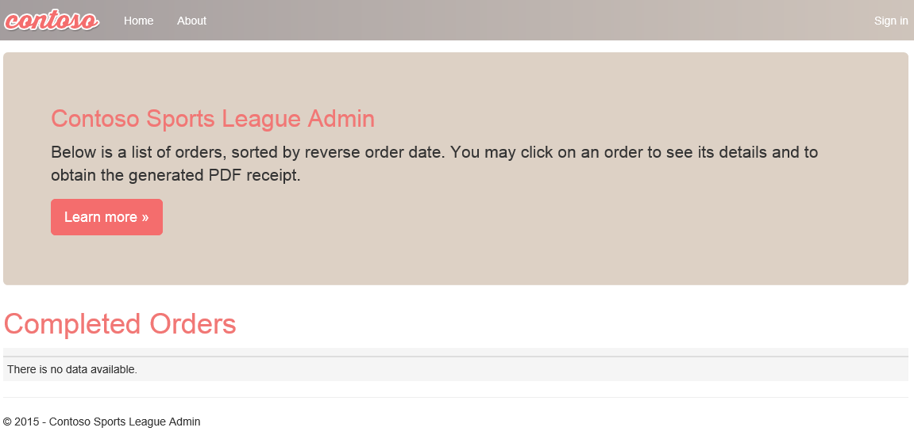

### Task 4: Deploying the payment gateway

In this exercise, the attendee will provision an Azure API app template using the Microsoft Azure Portal. The attendee will then deploy the payment gateway API to the API app.

#### Tasks to complete

-   Create the resources in Microsoft Azure and deploy the payment gateway API application.

#### Exit criteria

-   Please note the URL of the deployed API app for future reference.

### Task 5: Deploying the offers Web API

In this exercise, the attendee will provision an Azure API app template using the Microsoft Azure Portal. The attendee will then deploy the offers Web API.

#### Tasks to complete

-   Create the resources in Microsoft Azure and deploy the offers API application.

-   Specify the configuration settings to connect to the created resources in the Web Apps Application Settings in Azure.

#### Exit criteria

-   Please note the URL of the deployed API app for future reference.

### Task 6: Update and deploy the e-commerce website

In this exercise, you will deploy the e-commerce web app and ensure all of the configuration to connect to the other services is correct.

#### Tasks to complete

-   Update the e-commerce application to reference the new API applications.

-   Deploy the updated e-commerce site to the Azure website.

-   Verify the configuration by placing a test order on the e-commerce site and ensure the order appears on the admin site.

#### Exit criteria

-   The web application should display locally.

-   The web application should display in Microsoft Azure by navigating to its \[web app name\]**.azurewebsites.net** URL.

-   The home page should render a list of products with images underneath the Today's Offers heading.

-   The e-commerce application should render the products catalog without errors.

-   A test order should be rendered in the call center admin application after being submitted through the e-commerce site.

## Exercise 2: Identity and security

Duration: 75 Minutes

The Contoso call center admin application will only be accessible by users of the Contoso Active Directory environment. You have been asked to create a new Azure AD Tenant and secure the application so only users from the tenant can log on.

> Note: Tasks 1, 2, and 4 are optional and require global admin permissions on the Azure AD Tenant. Task 3 is also optional but does require the permission to create an app in the Azure AD tenant.

### Task 1: Enable Azure AD Premium Trial

#### Tasks to complete

-   Enable Azure AD Premium on your existing Azure AD Tenant

#### Exit criteria

-   The Azure AD Premium SKU should be enabled on your subscription

### Task 2: Create a new Contoso user 

#### Tasks to complete

-   Create a new user in your Azure AD tenant

#### Exit criteria

-   A new users to test your web application should be present in Azure AD

### Task 3: Configure access control for the call center administration Web Application

#### Tasks to complete

-   Enable Azure AD authentication with your existing Azure AD tenant on the call center admin web app and validate you can log in with the new user within that tenant

#### Exit criteria

-   The call center application should only allow users that log in through the customized Azure AD form access to the application

### Task 4: Apply custom branding for the Azure Active Directory logon page

#### Tasks to complete

-   Customize the branding by providing a banner and tile logo, a large illustration, and custom text, and then validate the branding is applied. The logo files can be found in the folder you extracted the starter files to

#### Exit criteria

-   The custom branding should be displayed on the logon page

### Task 5: Verify the user can successfully login to the admin site

#### Tasks to complete

-   Login to the site using the new user created in Azure AD

#### Exit criteria

-   The new user should be able to login to the Call Center Admin site

## Exercise 3: Enable Azure B2C for customer site

Duration: 75 minutes

In this exercise, you will configure an Azure AD Business to Consumer (B2C) instance to enable authentication and policies for sign-in, sign-out and profile policies for the Contoso E-Commerce site

Note: This portion of the hands-on lab is written in a lab format due to the complexity of the configuration

### Task 1: Create a new directory

1.  Log in to the Azure portal by using your existing Azure subscription or by starting a free trial. At the left bottom of the screen, click **New** **\>** **Azure Active Directory B2C**.

    

    

2.  Enter for the name, **ContosoB2C** and a unique domain name and region. Click **Create a new Azure AD B2C Tenant**, and it will take a minute to complete. Click the link to manage your new B2C Directory.

    

3.  Click on the orange No Subscription message for instructions on how to link to an active subscription.

    

Note: Essentially, you will need to switch back to your previous Azure AD tenant, and then launch the Azure AD B2C creation wizard again.

4.  Click on **Link an existing Azure AD B2C Tenant to my Azure subscription,** and select the Tenant you just created in the dropdown list and existing resource group. Press **Create**. 

5.  Open the new Azure AD B2C tenant.

6.  Click on **All Settings \> Applications \> +Add**.

    

### Task 2: Add a new application

1.  Specify the following configuration options for the Web App:

    -   Name: Contoso B2C Application

    -   Reply URL: https://\[your web url\].azurewebsites.net \<- this should be the HTTPS URL to the Contoso E-Commerce Site.

    -   Include Web App / web API: Yes

        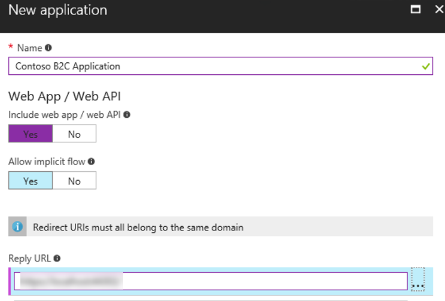

2.  Click **Create.**

3.  Click the application you just created, and copy down the globally unique **Application ID** you will use later in your code.

### Task 3: Create Policies, Sign up

1.  Open your Azure AD B2C Tenant in the Azure management portal.

2.  To enable sign-up on your application, you will need to create a sign-up policy. This policy describes the experiences consumers will go through during sign-up and the contents of tokens the application will receive on successful sign-ups. Click **Sign-up or sign-in policies** as well as **+Add** at the top of the blade.

    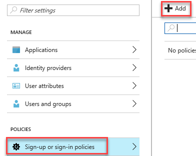

3.  The **Name** determines the sign-up policy name used by your application. For example, enter \"SiUp."

4.  Click **Identity providers**, and select \"Email signup." Optionally, you can also select social identity providers (if previously configured for the tenant). Click **OK**.

    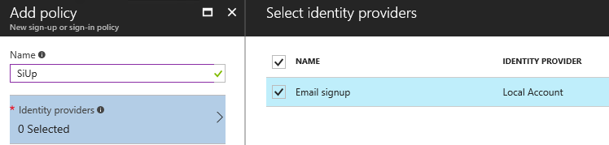

5.  Click **Sign-up attributes**. Here, you choose attributes you want to collect from the consumer during sign-up. For example, select \"Country/Region,\" \"Display Name\" and \"Postal Code." Click **OK**.

    

6.  Click **Application claims**. Here, you choose claims you want returned in the tokens sent back to your application after a successful sign-up experience. For example, select \"Display Name,\" \"Identity Provider,\" \"Postal Code,\" \"User is new\" and \"User\'s Object ID."

    

7.  Click **Create**. Observe the policy just created appears as \"**B2C\_1\_SiUp**\" (the **B2C\_1\_** fragment is automatically added) in the **Sign-up policies** blade.

8.  Open the policy by clicking \"**B2C\_1\_SiUp**."

9.  Select **\"Contoso B2C app\"** in the **Applications** drop-down.

10. Click **Run now**. A new browser tab opens, and you can run through the consumer experience of signing up for your application.

### Task 4: Create a sign-in policy

To enable sign-in on your application, you will need to create a sign-in policy. This policy describes the experiences consumers will go through during sign-in and the contents of tokens the application will receive on successful sign-ins.

1.  Click **Sign-in policies**.

    s

2.  Click **+Add** at the top of the blade.

3.  The **Name** determines the sign-in policy name used by your application. For example, enter \"**SiIn**\" \<the 3^rd^ letter is an upper case i\>.

4.  Click **Identity providers** and select \"**Local Account SignIn**." Optionally, you can also select social identity providers, if already configured. Click **OK**.

    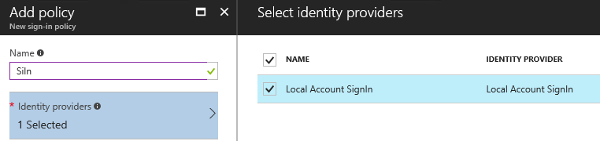

5.  Click **Application claims**. Here you choose claims that you want returned in the tokens sent back to your application after a successful sign-in experience. For example, select \"Display Name,\" \"Identity Provider,\" \"Postal Code,\" and \"User\'s Object ID." Click **OK**.

    

6.  Click **Create**. Observe the policy just created appears as \"**B2C\_1\_SiIn**\" (the **B2C\_1\_** fragment is automatically added) in the **Sign-in policies** blade.

7.  Open the policy by clicking \"**B2C\_1\_SiIn**."

8.  Select \"Contoso B2C app\" in the **Applications** drop-down.

9.  Click **Run now**. A new browser tab opens, and you can run through the consumer experience of signing into your application.

### Task 5: Create a profile editing policy

To enable profile editing on your application, you will need to create a profile editing policy. This policy describes the experiences that consumers will go through during profile editing and the contents of tokens that the application will receive on successful completion.

1.  Click **Profile editing policies**.

    

2.  Click **+Add** at the top of the blade.

3.  The Name determines the profile editing policy name used by your application. For example, enter \"SiPe."

4.  Click Identity providers, and select \"**Local Account SignIn**." Optionally, you can also select social identity providers, if already configured. Click **OK**.

    

5.  Click **Profile attributes**. Here, you choose attributes the consumer can view and edit. For example, select \"Country/Region,\" \"Display Name,\" "Job Title,\" \"Postal Code,\" "State/Province,\" and "Street Address." Click **OK**.

    

6.  Click **Application claims**. Here, you choose claims you want returned in the tokens sent back to your application after a successful profile editing experience. For example, select \"Display Name\" and \"Postal Code."

7.  Click **Create**. Observe the policy just created appears as \"**B2C\_1\_SiPe**\" (the **B2C\_1\_** fragment is automatically added) in the **Profile editing policies** blade.

8.  Open the policy by clicking \"**B2C\_1\_SiPe**."

9.  Select \"Contoso B2C app\" in the **Applications** drop-down.

10. Click **Run now**. A new browser tab opens, and you can run through the profile editing consumer experience in your application.

### Task 6: Modify the Contoso.App.SportsLeague.Web

1.  Within Visual Studio, click on **View -\> Other Windows -\> Package Manager Console**. Execute the following commands to install these the required NuGet Packages.
    ```
    Install-Package Microsoft.Owin.Security.OpenIdConnect -Version 3.0.1
    Install-Package Microsoft.Owin.Security.Cookies -Version 3.0.1
    Install-Package Microsoft.Owin.Host.SystemWeb -Version 3.0.1
    Install-Package Microsoft.IdentityModel.Protocol.Extensions -Version 1.0.4.403061554
    ```

2.  Next, using the Azure Management Portal, open the Contoso E-Commerce Site, and click on App Settings.

3.  Add the following settings:

    -   ida:Tenant - \[your Azure AD B2C name\].onmicrosoft.com

    -   ida:ClientId -- \[the client/app ID from your app\]

    -   ida:RedirectUri - https://\[your web url\].azurewebsites.net

    -   ida:SignupPolicyId -- B2C\_1\_SiUp

    -   ida:SignInPolicyId -- B2C\_1\_SiIn \<the 3^rd^ letter is an upper case i\>

    -   ida:UserProfilePolicyId -- B2C\_1\_SiPe

    -   ida:AadInstance - https://login.microsoftonline.com/{0}/v2.0/.well-known/openid-configuration?p={1}

    

4.  Click **Save** when you are complete.

5.  Within Visual Studio, **right** click on the **Contoso.Apps.SportsLeague.Web** project, and click **Add -\> New Item.**

    

6.  In the Search Installed Templates search box search for OWIN. Click the OWIN Startup class, change the name to **Startup.cs,** and then click **Add**.

7.  In the new class, insert the word partial in between public and class to make this a partial class.

    

8.  Add the following code between the brackets of the Configuration method.

    ```csharp
    ConfigureAuth(app);

    // Startup.cs
    public partial class Startup
    {
        public void Configuration(IAppBuilder app)
        {
            ConfigureAuth(app);
        }
    }
    ```
    
Note: The OWIN middleware will invoke the Configuration(\...) method when your app starts.

9.  Right click on the **App\_Start** folder, and click **Add -\> Class**.

10. Select **Visual C\# and Class,** and name the new file **Startup.Auth.cs**.

11. Replace the entire contents of Startup.Auth.cs with the following code:

    ```csharp
   // App_Start\Startup.Auth.cs
    using System;
    using Owin;
    using Microsoft.Owin.Security;
    using Microsoft.Owin.Security.Cookies;
    using Microsoft.Owin.Security.OpenIdConnect;
    using System.Threading.Tasks;
    using Microsoft.Owin.Security.Notifications;
    using Microsoft.IdentityModel.Protocols;

    using System.Configuration;
    using System.IdentityModel.Tokens;
    using System.Web.Helpers;
    using System.IdentityModel.Claims;

    namespace Contoso.Apps.SportsLeague.Web
    {
        public partial class Startup
        {
            // App config settings
            private static string clientId = ConfigurationManager.AppSettings["ida:ClientId"];
            private static string aadInstance = ConfigurationManager.AppSettings["ida:AadInstance"];
            private static string tenant = ConfigurationManager.AppSettings["ida:Tenant"];
            private static string redirectUri = ConfigurationManager.AppSettings["ida:RedirectUri"];

            // B2C policy identifiers
            public static string SignUpPolicyId = ConfigurationManager.AppSettings["ida:SignUpPolicyId"];
            public static string SignInPolicyId = ConfigurationManager.AppSettings["ida:SignInPolicyId"];
            public static string ProfilePolicyId = ConfigurationManager.AppSettings["ida:UserProfilePolicyId"];

            public void ConfigureAuth(IAppBuilder app)
            {
                app.SetDefaultSignInAsAuthenticationType(CookieAuthenticationDefaults.AuthenticationType);

                app.UseCookieAuthentication(new CookieAuthenticationOptions());

                // Configure OpenID Connect middleware for each policy
                app.UseOpenIdConnectAuthentication(CreateOptionsFromPolicy(SignUpPolicyId));
                app.UseOpenIdConnectAuthentication(CreateOptionsFromPolicy(ProfilePolicyId));
                app.UseOpenIdConnectAuthentication(CreateOptionsFromPolicy(SignInPolicyId));
                AntiForgeryConfig.UniqueClaimTypeIdentifier = ClaimTypes.NameIdentifier;
            }

            // Used for avoiding yellow-screen-of-death
            private Task AuthenticationFailed(AuthenticationFailedNotification<OpenIdConnectMessage, OpenIdConnectAuthenticationOptions> notification)
            {
                notification.HandleResponse();
                if (notification.Exception.Message == "access_denied")
                {
                    notification.Response.Redirect("/");
                }
                else
                {
                    notification.Response.Redirect("/Home/Error?message=" + notification.Exception.Message);
                }

                return Task.FromResult(0);
            }

            private OpenIdConnectAuthenticationOptions CreateOptionsFromPolicy(string policy)
            {
                return new OpenIdConnectAuthenticationOptions
                {
                    // For each policy, give OWIN the policy-specific metadata address, and
                    // set the authentication type to the id of the policy
                    MetadataAddress = String.Format(aadInstance, tenant, policy),
                    AuthenticationType = policy,

                    // These are standard OpenID Connect parameters, with values pulled from web.config
                    ClientId = clientId,
                    RedirectUri = redirectUri,
                    PostLogoutRedirectUri = redirectUri,
                    Notifications = new OpenIdConnectAuthenticationNotifications
                    {
                        AuthenticationFailed = AuthenticationFailed,
                    },
                    Scope = "openid",
                    ResponseType = "id_token",

                    // This piece is optional - it is used for displaying the user's name in the navigation bar.
                    TokenValidationParameters = new TokenValidationParameters
                    {
                        NameClaimType = "name",
                    },
                };
            }
        }
    }
    ```

> Note: The parameters you provide in OpenIdConnectAuthenticationOptions serve as coordinates for your app to communicate with Azure AD. You also need to set up cookie authentication. The OpenID Connect middleware uses cookies to maintain user sessions, among other things.

### Task 7: Send authentication requests to Azure AD

Your app is now properly configured to communicate with Azure AD B2C by using the OpenID Connect authentication protocol. OWIN has taken care of all of the details of crafting authentication messages, validating tokens from Azure AD, and maintaining user session. All that remains is to initiate each user\'s flow.

1.  Right click on the **Controllers** folder, and click **Add** -\> **Controller**. 

2.  Select **MVC 5 Controller -- Empty, and click Add.** Replace **Default** with **Account** for the controller name.

3.  Add the following using statement to the top of the controller:

    ```csharp
    using Microsoft.Owin.Security;
    ```

4.  Replace the default controller method Index

    

    With the following code:

    ```csharp
    // Controllers\AccountController.cs

    public void SignIn()
    {
        if (!Request.IsAuthenticated)
        {
            // To execute a policy, you simply need to trigger an OWIN challenge.
            // You can indicate which policy to use by specifying the policy id as the AuthenticationType
            HttpContext.GetOwinContext().Authentication.Challenge(
                new AuthenticationProperties () { RedirectUri = "/" }, Startup.SignInPolicyId);
        }
    }

    public void SignUp()
    {
        if (!Request.IsAuthenticated)
        {
            HttpContext.GetOwinContext().Authentication.Challenge(
                new AuthenticationProperties() { RedirectUri = "/" }, Startup.SignUpPolicyId);
        }
    }


    public void Profile()
    {
        if (Request.IsAuthenticated)
        {
            HttpContext.GetOwinContext().Authentication.Challenge(
                new AuthenticationProperties() { RedirectUri = "/" }, Startup.ProfilePolicyId);
        }
    }

    ```

5.  You can also use OWIN to sign out the user from the app. Add the following method to the account controller (**Controllers\\AccountController.cs**):

    ```csharp
    C\# Copy
    ```

    ```csharp
    // Controllers\AccountController.cs
    public void SignOut()
    {
        // To sign out the user, you should issue an OpenIDConnect sign out request
        if (Request.IsAuthenticated)
        {
            IEnumerable<AuthenticationDescription> authTypes = HttpContext.GetOwinContext().Authentication.GetAuthenticationTypes();

            HttpContext.GetOwinContext().Authentication.SignOut(authTypes.Select(t => t.AuthenticationType).ToArray());

            Request.GetOwinContext().Authentication.GetAuthenticationTypes();
        }
    }
    ```

### Task 8: Display user information

When you authenticate users by using OpenID Connect, Azure AD returns an ID token to the app that contains **claims**. These are assertions about the user. You can use claims to personalize your app. You can access user claims in your controllers via the ClaimsPrincipal.Current security principal object.

1.  Open the **Controllers\\HomeController.cs file** and add the following using statements at the end of the other using statements.

    ```csharp
    using System.Linq;

    using System.Security.Claims;
    ```

2.  Open the **Controllers\\HomeController.cs** file and add the following method:

    ```csharp
    [Authorize]

    public ActionResult Claims()
    {
        Claim displayName = ClaimsPrincipal.Current.FindFirst(ClaimsPrincipal.Current.Identities.First().NameClaimType);
        ViewBag.DisplayName = displayName != null ? displayName.Value : string.Empty;
        return View();
    }
    ```

3.  You can access any claim that your application receives in the same way. A list of all the claims the app receives is available for you on the **Claims** page. Right click on **Views -\> Home,** click **Add -\> MVC 5 View Page (Razor)** and name it **Claims.** 

    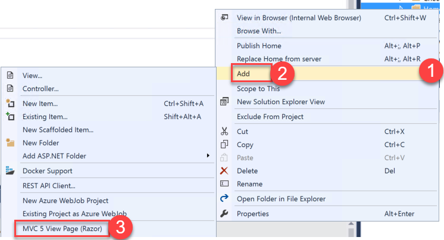

4.  Open the **Claims.cshtml** file and replace the code with the following:

    ```csharp
    @using System.Security.Claims
    @{
        ViewBag.Title = "Claims";
    }
    <h2>@ViewBag.Title</h2>

    <h4>Claims Present in the Claims Identity: @ViewBag.DisplayName</h4>

    <table class="table-hover claim-table">
        <tr>
            <th class="claim-type claim-data claim-head">Claim Type</th>
            <th class="claim-data claim-head">Claim Value</th>
        </tr>

        @foreach (Claim claim in ClaimsPrincipal.Current.Claims)
        {
            <tr>
                <td class="claim-type claim-data">@claim.Type</td>
                <td class="claim-data">@claim.Value</td>
            </tr>
        }
    </table>
    ```

5.  Right click on the **Views -\> Shared** folder, click **Add**, and add a new **MVC 5 Partial Page (Razor)**. Specify **\_LoginPartial** for the name.

    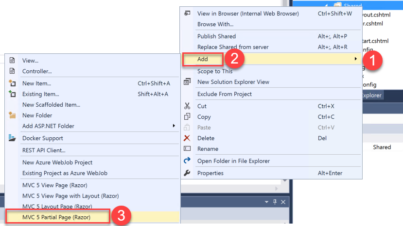

6.  Add the following code to the razor partial view to provide a sign-in and sign-out link as well as a link to edit the user's profile.

    ```csharp
    @if (Request.IsAuthenticated)
    {
        <text>
            <ul class="nav navbar-nav navbar-right">
                <li>
                    <a id="profile-link">@User.Identity.Name</a>
                    <div id="profile-options" class="nav navbar-nav navbar-right">
                        <ul class="profile-links">
                            <li class="profile-link">
                                @Html.ActionLink("Edit Profile", "Profile", "Account")
                            </li>
                        </ul>
                    </div>
                </li>
                <li>
                    @Html.ActionLink("Sign out", "SignOut", "Account")
                </li>
            </ul>
        </text>
    }
    else
    {
        <ul class="nav navbar-nav navbar-right">
            <li>@Html.ActionLink("Sign up", "SignUp", "Account", routeValues: null, htmlAttributes: new { id = "signUpLink" })</li>
            <li>@Html.ActionLink("Sign in", "SignIn", "Account", routeValues: null, htmlAttributes: new { id = "loginLink" })</li>
        </ul>
    }

    ```

7.  Open Views\\Shared\\\_Layout.cshtml in Visual Studio. Locate the header-tap div. and add the two lines highlighted.

    ```xml
    <div class="header-top">
        <div class="container">
            <div class="row">
                <div class="header-top-left">
                <a href="#"><i class="fa fa-twitter"></i></a>
                <a href="#"><i class="fa fa-facebook"></i></a>
                <a href="#"><i class="fa fa-linkedin"></i></a>
                <a href="#"><i class="fa fa-instagram"></i></a>
                </div>
                <div class="header-top-right">
                    <a href="#" class="top-wrap"><span class="icon-phone">Call today: </span> (555) 555-8000</a>
                    @Html.ActionLink("Claims", "Claims", "Home")                                        
                </div>                   
                @Html.Partial("_LoginPartial")
            </div>
        </div>
    </div>
    ```

### Task 9: Run the sample app

1.  Right click on the **Contoso.Apps.SportsLeague.Web** project, and click **Publish**. Follow the steps to deploy the updated application to the Microsoft Azure Web App.

Launch a browser outside of Visual Studio for testing if the page loads in Visual Studio.

2.  Test out Sign up. Next, test Sign out.

3.  When you click on Claims and are not signed in, it will bring you to the sign-in page and then display the claim information. Sign in, and test Edit Profile.

    

    Claims information page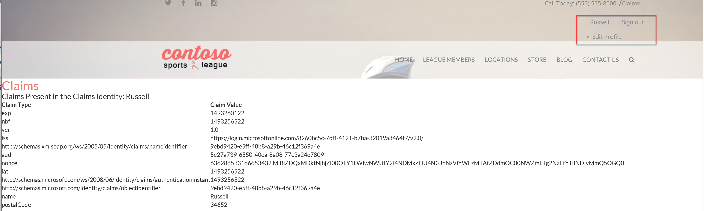

## Exercise 4: Enabling Telemetry with Application Insights

To validate the scalability of the application and to configure telemetry, you have been asked to configure Microsoft Azure Application Insights and perform a web load test using Azure DevOps.

### Task 1: Configure the application for telemetry

##### Tasks to complete

-   Configure a method to capture telemetry information for the application for the server and client side.

-   Complete the implementation of the TrackException and TrackEvent method in Helpers\\TelemetryHelper.cs.

-   Republish the web application with telemetry enabled.

#### Exit criteria

-   Verify that when you browse to the website, the telemetry data appears.

### Task 2: Creating the web performance test and load test

##### Tasks to complete

-   Submit several test orders to verify that telemetry is capturing custom events

-   Simulate a load test of at least 250 users browsing the home page over a 5-minute time frame

-   Use the monitoring capabilities of your telemetry solution to identify failures from the test (if any)

-   Use the monitoring capabilities of your telemetry solution to identify performance issues from the test

#### Exit criteria

-   You should be able to view the average response time for the simulated load test

-   The telemetry solution should show custom events captured by the application such as new orders

-   The telemetry solution should show performance numbers such as the number of sessions and average response time

## Exercise 5: Automating backend processes

Contoso wants to automate the process of generating receipts in PDF format and alerting users when their orders have been processed.

### Task 1: Create an Azure Function to Generate PDF Receipts

##### Tasks to Complete 

-   Create an Azure Function in the contososports resource group using the assets in C:\\Hackathon\\Contoso Sports League\\Contoso.CreatePDFReport

-   Execute the function using the example data in Sample.dat to validate it generates a PDF in your storage account

-   Use Storage Explorer or Visual Studio to view the generated PDF file

#### Exit criteria

-   You should have a function that accepts the format specified in Sample.dat and generates a PDF file in the storage account for the Contoso Sports solution.

### Task 2: Create an Azure Logic App to Process Orders

##### Tasks to Complete

-   Create an Azure Logic App that listens for new orders on the receiptgenerator storage queue

-   When a new message is received pass it to the Azure Function using the same syntax as the sample.dat file

    -   Hint: the following can be used to base64 encode the data
    ```
    "Order": "@{base64(triggerBody()?['MessageText'])}"
    ```

-   After the receipt is generated the order row should be updated HasBeenShipped value and the link to the receipt so the admin app can display it correctly.

    -   Hint the following values will need to be updated in SQL:
    ```
    "OrderDate": "@{body('ContosoMakePDF')['OrderDate']}",
    "FirstName": "@{body('ContosoMakePDF')['FirstName']}",
    "LastName": "@{body('ContosoMakePDF')['LastName']}",
    "Address": "@{body('ContosoMakePDF')['Address']}",
    "City": "@{body('ContosoMakePDF')['City']}",
    "State": "@{body('ContosoMakePDF')['State']}",
    "PostalCode": "@{body('ContosoMakePDF')['PostalCode']}",
    "Country": "@{body('ContosoMakePDF')['Country']}",
    "Phone": "@{body('ContosoMakePDF')['Phone']}",
    "SMSOptIn": "@{body('ContosoMakePDF')['SMSOptIn']}",
    "SMSStatus": "@{body('ContosoMakePDF')['SMSStatus']}",
    "Email": "@{body('ContosoMakePDF')['Email']}",
    "ReceiptUrl": "@{body('ContosoMakePDF')['ReceiptUrl']}",
    "Total": "@{body('ContosoMakePDF')['Total']}",
    "PaymentTransactionId": "@{body('ContosoMakePDF')['PaymentTransactionId']}",
    "HasBeenShipped": "@{body('ContosoMakePDF')['HasBeenShipped']}"
    ```

    ```   
    "path": "/datasets/default/tables/@{encodeURIComponent(encodeURIComponent('[dbo].[Orders]'))}/items/@{encodeURIComponent(encodeURIComponent(body('ContosoMakePDF')['OrderId']))}"
    ```

-   An action will need to be added to remove the message from the queue so it is not processed multiple times

#### Exit criteria

-   A PDF receipt should be generated each time an order is created on the website

-   The order should only be processed once

-   The receipt should be downloadable from the admin website

### Task 3: Use Twilio to send SMS Order Notifications

> Note: This portion of the task is added inline due to the complexity involved.

#### Subtask 1: Configure your Twilio trial account

1.  If you do not have a Twilio account, sign up for one for free at the following URL:
    [**https://www.twilio.com/try-twilio**](https://www.twilio.com/try-twilio).

    

2.  When you sign up for a free Twilio trial, you will be asked to verify your personal phone number. This is an important security step that is mandatory for trying Twilio.

    

3.  Click **All Products & Services**.\
    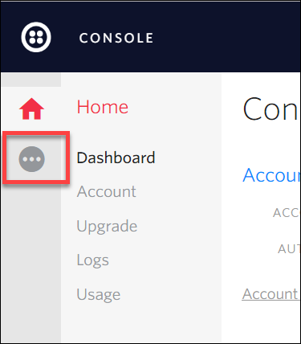

4.  Click on **Phone Numbers**.\
    

5.  Click **Get Started**.\
    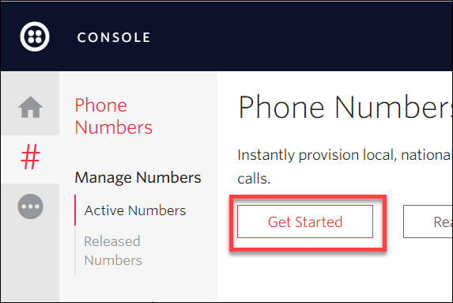

6.  Click the **Get your first Twilio phone number** button.\
    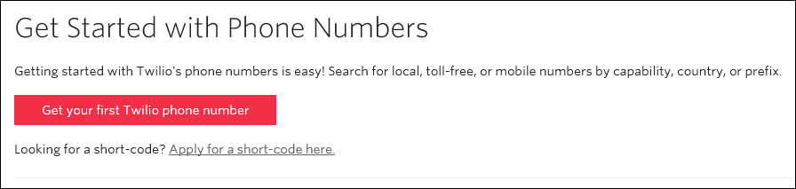

7.  Record the **Phone Number**, click the **Choose this Number** button on the **Your first Twilio Phone Number** prompt, and click **Done.**\
    

8.  Click on **Home**, record the **Account SID** and **Auth Token** for use when configuring the Twilio Connector.\
    

#### Subtask 2: Create a new logic app 

1.  Open **SQL Server Management Studio** and connect to the SQL Database for the **ContosoSportsDB** database.\
    

2.  Under the **ContosoSportsDB** database, expand **Programmability**, right-click on **Stored Procedures**, click **New**, followed by **Stored Procedure...**

    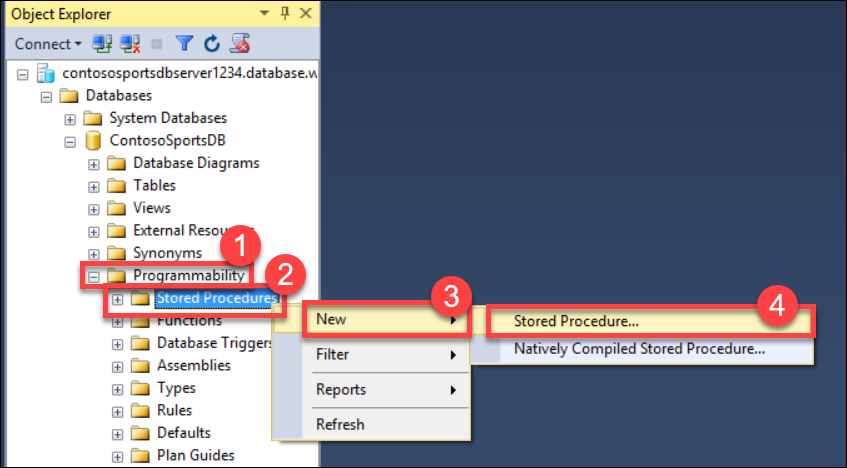

3.  Replace the Stored Procedure Template code with the following:
    ```
    CREATE PROCEDURE [dbo].[GetUnprocessedOrders]
    AS
    declare @returnCode int 
    SELECT @returnCode = COUNT(*) FROM [dbo].[Orders] WHERE PaymentTransactionId is not null AND PaymentTransactionId <> '' AND Phone is not null AND Phone <> '' AND SMSOptIn = '1' AND SMSStatus is null
    return @returnCode

    GO
    ```

4.  Click on **Execute** in the toolbar, or press the F5 key.\
    

5.  Delete the SQL script for the Stored Procedure from the code editor, and replace it with the following:
    ```
    CREATE PROCEDURE [dbo].[ProcessOrders]
    AS
    SELECT * FROM [dbo].[Orders] WHERE PaymentTransactionId is not null AND PaymentTransactionId <> '' AND Phone is not null AND Phone <> '' AND SMSOptIn = '1' AND SMSStatus is null;

    UPDATE [dbo].[Orders] SET SMSStatus = 'sent' WHERE PaymentTransactionId is not null AND PaymentTransactionId <> '' AND Phone is not null AND Phone <> '' AND SMSOptIn = '1' AND SMSStatus is null;
    ```

6.  Click on **Execute** in the toolbar, or press the F5 key.

    

7.  Open the Azure Management Portal (<http://portal.azure.com>), and click **+New** **\> Web + Mobile \> Logic App**.

    

8.  On the **Create logic app** blade, assign a value for **Name**, and set the Resource Group to **contososports**.

    

9.  Open the Logic App by clicking **More services -\> Logic Apps**, and click on the Logic App just created.

    

10. Select the **Blank LogicApp** Template.\
    

11. On the **Logic Apps Designer**, click **Schedule**.

    

12. Set the **FREQUENCY** to **MINUTE**, and **INTERVAL** to 1.

    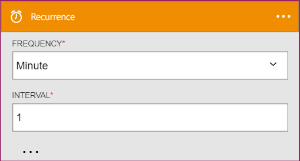

13. Click the **New Step** followed by **Add an action**.

    

14. Type **SQL Server** into the filter box, and click the SQL **Server -- Execute stored procedure** action.

    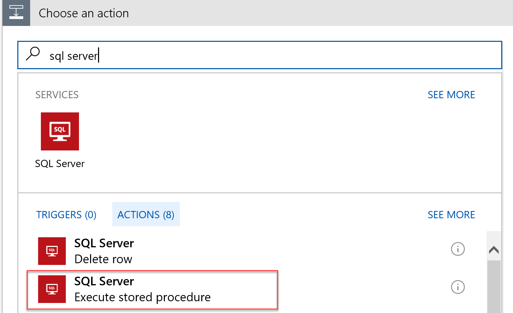

15. The first time you add a SQL action, you will be prompted for the connection information. Name the connection **ContosoDB**, input the server and database details used earlier, and click **Create**.\
    

16. Select the **\[dbo\].\[GetUnprocessedOrders\]** stored procedure from the drop-down on the Procedure Name field.

    ![In the Execute stored procedure section, the Procedure name is \[dbo\].\[GetUnprocessedOrders\].](images/Hands-onlabunguided-Moderncloudappsimages/media/image61.png "Execute stored procedure section")

17. Click on **New Step**, and click the **Add a condition** link.

    

18. Specify **ReturnCode** for the OBJECT NAME, set the RELATIONSHIP to **is greater than**, and set the VALUE to **0**.

    

19. Click the **Add an action** link on the **If yes** condition.

    

20. Type **SQL Server** into the filter box, and click the **SQL Server -- Execute stored procedure** action.

    

21. Select the **ProcessOrders** stored procedure in the Procedure name dropdown.

    ![Under If Yes, Execute stored procedure 2 is selected, and the Procedure name is \[dbo\].\[ProcessOrders\].](images/Hands-onlabunguided-Moderncloudappsimages/media/image66.png "If yes section")

22. Click the **Add an action** link.

    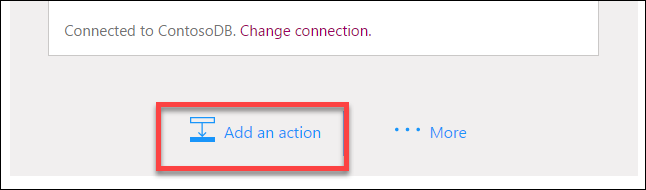

23. Type **Twilio** in the filter box, and click the **Twilio -- Send Text Message (SMS)** connector.

    

24. Set the Connection Name to Twilio, specify your Twilio **Account SID** and **Authentication Token**, then click the **Create** button.

    ")

25. Using the drop-down, select your Twilio number for the **FROM PHONE NUMBER** field. Specify a place holder phone number in the **TO PHONE NUMBER**, and a **TEXT** message.\
    ")

26. On the Logic App tool bar click the **Code View** button.

    

27. Find the **Send\_Text\_Message\_(SMS)** action, and modify the body property of the Twilio action:

    

    Add the following code between Hello and the comma.

    ```
    @{item()['FirstName']}
    ```
    
    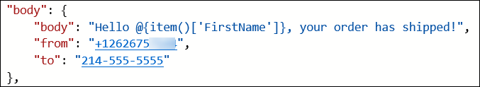

28. Modify the **to** property to pull the phone number from the item.

    ```
    @{item()['Phone']}
    ```
    
    

29. Immediately before the **Send\_Text\_Message\_(SMS)**, create a new line, and add the following code:
    ```
    "forEach_email": {
        "type": "Foreach",
        "foreach": "@body('Execute_stored_procedure_2')['ResultSets']['Table1']",
        "actions": {
    ```
    
30. Remove the **runAfter** block from the **Send\_Text\_Message\_(SMS)** action.\
    

31. Locate the closing bracket of the **Send\_Text\_Message\_(SMS)** action, create a new line after it, and add the following code:
    ```
        },
        "runAfter": {
            "Execute_stored_procedure_2": [
                "Succeeded"
            ]
        }
    }
    ```

32. After the code for the **Send\_Text\_Message\_(SMS)** has been modified to be contained within the **forEach\_email** action, it should look like the following:

    

33. Click **Save** on the toolbar to enable the logic app.

    

34. Your workflow should look like below, and you should receive a text for each order you have placed.

    

## After the hands-on lab

Duration: 10 Minutes

### Task 1: Delete resources

1.  Since the HOL is now complete, go ahead and delete all of the Resource Groups that were created for this HOL. You will no longer need those resources and it will be beneficial to clean up your Azure Subscription.

You should follow all steps provided *after* attending the hands-on lab.

